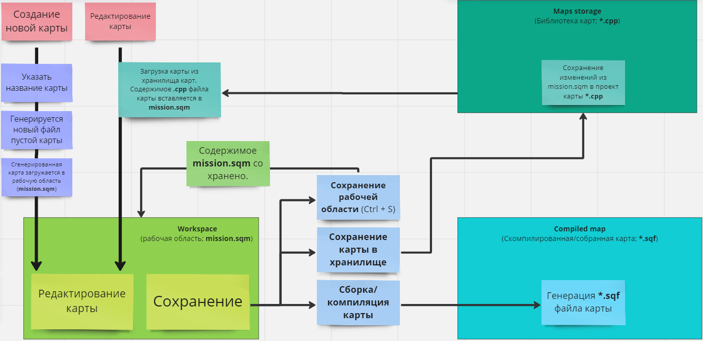

# Интерфейс
Интерфейс редактора разделен на 4 основных зоны.

Зоны перечислены ниже:
1. **Меню и панель инструментов.** Здесь расположены основные способы упралвения редактором, картами и инструментами. Содержит меню и панель инструментов.
2. **Левая панель.** Здесь расположен инспектор игрового объекта либо список игровых объектов со слоями (в зависимости от включенного режима).
3. **Правая панель.** Здесь находится библиотека игровых объектов, а также история изменений объектов (в зависимости от включенного режима).
4. **Окно сцены.** Основное окно редактирования сцены.

# Горячие клавиши

## Камера

Управление камерой в режиме сцены достаточно простое. Ниже представлен список стандартных хоткеев для управления камерой:
| Кнопки | Действие |
| --- | --- |
|  +  | Вращение камеры |
|  вверх / вниз | Перемещение камеры по направлению к центру экрана или от него |
| <kbd>W</kbd> <kbd>S</kbd> <kbd>A</kbd> <kbd>D</kbd> | Перемещение камеры вперед/назад/влево/вправо |
| <kbd>Q</kbd> <kbd>Z</kbd> | Перемещение камеры вверх/вниз |
| <kbd>NUM 8</kbd> <kbd>NUM 2</kbd> <kbd>NUM 4</kbd> <kbd>NUM 6</kbd> | Вращение камеры вверх/вниз/влево/вправо |
| Зажать <kbd>Shift</kbd> | Увеличивает скорость камеры при движении |

## Сцена и объекты

Ниже представлен список стандартных хоткеев управления в сцене:
| Кнопки | Действие |
| --- | --- |
|  | Выбор объекта. Нажав по пустому месту выделение будет снято |
|  + <kbd>Ctrl</kbd> | Выделение нескольких объектов |
|  | Открывает контекстное меню
| <kbd>Backspace</kbd> | Убрать/показать иконки игровых объектов и интерфейс |
| <kbd>1</kbd> <kbd>2</kbd> <kbd>3</kbd> | Режимы трансформации объекта:  1. Без режима/упрощенное изменение позиции 2. Расширенный режим изменения позиции 3. Режим вращения |
| <kbd>Space</kbd> | Переключение следующего режима трансформации |
| <kbd>Shift</kbd> +  +  | Быстрое вращение объекта |
| <kbd>Alt</kbd> +  +  | Быстрая трансформация z-оси объекта (поднять/опустить) |
| <kbd>Ctrl</kbd> + <kbd>C</kbd> / <kbd>Ctrl</kbd> + <kbd>V</kbd> | Копирование и вставка выделенных объектов |

## Прочее

Ниже представлен список стандартных дополнительных хоткеев:
| Кнопки | Действие |
| --- | --- |
| <kbd>Esc</kbd> | Выход из редактора |
| <kbd>Ctrl</kbd> + <kbd>S</kbd> | [Сохранить текущую карту в рабочей области](#workspace-рабочая-область) |
| <kbd>E</kbd> | Открыть/закрыть [окно слоев](#список-объектов-и-слои) и игровых объектов на карте |
| <kbd>R</kbd> | Открыть/закрыть [окно истории](#история-изменений) |
| <kbd>Shift</kbd> + <kbd>E</kbd> | Открыть/закрыть [окно инспектора](#инспектор) |
| <kbd>Shift</kbd> + <kbd>R</kbd> | Открыть/закрыть [окно библиотеки игровых объектов](#библиотека-объектов) 
| <kbd>F</kbd> | Центрировать карту на выбранном игровом объекте |

------

# Меню и панель инструментов

Панель инструментов практически не изменена по сравнению с 3DEN редактором Arma3. Некоторые кнопки были отключены/убраны за ненадобностью. Более подробное описание всех свойств можно найти на официальной wiki Arma3 [по этой ссылке](https://community.bistudio.com/wiki/Eden_Editor:_Toolbar). Также при наведении на кнопку в панели инструментов будет показываться краткое описания функционала указанной кнопки.

Больше всего было подвергнуто изменению меню, в котором каждый из разделов будет рассмотрен чуть подробнее.

- [Relicta Editor](#relicta-editor) - общий/системный раздел
- [Карта](#работа-с-картами) - создание, сохранение, загрузка и сборка карт.
- [Правка](#правка) - режимы трансформации, отмена и возврат изменений и прочие компоненты, связанные с редактированием в сцене.
- [Вид](#вид) - модификаторы и утилиты визуального отображения.
- [Инструменты](#инструменты) - инструменты платформы, валидаторы и редакторы подсистем.
- [Настройки](#настройки) - настройки ReEditor и платформы.
- [Запуск](#запуск) - старт режима симуляции.
- [Информация](#информация) - версия проекта, ссылки на репозиторий и список изменений.

## Relicta Editor
В этом разделе можно открыть папку ReSDK через соответствующий пункт (Открыть папку проекта), папку с логами платформы, перезапустить редактор в случае фатальных ошибок, а также рекомпилировать редактор и/или библиотеку игровых объектов (функция рекомпиляции доступна при включении через настройки ReEditor).
## Работа с картами

При работе с картами мы сталкиваемся с необходимостью загрузки и сохранения этих самых карт. Важно понимать принцип работы системы карт и уметь загружать/сохранять/собирать карты.

### Описание системы работы с картами

Работа с картами происходит по следующей схеме:
1. Загружаем или создаем новую карту в [рабочей области](#workspace-рабочая-область).
2. Редактируем.
3. Сохраняем карту в [хранилище карт](#maps-storage-хранилище-карт).
4. [Собираем карту](#compiled-maps-собранные-карты) для работы на сервере и в симуляции.

Ниже схема работы с картами. Красные стикеры - отправные точки.

> **\*.cpp**, **\*.sqf** - означает любое имя файла с расширением `.cpp` и `.sqf`

#### Workspace (Рабочая область)
Рабочая область - это персональное временное пространство, в котором пользователь производит манипуляции с картой, загруженной из хранилища карт. При загрузке карты из хранилища несохраненные данные из рабочей области удаляются. 
При сохранении рабочей области данные записываются во временный файл **mission.sqm**, находящийся в корне проекта. Сохранение рабочей области нужно для того, чтобы при работе над одной картой между циклами разработки не приходилось каждый раз загружать её из хранилища. В свою очередь, чтобы другие пользователи смогли увидеть ваши изменения карты, она должна быть сохранена в хранилище карт. 

#### Maps storage (Хранилище карт)
Хранилище карт - это библиотека бинарных файлов карт, которые загружаются в рабочую область для редактирования и сохраняются для возможности просмотра другими пользователями SDK. Эти файлы содержат позиции и свойства игровых объектов на карте, которые можно изменять через редактор. 
Все карты хранятся в папке [Src/Editor/Bin/Maps](../../Src/Editor/Bin/Maps) с расширением **.cpp**

#### Compiled maps (Собранные карты)
Собранная карта (*или скомпилированная карта*) - это конечный вариант карты для воспроизведения в режиме симуляции или непосредственно на сервере, скомпилированный в игровые инструкции. Собранные карты хранятся в папке [Src/host/MapManager/Maps](../../Src/host/MapManager/Maps) и имеют расширение **.sqf**, так как выполняются как обычный скрипт при загрузке режима.

### Создание карт
Для создания новой карты откройте раздел меню `Карта` и выберите пункт `Создать новую карту`. Не забудьте сохранить ваши наработки из рабочей области, так как при создании новой карты все несохраненные данные будут удалены. 
Когда новая карта будет создана вам будет предложено ввести её имя. Имя карты - это уникальный идентификатор, который используется в имени файла карты, а также при указании в режиме.

### Редактирование карт
Чтобы открыть существующую карту, нужно загрузить её из хранилища карт. Откройте раздел меню `Карта` и выберите пункт `Открыть карту`. Не забудьте сохранить ваши наработки из рабочей области.

### Сохранение карт
Из описания работы с картами мы знаем, что карту можно сохранять в рабочей области, хранилище а также скомпилировать для симуляции/сервера. В разделе меню `Карта` за сохранение в рабочей области отвечает пункт `Сохранить текущую карту в рабочей области` (*либо через горячие клавиши <kbd>Ctrl</kbd> + <kbd>S</kbd>*), за сохранение в хранилище - `Сохранить карту` а за сборку - `Выполнить сборку карты`.
> **Обратите внимание!**
>> Перед сохранением карты в хранилище преварительно нужно сохранить рабочую область, так как данные из рабочей области берутся из точки последнего сохранения рабочей области.

## Правка
| Опция	| Описание |
| ---- | ---- |
|Отменить|Отмените последнюю операцию. Вы можете просмотреть список всех операций на панели истории редактирования.
|Повторить|Повторите ранее отмененную операцию. Вы можете просмотреть список всех операций на панели истории редактирования.
|Выбрать все на экране|Выделяет все объекты, значок которых виден в текущем представлении.
|Режим трансформации|Переключите конкретный виджет преобразования.
|Сетка|Переключите один из определенных типов сетки, либо измените её размер.
|Вертикальный режим|Переключите вертикальный режим. *Так как ReEditor использует плоскую карту эта опция не имеет особой значимости.*
|Переключать привязку поверхности|Переключите привязку поверхности.
|Тип шаблона|Выберите режим обозревателя ресурсов. *В ReEditor не используется. Оставлен для работы горячих клавиш*

## Вид
| Опция	| Описание |
| ---- | ---- |
| Центрировать на выбранном элементе|Центрирует камеру на выделенном игровом объекте. Если выделено несколько объектов - камера будет центрирована на первом из выделенных.
| Переключить привязку камеры к выбранному объекту|Камера фиксируется (*лочится/привязывается*) на выбранном объекте. 
| Переключить карту|Открывает режим 2d карты для быстрого перемещения к точке или массовой манипуляции объектами.
| Переключить текстуры карты|Оставлено для обратной совместимости. В ReEditor не имеет значения.
|Включить фонарик|Включает подсветку местности в ночное время в режиме редактирования.
| Интерфейс|Здесь можно включить, выключить или переключить отображение левой или правой панели, а также переключить отображение значков объектов, ограничительных линий выделенных объектов и интерфейса.
|Сцена|Здесь можно переключить отображение имен объектов в сцене, время суток, отображение курсора геометрии для определения где есть *физическая* поверхность и переключить отображение сетки чанков.

### Отображение сетки чанков
При включении отображения сетки чанков вы сможете увидеть линии границ чанков, а также их имена и размеры. 

* Красным цветом помечаются чанки, в которых хранятся предметы.
* Желтым цветом помечаются чанки, в которых хранятся структуры.
* Белым цветом помечаются чанки, в которых хранятся декорации.

Подробнее об различиях разных типов игровых объектов [можно почитать тут](../PROJECT_ARCHITECTURE.md#описание-системы-игровых-объектов-gameobjects)

## Инструменты
Здесь расположены инструменты платформы и ReEditor.
| Опция	| Описание |
| ---- | ---- |
|Системные инструменты|Здесь хранятся инструменты платформы, такие как консоль отладки, просмотрщик анимаций и конфигов. По умолчанию данный раздел выключен и включается через настройки ReEditor [в разделе меню `Настройки`](#настройки).
|Генераторы|Внутренние инструменты для генерации различного контента
|Валидаторы| Здесь можно обновить объекты, которые были перепривязаны от **IStruct** или **Decor**, отобразить в консоли пути всех класов, загруженных в редактор, проверить нагрузку сцены игровыми объектами и найти "*мертвые*" классы, которые есть на карте но отсутствуют в библиотеке объектов.
|Создать режим|Генерирует новый режим, создавая файлы режима и базовой роли для него из шаблонных файлов.
|Просмотр моделей|Открывает окно просмотра модели. Рядом с кнопкой *применить* есть строка поиска. При наведении на неё отобразятся доступные способы поиска. При выборе модели в буфер обмена скопируется отчет о модели: путь и конфигурации. Данная информация будет продублирована на экране.
|Редактор позиции модели|Открывает внутренний редактор создания точек относительно модели. Полезный инструмент например для создания кроватей или стульев с помощью точкек на которых можно расположит персонажа. Если был выделен объект, то он будет помещен в редактор эмиттеров.
|Редактор частиц и освещения|Открывает внутренний редактор системы частиц и освещения. Если был выделен объект, то он будет помещен в редактор эмиттеров. Подробнее в [справочнике по редактору эмиттеров](Editor_emitters.md)
|Редактор прокси-слотов|Открывает редактор точек на персонаже, к которым привязываются игровые объекты. Помогает правильно настроить положение моделей на слотах персонажа, например в руках.

## Настройки
Данный раздел меню содержит различные настройки.
| Опция	| Описание |
| ---- | ---- |
|Настройки ReEditor|Открывает окно настроек редактора ReEditor. [Подробнее ниже](#настройки-reeditor)
|Настройки редактора|Открывает окно встроенных настроек 3DEN. Здесь можно настроить частоту автосохранения рабочей области, задать скорость камеры в разных режимах и изменить некоторые дополнительные настройки редактора.
|Параметры видео|Настройки графики
|Параметры аудио|Настройки звука
|Настройки игры|Общие игровые настройки
|Управление|Настройки управления

### Настройки ReEditor
Изначально при первом запуске редактора в папке [Src/Editor](../../Src/Editor) создается файл `EditorSettings.txt`. Данный файл содержит все специфические настройки ReEditor. Настройки загружаются из файла при компиляции редактора и сохраняются в файле при изменении через настройки ReEditor. 
> Ручное редактирование файла настроек не рекомендуется. 

Описание каждой настройки в данном руководстве бессмыслено по двум причинам:
1. В процессе разработки настройки будут постоянно расширяться и изменяться.
2. Настройки достаточно подробно задокументированы при наведении на конкретную настройку.

## Запуск
Раздел меню `Запуск` позволяет запустить игру в режиме **симуляции**. Режим симуляции - это полноценная эмуляция серверной среды в одиночной игре. Т.е. сервер и клиент исполняются на одной машине - ПК пользователя. 

Симуляция воспроизводит стандартный цикл выполнения: установка режима, его запуск, прогресс и завершение. В процессе симуляции можно редактировать код клиента и сервера, после чего можно выполнить рекомпиляцию, запустив цикл выполнения с самого начала и с применёнными изменениями кода. Если во время выполнения клиентский или серверный код вызвал ошибку ReSDK сигнализирует об этом, отобразив окно с кратким описанием ошибки, стэком вызова и исходным файлом, содержащим ошибку. В некоторых случаях отладчик может определить строку с ошибкой и при нажатии соответствующей кнопки в окне - откроект редактор VS Code (при наличии) с проблемным файлом.

Основные способы запуска симуляции перечислены ниже:
| Опция	| Описание |
| ---- | ---- |
| Запустить симуляцию|Запуск симуляции без настроек. Пользователь самостоятельно должен установить режим и запустить его если этого требуют условия запуска.
|Запустить симуляцию с режимом|Открывает окно выбора режима. Отличается от предыдущего пункта тем, что пользователю не требуется при каждом цикле симуляции вручную прописывать устанавливаемый режим.
|Запустить симуляцию с режимом для этой карты|Запускает режим, использующий текущую карту, открытую в рабочей области. Если режимов, использующих эту карту несколько - открывает окно выбора режима.
|Запуск симуляции с последним режимом и ролью|Автоматически устанавливает режим, роль и позицию персонажа, запомненную с предыдущих запусков симуляции. Помогает при постоянном просмотре одной локации на определенной карте. Не требует установки режима, роли и нажатия кнопки готовности.
|Настроить симуляцию и запустить|Открывает окно детальной настройки симуляции. Все опции задокументированы при наведении. Вы можете как прописать вручную, так и перетянуть нужный режим или роль из библиотеки объектов на нужный пункт настроек.
|Запуск симуляции частиц| Запускает визуальную симуляцию в режиме редактора. Включает все источники света и частицы.

## Информация
В данном разделе меню нет важной информации или функциональности. Раздел просто отображает версию редактора и ссылки на страницы репозитория.

------

# Левая панель
Левая панель содержит окно инспектора и списка объектов со слоями. Переключить отображение режимов левой панели можно через [раздел меню `Вид`](#вид) или через [горячие клавиши](#прочее)
## Инспектор
Инспектор позволяет редактировать свойства выделенных игровых объектов. В зависимости от их типов (имён класса) список доступных настроек различается.

| Опция | Описание |
| --- | --- |
|Объект|Отображает класснейм выбранного объекта для одного и количество выделенных для нескольких объектов. Чтобы узнать какие типы объектов выделены при множественном выделении наведите мышь на этот пункт. При нажатии по этому пункту открывается контекстное меню для замены типов и сброса настроек объекта. 
|Глобальная ссылка|Уникальный идентификатор (строка) с помощью которой можно получить доступ к объекту во время симуляции либо использовать в зависимых инструментах (например при привязке электрического источника освещения к щитку или переключателю).
|Трансформация|Позволяет изменять позицию и ориентацию объекта через окно инспектора
|Вероятность появления|При включении данной опции можно указать вероятность появления объекта при каждой загрузке карты (в процентах)
|Случайное направление|Включив данную опцию при каждом создании объект будет направлен в случайную сторону.
|Случайная позиция|При включении данной опции можно указать случайный радиус появления игрового объекта
|Скрипт объекта|Позволяет назначить игровому объекту скрипт, созданный с помощью редактора [визуального скриптинга ReNode](../ReNode/README.md)
|Параметры|Набор входных данных, которые можно обработать внутри скрипта объекта.
| Код инициализации| **(Сохранен для обратной совместимости и будет удален позже)** Позволяет определять выполняемые ecode-инструкции при создании объекта. 

Каждый игровой объект имеет ряд собственных свойств в зависимости от имени класса. Практически каждая из опций задокументирована и при наведении на её название можно получить описание за что конкретно отвечает данная опция.

### Множественное редактирование свойств

При работе в инспекторе с несколькими выделенными объектами стоит учитывать некоторые моменты:

- Глобальные ссылки изменяются для всех объектов. Один объект (как правило первый выделенный) будет проименован заданным именем, а все последующие получат постфикс к заданному имени. Пример: ввели "main_object" -> первый выделенный объект будет иметь ссылку "main_object", второй "main_object (1)", третий "main_object (2)" и т.д.
- В разделе трансформации изменение и сброс применяется ко всем выделенным объектам.
- Настройки случайности устанавливаются и сбрасываются для всех объектов.
- Свойства устанавливаются и сбрасываются для всех объектов, которые их имеют.
- Скрипт объекта устанавливается и сбрасывается для всех выделенных объектов.
- Параметры скрипта устанавливаются, удаляются и сбрасываются для объектов, которым назначен скрипт.

На изображении выше продемонстрировано окно инспектора с 3 выделенными игровыми объектами. Как вы можете заметить к некоторым свойствам добавился текст `(несколько)`, что означает то, что данное свойство можно изменить для всех выделенных объектов. В случае со специфическими свойствами, такими как: "Имя объекта", "Описание", "Модель" и т.д., вы можете наблюдать приписку в скобках, указывающую сколько выделенных объектов имеют данное свойство.

Свойства помеченные зеленым цветом означают, что в первом выбранном объекте такого свойства нет и оно предоставлено от последующих выделенных объектов. Для того, чтобы посмотреть каким классом предоставлено свойство наведитесь на его название.

## Список объектов и слои

В верхней части окна есть строка поиска объектов по названию (не путать с именами классов) и кнопки свернуть/развернуть все слои.

Список слоёв представлен в виде папок (без символа галочки), которые можно создавать, удалять скрывать и блокировать для редактирования. Управление слоями происходит через кнопки в нижней части окна. При двойном нажатии на папку со слоем можно изменить его имя.

При создании нового слоя все выделенные объекты будут автоматически помещены в этот слой. Так же объекты можно перетаскивать в разные слои или убирать из слоев. Объекты, не помещенные ни в один из слоев лежат в папке с галочкой `"Пусто"`

------

# Правая панель
Правая панель содержит окно библиотеки игровых объектов и истории изменений. Переключить отображение режимов правой панели можно через [раздел меню `Вид`](#вид) или через [горячие клавиши](#прочее)

## Библиотека объектов
Для создания игровых объектов на карте разверните окно библиотеки объектов и перетащите нужный объект в сцену. При наведении на игровой объект слева от списка объектов отобразится базовая модель объекта а в описании будет показано его название и игровое описание.

При нажатии  по выбранному объекту откроется контекстное меню, в котором можно показать определение данного класса в коде (работает при наличии VS Code) или выделить все объекты с таким именем класса на карте.

При нажатии на треугольник слева от имени класса можно развернуть или свернуть список всех классов, которые унаследованы от базового класса. Например, на скриншоте выше мы видим что `Bandage` унаследован от `Item` и у `Bandage` есть наследники, но их список свёрнут.

В вверхней части имеется строка поиска игровых объектов. При наведении на строку поиска отобразится описание с возможными фильтрами поиска.

## История изменений
При открытии истории изменений вы увидите следующее окно.

Нажав на строки ниже мы можем быстро откатить состояние сцены к предыдущим значениям.

# Контекстное меню
При нажатии  в зависимости от выбранного объекта откроется контекстное меню, в котором будут различные полезные опции. Например, попробуем нажать ПКМ по костру на карте:

> **Обратите внимание!**
>> Список опций в контекстном меню для указанного объекта актуален для версии редактора 1.3. В будущих версиях количество опций изменится.

----

## [Вернуться назад](README.md)
