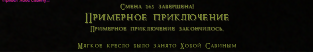

# Создание режима

Ознакомившись с основами редактора перейдем к созданию режима. Любому режиму для работы требуется карта и объекты на ней (например поверхности для хождения по ним, стены, потолки или точки спавна).
Перейдите в раздел меню `Карта` и нажмите `Создать новую карту`


Обратите внимание, что после создания новой карты она изначально будет загружена в рабочую область, поэтому предварительно сохраните и скомпилируйте текущую карту если это необходимо.


При создании появится окно загрузки после чего редактор будет перезапущен с новой картой.


После загрузки вам будет предложено ввести имя вашей новой карты.


Вводим название нашей карты. В серии руководств по созданию режимов и ролей мы будем использовать карту SampleMap. Нажимаем зеленую кнопку `Создать` и появляемся в привычном окне редактора.

Для начала построим небольшую сцену из земли. Обратите внимание, что верхние блоки мы поместили в слой `Потолок`, чтобы скрыть его на момент редактирования. Попробуйте самостоятельно поместить блоки потолка в отдельный слой. Подробнее о том как это сделать вы можете повторно посмотреть в [разделе о слоях](Editor_basics.md#список-объектов-и-слои)


Наша замечательная карта, по которой можно передвигаться завершена! Давайте наконец создадим для неё игровой режим!

Переходим в раздел меню `Инструменты` и выбираем `Создать режим`.


В открывшемся окне вводим название нашего режима. Префикс `GM` можно не писать, он добавится автоматически если вы его не указали.


Нажимаем `Ок`. Сгенерируются файлы режима и базовой роли для него. После этого новый режим с ролью добавится в библиотеку классов и наш режим будет создан с именем `GMSampleGamemode`.

Наш режим создан в папке `Src\host\GameModes` в виде папки с аналогичным именем, которое мы указали в предыдущем окне. Внутри этой папки изначально лежат 3 файла:
- **GMSampleGamemode.sqf** - Собственно описание класса нашего режима.
- **GMSampleGamemode_roles.sqf** - Описание базовой роли для нашего режима. Сюда же мы будем вписывать свои роли, про создание которых описано [в руководстве по созданию ролей](Editor_roles.md)
- **loader.hpp** - загрузчик всех файлов режима. Если мы добавляем свои файлы, относящиеся к режиму или например хотим отсортировать роли нашего режима по разным файлам, то все эти файлы так же должны быть дозагружены через loader.hpp.


# Разработка режима

Итак, откроем в редакторе VS Code файл **GMSampleGamemode.sqf**


В сгенерированном файле режима уже автоматически установлено его название и название нашей созданной карты. 

Строчка `#include <..\GameMode.h>` означает **подняться на директорию выше** и вставить содержимое из файла `GameMode.h` в целевой файл. Нужна она для того, чтобы нам не подключать массу различных заголовочных файлов для полной работы. Мы просто подключили GameMode.h и больше не паримся...

Дальше написан `editor_attribute("CodeOnyGamemode")`. Не придавайте этому особого значения. Это просто атрибут для режима редактора, который помечат класс как режим, разрабатываемый через код.

На следующей строке идёт определение (*декларация*) класса нашего игрового режима. Обратите внимание, что класс наследует логику от `GMBase`. GMBase - это базовый класс игрового режима, который поддерживает основную логику и предоставляет полезные функции. Вы можете ознакомиться с содержимым базового режима GMBase для ознакомления со всеми возможными полями и методами. Там они так же хорошо задокументированы как и в сгенерированном режиме, но в более системном формате.

Любой режим должен иметь название, описание и наверное какую-то продолжительность игры. Укажем в полях (переменных класса) имя режима (**name**), описание (**desc**), доступное при выборе администратором или через голосование а также расширенное описание (**descExtended**), показываемое в конце раунда. 

Продолжительность игры задается через поле продолжительности (**duration**), указываемое в секундах. Чтобы конвертировать секунды в минуты, нужно умножить количество минут на 60. Например, режим, длительностью 45 минут можно было бы определить таким образом: `var(duration,60*45);`.
Однако для дополнительного удобства в заголовочном файле `engine.hpp`, который кстати уже подключен в `GameMode.h` существет несколько полезных макросов для работы со временем:
- t_asMin(s) - Преобразуер значение s минут в секунды. 
```sqf
t_asMin(45); // 2700 секунд
```
- t_asHrs(s) - Преобразует значение s часов в секунды.
```sqf
t_asHrs(2); // 7200 секунд
```


Ниже идёт константная функция `getMapName`. Она просто возвращает название файла карты. Кстати если преобразовать константную функцию в обычную, то можно настроить логику выбора разных карт одним режимом.

Далее раздел настроек случайности. Раздел подробно задокументирован и тут нужно лишь подобрать оптимальные значения.

В разделе настроек для лобби (`getLobbySoundName, getLobbyBackground`) можно указать задний фон лобби и музыкальную тему. Аудио лежит в папке `Resources\music`. Композиция должна быть в `.ogg` формате. Изображения для лобби лежат в папке `Resources\ui\lobby` и сохранены в формате `.paa`.

# Добавление ролей в режим

Чуть ниже после настроек заднего фона лобби и музыки присутствуют 2 метода со списоком ролей для лобби и во время игры. Более детально добавление ролей будет рассмотрено в [руководстве по созданию ролей](Editor_roles.md)

## getLobbyRoles
- Данный метод должен возвращать массив строк. В строках должны быть указаны имена классов ролей, которые будут доступны до старта раунда. 
## getLateRoles
- Данный метод должен возвращать массив строк, аналогично getLobbyRoles. Этот список становится доступен сразу после старта раунда. Так же роли, которые настроены как доступные после старта раунда также будут автоматически переноситься в этот список. Это значит, что вам не требуется дублировать роли, доступные во время всего цикла игры в оба массива.

# Дополнительные настройки режима
Раздел дополнительных настроек позволяет включить режим в систему голосования, разрешить систему аспектов раунда и настроить работу случайных событий (*Влияний Реликты*), происходящих во время процесса игры.

# Основные события режима

Перед началом раунда мы должны убедиться что все условия для его старта соблюдены. Чаще всего это выражается в проверке занятости определенных ролей, реже для проверки количества человек на сервере. Однако вы можете добавить любую пользовательскую логику условия для старта режима.

## Событие возможности старта режима

Для проверки возможности запуска режима существует метод **conditionToStart**, который должен возвращать `bool` и выполняющийся когда таймер лобби становится равен 0. В случае **true** режим будет запущен, а в случае **false** таймер запустится заново. 

Например напишем простую проверку, что за все доступные лобби роли зашёл хотя бы один человек. Для получения количества кандидатов, занявших определенную роль в базовом режиме `GMBase` определён метод **getCandidatesCount**:

```sqf
func(conditionToStart)
{
	objParams();

	// Получаем количество ролей, доступных в лобби
	// count - встроенная унарная функция
	private _countLobbyRoles = count callSelf(getLobbyRoles);
	// Счетчик ролей, которые кто-то занял
	private _countNonEmptyRoles = 0;

	// Итерируем (перебираем) каждый элемент массива, возвращаемого getLobbyRoles
	{
		// на каждой итерации специальная переменная _x принимает значение текущего элемента массива

		// вызываем метод getCandidatesCount, передав аргументом _x (класснейм роли) 
		// и сравниваем больше нуля количество кандидатов на роль
		if (callSelfParams(getCandidatesCount,_x) > 0) then {
			// Увеличиваем счетчик непустых ролей на 1
			_countNonEmptyRoles = _countNonEmptyRoles + 1;
		};
	} foreach callSelf(getLobbyRoles);

	// Последнее выражение является "возвращаемым значением"

	// Если счетчик непустых ролей равен количеству всех ролей
	_countNonEmptyRoles == _countLobbyRoles
};
```

Но игрокам хотелось бы знать причину чего действительно не хватило для запуска режима. На этот случай существует метод **onFailReasonToStart**, который должен возвращать строку. Данная строка будет выведена в лобби в момент когда таймер сбросился.

```sqf
func(onFailReasonToStart)
{
	objParams();
	"Не все роли заняты";
};
```

Получилось достаточно обобщенно. Хотелось бы больше информативности. Давайте немного изменим метод, и выведем какие именно роли не были заняты:

```sqf
func(onFailReasonToStart)
{
	objParams();
	
	// Создаем пустой массив, в который будет добавлять не занятые роли
	private _needRoles = [];
	
	{
		if (callSelfParams(getCandidatesCount,_x) == 0) then {
			_needRoles pushBack _x; // pushBack - бинарная встроенная функция
			// Означает: поместить элемент _x в конец массива _needRoles
		};
	} foreach callSelf(getLobbyRoles);

	// joinString - встроенная бинарная функция, которая соединяет элементы массив строк разделителем:
	// ["1","2","3","4"] joinString " and "; "1 and 2 and 3 and 4"
	"Не все роли заняты. Нужно занять: " + (_needRoles joinString ",");
};
```

Отлично. Теперь **onFailReasonToStart** будет информировать какие именно роли не были заняты. Однако они будут выводиться как имена классов. Сделаем небольшой хак и ещё немного улучшим данный метод, вычислив из имени типа значение имени роли.

```sqf
func(onFailReasonToStart)
{
	objParams();

	private _needRoles = [];

	{
		if (callSelfParams(getCandidatesCount,_x) == 0) then {
			// Проверим действительно ли существует класс с таким именем
			
			// isImplementClass() - макрос, который в качестве аргумента
			// принимает строку и проверяет есть ли класс, определенный 
			// с таким названием. Например, isImplementClass("GMSampleGamemode") вернет true

			if isImplementClass(_x) then {

				// getFieldBaseValue() - макрос, который принимает в качестве
				// аргументов строку с именем класса и строку с именем поля (переменной)
				// и возвращает начальное значение, определенное в классе
				private _roleName = getFieldBaseValue(_x,"name");
				_needRoles pushBack _roleName;
			};
		};
	} foreach callSelf(getLobbyRoles);

	"Не все роли заняты. Нужно занять: " + (_needRoles joinString ",");
};
```

> **Обратите внимание!**
>> Макросы для работы с типами `isImplementClass()` и `getFieldBaseValue()` определены в основном заголовочном файле `oop.hpp`, который так же содержится внутри `GameMode.h`

# Ключевые события и цикл раунда

Ещё ниже мы можем наблюдать группу методов, которые вызываются в основных точках режима: старте, конце и на каждой секунде.

## Событие preSetup
Данный метод вызывается когда наш режим GMSampleGamemode был установлен администратором, локальной симуляцией (при редактировании через SDK) либо выбран на сервере системой как случайный. Иными словами - метод является стартовой точкой цикла симуляции режима. 
В момент вызова метода **preSetup** карта уже создана, поэтому мы можем предварительно подготовить её перед началом раунда: создать или удалить дополнительные объекты или просчитать сложные вычисления (например, сгенерировать пещеры), которые могут понадобится при старте или во время раунда. 

Для примера работы давайте попробуем заменить все наши блоки земли на каменные блоки.

Порядок действий в коде будет таков:
1. Собираем все блоки земли (с именем класса BlockDirt) на карте с помощью функции `getAllObjectsInWorldTypeOf`
2. Получаем позицию и направление каждого из блока
3. Создаем декорацию блока камня (тип BlockStone) на позиции блока земли
4. Удаляем блок земли.

```sqf
	// Вызывается когда режим GMSampleGamemode выбран (до старта раунда с загруженной картой)
	func(preSetup)
	{
		objParams();

		// Получаем список всех блоков земли на карте
		// Второй аргумент означает нужно ли возвращать объекты, унаследованные от BlockDirt
		private _listBlocks = ["BlockDirt",false] call getAllObjectsInWorldTypeOf;
		{
			// Получаем координаты блока
			private _blockPos = callFunc(_x,getPos);
			private _blockDir = callFunc(_x,getDir);
			
			// Создаем декорацию BlockStone
			// 4 аргумент принимает false для того, чтобы объект оставался висеть на созданной позиции
			// Иными словами, аргумент указывает, что нужно отключить "эмуляцию падения" объекта
			["BlockStone",_blockPos,_blockDir,false] call createDecoration;
			
			// Удаляем блок земли
			delete(_x);
		} foreach _listBlocks;
	};
```

Теперь неплохо было бы проверить что у нас получилось. Для этого давайте поставим внутри нашей сцены немного освещения и затем нажмем ПКМ по поверхности земли. После этого в контекстном меню выберем `Запустить симуляцию отсюда`. Данный пункт предназначен для мгновенного спавна персонажа на карту в указанную вами точку.


И в игре мы видим, что наши блоки земли стали... блоками камня!


Это был лишь небольшой пример использования события preSetup. Конечно вы можете придумать массу способов и вариантов использования данного события. Всё зависит лишь от вашей фантазии.

## Событие postSetup
Данный метод вызывается сразу после старта раунда, когда все игроки уже загрузились в свои роли. **postSetup** полезен, если мы хотим произвести некоторую режимную логику, требующую информации о персонажах, которые есть в игре со старта раунда. Например: обработать антагонистов - выдать им задачи и информационные сообщения о том, что именно им нужно сделать. И пока мы ещё не добрались до части кода, отвечающего за обработку и выбор антагонистов, предлагаем сделать голод всем персонажам, зашедшим в раунд с начала. А чтобы они не умерли с голоду - дадим им в руки немного еды.

Здесь порядок действия имеет много схожего с кодом, который мы писали для события preSetup:
1. Собираем всех сущностей (персонажей) на карте с помощью функции getAllMobsInWorld.
2. Устанавливаем каждому персонажу голод на некоторое значение.
3. Выдаем персонажу предмет в активную руку с помощью createItemInInventory

```sqf
// Вызывается после начала раунда когда все клиенты зашли в игру
func(postSetup)
{
	objParams();

	// Получаем список всех персонажей на карте
	// Второй аргумент означает нужно ли возвращать объекты, унаследованные от Mob
	// Так как женские персонажи унаследованы от Mob, то устанавливаем агрумент как true
	private _allMobs = ["Mob",true] call getAllMobsInWorld;

	{
		// Устанавливаем голод на низкое значение
		callFuncParams(_x,setHunger,20);

		// Выдаем персонажу еду в активную руку
		["Egg",_x] call createItemInInventory;
	} foreach _allMobs;
};
```

Когда вы отредактировали код клиента или сервера, нажмите `Esc` и нажмите розовую кнопку `Compile and run`. После этого все классы и функции будут перекомпилированы и цикл симуляции запустится сначала. 

Вышло достаточно примитивно, но зато наш персонаж не умрет с голоду... в ближайшее время.

## Обработчик checkFinish
Каждый раунд должен в конце концов быть завершен. И на наши плечи ложится ответственность за то, чтобы он заканчивался различными способами. Для этого нам понадобится метод **checkFinish**. Он вызывается раз в секунду с начала раунда и до его конца. Как правило checkFinish обрабатывает логику, проинициализированную в postSetup. 

В нашем сгенерированном режиме checkFinish уже обрабатывает длительность раунда. Давайте попробуем добавить условие, что раунд завершится если вся еда, выданная персонажам в postSetup была съедена. Для этого придется немного модифицировать метод postSetup, занеся каждое созданное яйцо в массив, который в checkFinish будет проверяться раз в секунду.

```sqf
var(allEggs,[]); //сюда будут записываться объекты созданной нами еды

func(postSetup)
{
	objParams();

	private _allMobs = ["Mob",true] call getAllMobsInWorld;

	{
		// Устанавливаем голод на низкое значение
		callFuncParams(_x,setHunger,20);

		// Выдаем персонажу еду в активную руку
		private _newEgg = ["Egg",_x] call createItemInInventory;
		
		// Добавляем в массив allEggs созданное яйцо
		getSelf(allEggs) pushBack _newEgg;
	} foreach _allMobs;
};
```

Теперь изменим checkFinish:

```sqf
// Проверка режима. Выполняется каждую секунду
// Возвращаемое значение должно быть числом
// Любое число, не равное 0 означает конец режима
func(checkFinish)
{
	objParams();

	// Обработка конца режима по времени
	if (gm_roundDuration >= getSelf(duration)) exitWith {1};
	
	// Добавьте тут пользовательскую логику конца режима.

	// Получаем количество яиц созданных в postSetup
	private _existsEggs = count getSelf(allEggs);
	{
		// Когда яйца съедены они удаляются и все ссылки на них принимают nullPtr значение
		// Таким образом если яйца не существует - уменьшаем счетчик существующих яиц
		if isNullReference(_x) then {
			_existsEggs = _existsEggs - 1;
		};
	} foreach getSelf(allEggs);

	// Если счетчик существующих яиц меньше либо равен 0 завершаем раунд с кодом 2
	if (_existsEggs <= 0) exitwith {2};
	
	0
};
```
Но вот режим завершается и мы видим следующее:


**Неизвестная причина** - это необработанное условие конца раунда. Если бы в раунде закончилось время, то нам показало совершенно другую причину конца раунда. А как определить свою причину завершения смотрите ниже

### Вывод результата конца раунда
Для вывода результата конца раунда используется метод **getResultTextOnFinish**. Принцип работы аналогичен методу `onFailReasonToStart`, только вызывается он когда режим завершён. Для получения результата конца раунда используйте `getSelf(finishResult)`

```sqf
func(getResultTextOnFinish)
{
	objParams();

	if (getSelf(finishResult) == 1) exitWith {
		"Время режима закончилось."
	};
	// Добавляем свою причину когда съедены все яйца
	if (getSelf(finishResult) == 2) exitWith {
		"Все яйца съедены."
	};
	
	
	"Неизвестная причина."
};
```


Таким образом мы можем создавать и комбинировать множество различных вариаций конца режима. Тут опять же всё упирается в вашу фантазию.

## Событие onFinish

В методе **onFinish** обычно выводится результат конца раунда в более подробной форме. Обратите внимание, что изначально onFinish вызывает базовый метод с помощью ооп-макроса `super()`. Иными словами - super вызывает функционал метода onFinish, определенного в GMBase. Так нам не требуется каждый раз дублировать какой-либо код. В базовом методе onFinish выводится коротка сводка конца раунда, включающая название, описание, результат из getResultTextOnFinish, статистические данные как например количество выбитых зубов.

# Работа с антагонистами

Антагонисты - это персонажи, которые имеют собственные цели, направленные на завершение режима. В "Поместье Хвостово" антагонист это убийца, в Грязноямске они могут быть Агентами Новой Армии и т.д. Антагонисты добавляют дополнительный интерес к общему геймлею и делают раунд более разнообразным.

В разделе, посвященному настройке антагонистов есть всего лишь несколько методов, которые помогут настроить злодеев режима.

## Требуемое количество антагонистов

В начале раздела мы видим 2 метода:

```sqf
getterconst_func(getMinFullAntags,1);
getterconst_func(getMinHiddenAntags,1);
```

Это минимальное количество игроков, которые выбрали в настройках лобби полных и скрытых антагонистов. При старте раунда система автоматически проверяет сколько людей выбрали нужный тип антагонистов. Если это количество не удовлетворяет по каким-либо причинам, то система будет осуществлять выбор антагонистов из всех игроков.

> Пример
>> Режим требует 3 полных антагониста, но на сервере их выбрало лишь 1 игрок. В этом случае система будет выбирать из всех игроков, роли которых могут быть антагонистами.

Обратите внимание, что в настройках лобби есть 4 режима антагониста:
- **Нет** - означает, что игрок не хочет быть антагонистом.
- **Скрытый** - означает, что игрок хочет быть только скрытым антагонистом.
- **Полный** - означает, что игрок хочет быть только полным антагонистом.
- **Все** - означает, что игрок хочет быть либо скрытым, либо полным антагонистом.

Если игрок выбрал "**Все**" в настройках лобби он одновременно считатеся как желающий стать полным антагоистом и/или скрытым антагонистом.

## Полные антагонисты

В коде режима ниже расположен метод **getAntagRoleFull**, который выполняется при старте раунда до того как все игроки заспавнились за свои роли. Этот метод нацелен на то, чтобы переопределить выбранную роль игрока на особую роль антагониста, с другими характеристиками, снаряжением, задачами и расположением.

Метод **getAntagRoleFull** имеет 2 параметра:
- **_client** - ссылка на объект `ServerClient` (клиента игрока). Имея ссылку на клиента можно сделать например так, чтобы антагонист выдавался только клиентам, у которых никнейм содержит букву `E` или клиентам, которые имеют уровень доступа выше чем `ACCESS_PLAYER`.
- **_index** - порядковый номер (начинается с 1) проверяемого клиента. Когда запускается процесс определения полных антагонистов все готовые игроки проверяются в массиве готовых игроков. Все элементы (игроки) этого массива находятся в случайном порядке. Поэтому мы никогда не знаем какой именно игрок будет проверен при каждом вызове **getAntagRoleFull**

Метод **getAntagRoleFull** возвращает строку, которая является именем класса антагониста, который должен определить пользователь. Если метод возвращает пустую строку, значит для данного клиента роль не будет заменена и он не станет антагонистом. Более подробно про антагонистов будет рассмотрено в разделе, [посвященному созданию ролей](Editor_roles.md)

Внутри этого метода так же существуют 2 специальных переменных с зарезервированными именами:
 - **_countInGame** - эта локальная переменная имеет целочисленное значение, отражающее количество игроков, у которых была нажата кнопка готовности на момент старта раунда. Иными словами - это количество людей, которые будут начинать игру со старта раунда. Обратите внимание, что некоторым игрокам после распределения могло бы не хватить ролей, но они так же будут подсчитаны в этом списке.
 - **_countProbFullAntags** - эта локальная переменная имеет целочисленное значение, отражающее сколько выбрали в лобби "Полных антагонистов", либо всех игроков, если не набралось необходимое (`getMinFullAntags`) количество полных антагонистов.
Данные переменные помогут вам вычислить например процентное значение от всех игроков, которые действительно получат антагонистов. Чуть ниже простой пример, который будет выдавать первым 20 процентам игроков антагониста при 30 игроках, зашедших в раунд:

```sqf
func(getAntagRoleFull)
{
	objParams_2(_client,_index);
	
	// _countInGame - имеет значение 30

	// Выбираем первые 20 процентов от игроков и делаем антагонистами

	// Если номер проверяемого игрока меньше чем
	if (_index <= (
		(
			round( // округляем если число не целое
				_countInGame * 20 / 100 // 20% от 30 игроков = 6
			)
		) max 1) // выбираем большее между значениями слева и справа от max. Иначе говоря делаем, чтобы было не меньше 1 антагониста
	) exitWith {

		// Пример роли антагониста
		"RAnyAntagonist_GMSampleGamemode"
	};

	""
};
```

Таким образом получается, что первые 6 игроков от всех 30, проверяемых в **getAntagRoleFull** получат роль антагониста `RAnyAntagonist_GMSampleGamemode` вместо той, на которую они претендовали изначально. 

## Скрытые антагонисты

Ещё чуть ниже мы видим метод **handleAntagRoleHidden**, который отвечает за обработку скрытых антагонистов. Скрытые антагонисты отличаются от полных лишь тем, что не получают явной подмены роли в момент назначения. Данный метод вызывается при старте раунда, когда все игроки уже зашли за свои роли и требует определения пользовательской логики по определению скрытых антагонистов и выдачи им каких-либо задач.

Метод **handleAntagRoleHidden** имеет 3 параметра:
- **_client** - ссылка на объект клиента.
- **_mob** - ссылка на игрового персонажа.
- **_index** - порядковый номер проверяемого персонажа, начинающийся с 1.

Как и в случае с `getAntagRoleFull` метод обрабатывает случайно перемешанный массив игроков, которые зашли в игру со старта, но ему не требуется возвращаемое значение, так как скрытые антагонисты не получают отдельной роли. 

Аналогично предыдущему методу, в **handleAntagRoleHidden** есть 2 специальных зарезервированных переменных:

 - **_countInGame** - эта локальная переменная имеет целочисленное значение, отражающее количество игроков, успешно зашедших в раунд.
 - **_countProbHiddenAntags** - эта локальная переменная имеет целочисленное значение, отражающее сколько выбрали в лобби "Скрытых антагонистов", либо всех игроков, если не набралось необходимое (`getMinHiddenAntags`) количество скрытых антагонистов.

Давайте попробуем выдать скрытого антагониста первым двум проверяемым игрокам и дать им задачу - сесть на некоторе клесло.

Если вы в игре - нажмите `Esc` и выбереите слева снизу пункт `Вернуться в ReEditor`

Для начала на нашей карте создадим кресло и глобальную ссылку для него, чтобы немного уменьшить количество написанного кода. Чтобы найти кресло, вбейте в поисковой строке библиотеки объектов `chair`

> Глобальная ссылка, это уникальный идентификатор игрового объекта, с помощью которого можно быстро получить доступ к игровому объекту, созданному на карте. Для получения игрового объекта по глобальный ссылке используйте функцию `getObjectByRef`.


```sqf
var(hiddenAntags,[]); //массив скрытых антагонистов

func(handleAntagRoleHidden)
{
	objParams_3(_client,_mob,_index);

	if (_index <= 2) then {
		getSelf(hiddenAntags) pushBack _mob;
	};
};
```

Добавим в **postSetup** вывод задачи нашим антагонистам.

```sqf

func(postSetup)
{
	objParams();

	private _allMobs = ["Mob",true] call getAllMobsInWorld;

	{
		callFuncParams(_x,setHunger,20);
		private _newEgg = ["Egg",_x] call createItemInInventory;
		getSelf(allEggs) pushBack _newEgg;
	} foreach _allMobs;

	// ---------- hidden antags logic ----------

	// Получаем скрытых антагонистов.
	private _hiddenAntags = getSelf(hiddenAntags);

	private _message = "Займите своим седалищем роскошное кресло, пока это не сделали другие!";

	// Установим стиль сообщения, чтобы его было лучше видно в воспоминаниях

	// setstyle(), style_redbig - макросы для работы со стилями текста, определенные в text.hpp
	_message = setstyle(_message,style_redbig);

	{
		// Добавляем запись в сообщение при первом подключении.
		callFuncParams(_x,addFirstJoinMessage,_message);

		// Добавляем запись в воспоминания.
		callFuncParams(_x,addMemory,_message);
	} foreach _hiddenAntags;

};
```

Немного изменим наши методы **checkFinish** и **getResultTextOnFinish**, дополнив их обработкой для скрытых антагонистов.

```sqf
var(sittingOnChair,nullPtr); // сюда чуть позже впишем антагониста через checkFinish, который сел на стул

func(checkFinish)
{
	objParams();

	if (gm_roundDuration >= getSelf(duration)) exitWith {1};
	
	private _existsEggs = count getSelf(allEggs);
	{
		if isNullReference(_x) then {
			_existsEggs = _existsEggs - 1;
		};
	} foreach getSelf(allEggs);

	if (_existsEggs <= 0) exitwith {2};

	// ---------- hidden antags logic ----------

	private _result = 0;

	// Получаем игровой объект по глобальной ссылке
	private _kreslo = "tron" call getObjectByRef;
	
	// Проверяем если кресло существует в мире
	if !isNullReference(_kreslo) then {

		// Получаем того, кто сидит на кресле. 
		// Если на кресле никто не сидит, то метод возвращает nullPtr
		private _seatOwner = callFuncParams(_kreslo,getSeatOwner,null);
		if !isNullReference(_seatOwner) then {
			
			// Если сидящий на кресле находится в массиве скрытых антагонистов, 
			// значит сидящий - скрытый антагонист.

			// array_exists() - макрос, определенный в engine.hpp
			if array_exists(getSelf(hiddenAntags),_seatOwner) then {
				_result = 3; // Новый результат конца раунда

				// Сохраним нашего антагониста, чтобы вывести его имя в getResultTextOnFinish
				setSelf(sittingOnChair,_seatOwner);
			};

		};
	};
	
	_result
};


func(getResultTextOnFinish)
{
	objParams();

	if (getSelf(finishResult) == 1) exitWith {
		"Время режима закончилось."
	};
	
	if (getSelf(finishResult) == 2) exitWith {
		"Все яйца съедены."
	};
	
	if (getSelf(finishResult) == 3) exitWith {
		// getNameEx - позволяет вернуть имя и фамилию персонажа в нужном склонении
		"Мягкое кресло было занято " + callFuncParams(getSelf(sittingOnChair),getNameEx,"кем")
	};
	
	"Неизвестная причина."
};

```

После всех изменений снова выбираем поверхность на карте с помощью `ПКМ` и выбираем пункт контекстного меню `Запустить симуляцию отсюда`

В симуляции откройте воспоминания вашего персонажа и вы увидите вашу задачу:


Попробуем сесть на кресло и режим закончится!



На этом руководство по разработке режима завершено. Не забудьте сохранить нашу карту в ReEditor. Экспериментируйте различные варианты, создавайте собственные режимы и не бойтесь спрашивать непонятные моменты в нашем [дискорде](discord.relicta.ru).

## [Вернуться назад](README.md)