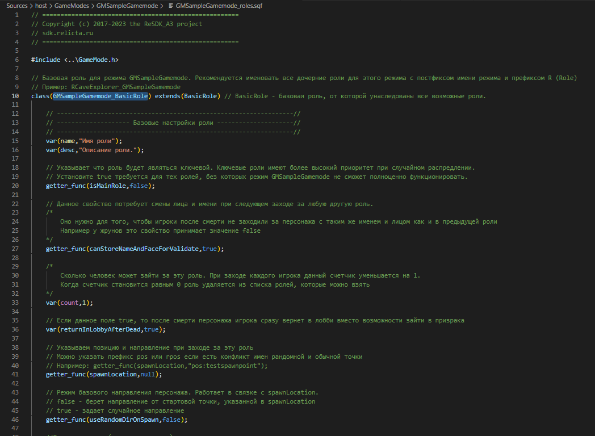
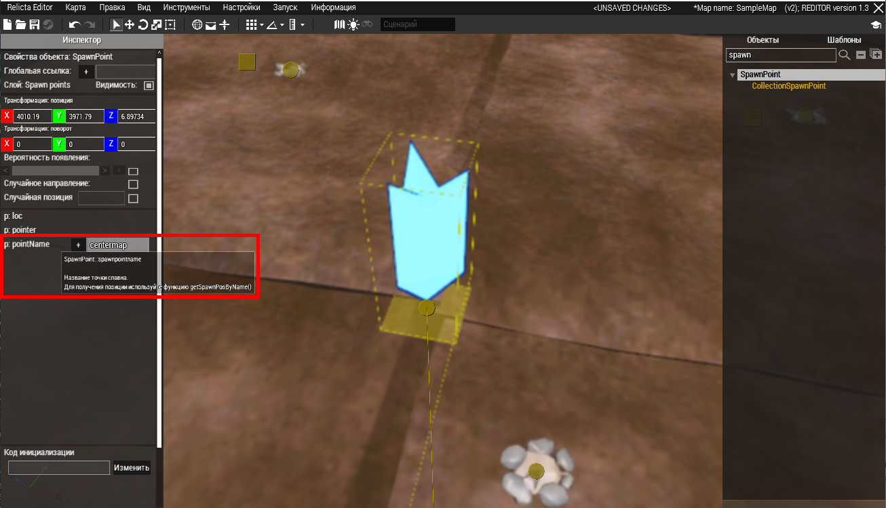
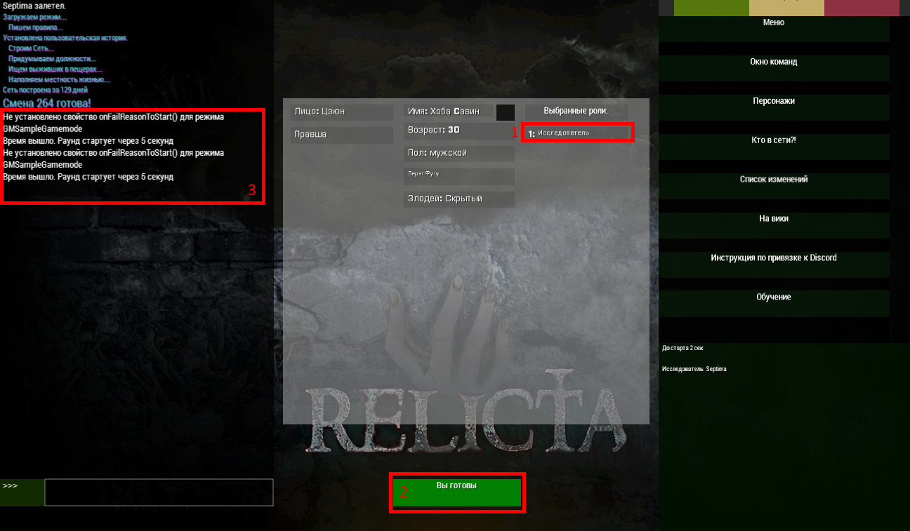

# Создание ролей

Создание ролей занимает львиную долю при разработке режима. Важно знать все ньюансы и уметь пользоваться всеми функциями, доступными для создания ролей. Данное руководство предназначено для изучения создания ролей, разделенное на разделы. Чтобы лучше вникнуть в весь процесс рекомендуем **последовательно** изучать каждый из разделов.

Когда мы создали наш режим `GMSampleGamemode` были созданы 2 файла: `GMSampleGamemode.sqf`, отвечающий за логику режима и `GMSampleGamemode_roles.sqf` - в котором мы будем описывать роли, существующие в этом режиме.

> Внимание!
>> Перед руководством по ролям редкомендуем предварительно ознакомиться с [гайдом по созданию режима](Editor_newgamemode.md), так как в процессе создания ролей мы будем редактировать некоторые методы в нашем режиме.

Давайте откроем файл `GMSampleGamemode_roles.sqf` в редакторе VS Code



Данный файл сгенерировал класс роли `GMSampleGamemode_BasicRole`, от которого мы будем наследовать все наши роли, доступные в режиме `GMSampleGamemode`. Обратите внимание, что наша базовая роль унаследована от класса `BasicRole`, которая предоставляет множество полезных и базовых функций для любых ролей.

# Создание новой роли режима

Каждая роль имеет имя и описание, отображаемое в лобби. Для базовой роли мы не будем менять описание, поэтому давайте унаследуем `GMSampleGamemode_BasicRole`, создав от неё класс ниже.

```sqf
class(RExplorer_GMSampleGamemode) extends(GMSampleGamemode_BasicRole)
	
	var(name,"Исследователь");
	var(desc,"Вам предстоит исследовать тестовый режим");

endclass
```

В данном примере мы создали роль `RExplorer_GMSampleGamemode`. Вы можете выбрать другое название роли, но обратите внимание на префикс `R` в начале роли. Это стандартизированное название пользовательских ролей, предназначенное для избежания конфликта имён и удобного поиска по ролям. Так же в роли присутствует постфикс `_GMSampleGamemode` аналогичный имени нашего режима. Он нужен чтобы другие разработчики ролей понимали, что эта роль создана и используется для режима `GMSampleGamemode`.

> Проблема конфликта имён!
>> ООП расширение sqf, написанное специально для ReSDK не имеет поддержки пространств имён. Если бы в одном режиме мы создали роль `Head` и во втором с таким же именем мы получили бы конфликт имен, так как есть игровой предмет, имеющий класс `Head` и 2 наших роли в разных режимах. Именно поэтому для классов ролей существует стандартизированное правило именования, обязывающее указывать префикс `R` и постфикс с именем режима.

Пока что наша роль не готова к игре. Её необходимо [добавить в режим](#прописывание-роли-в-режим) и установить [позицию спавна](#позиция-спавна)

## Прописывание роли в режим

После создания роли нам необходимо добавить её в список ролей для лобби, либо для ролей, доступных после начала раунда.

Вернемся к файлу режима, найдем метод **getLobbyRoles** и добавим туда нашу роль:
```sqf
// Список ролей (имён классов) для режима GMSampleGamemode, доступных до старта раунда.
func(getLobbyRoles)
{
	[
		// Введите тут строковые имена классов ролей через запятую
		/*
			Пример:
				"GMSampleGamemode_BasicRole1",
				"GMSampleGamemode_BasicRole2",
				"GMSampleGamemode_BasicRole3"
		*/
		"RExplorer_GMSampleGamemode"
	]
};
```

Чтобы роль была видна в списке до старта раунда убедитесь, что в роли метод **canTakeInLobby** возвращает true, но так как мы унаследовали роль от `GMSampleGamemode_BasicRole` данный метод уже возвращает true.

Аналогичным способом мы можем добавить роль в список ролей, доступных после старта раунда. Для этого мы можем добавить роль в метод **getLateRoles**. Так же нужно убедиться, что метод роли **canVisibleAfterStart** возвращает true. 
*(По умолчанию у сгенерированной базовой роли для любого из пользовательских режимов метод **canVisibleAfterStart** уже возвращает true.)*

> Обратите внимание!
>> Если роль уже есть в списке **getLobbyRoles** и её метод **canVisibleAfterStart** возвращает true, то она автоматически будет доступна после старта раунда.

# Общие настройки роли

После имени и описания мы видим несколько методов и полей общего назначения. Давайте рассмотрим их поподробнее:

## Свойство главной роли

Для указания что роль является главной (ключевой) существует метод **isMainRole**. Обычно он используется в пользовательском коде, а конкретно при распределении антагонистов. Если у нас есть старейшина деревни, который является ключевой ролью, было бы странно и неинтересно если бы он стал антагонистом-маньяком, цель которого убить всех жителей.

## Требование смены лица и имени после смерти

Когда игрок умирает и возвращается в лобби он может зайти за нового персонажа. В обычных условиях настройки лобби, а конкретно лицо и имя остаются от старого персонажа. И получается не классно, когда умерший игрок заходит за персонажа с таким же именем и лицом в раунд как его предыдущий погибший персонаж. 

Для решения этой проблемы существует метод **canStoreNameAndFaceForValidate**, который при значении `true` обязывает системно сменить лицо и имя, которые должны отличаться от данных предыдущего персонажа игрока. Значение `false` можно применять например для различных монстров, у которых (вероятнее всего) нет лица и имени.

## Количество слотов роли

Большинство ролей обычно ограничены в своем количестве. Так например в городе может быть только 1 Голова, 10 ополченцев, 2 лекаря и т.д.

Для ограничения количества заходов за роль существует переменная роли **count**, в которой мы можем указывать количество персонажей, которые могут зайти за эту роль из лобби. Когда игрок заходит за роль, её значение **count** уменьшается на 1. При достижении нуля роль убирается из списка доступных. Однако, так как это переменная роли, мы можем динамически управлять количеством ролей во время раунда. Например, если на сервер заходит больше человек, а ролей остаётся мало, то можно увеличить количество.

Для получения объекта роли во время выполнения из любого места в коде используйте функцию `gm_getRoleObject`

```sqf
// Получаем объект роли
private _myRole = "RExplorer_GMSampleGamemode" call gm_getRoleObject;

// Устанавливаем количество "слотов" для роли, равное 10
setVar(_myRole,count,10); 
```

> Обратите внимание!
>> Если роль уже убрана системой при достижении нуля, изменение её значения поля **count** не вернёт роль обратно в список доступных.

## Возврат в лобби после смерти

Обычно при смерте персонажа игрок может покинуть его тело, зайдя за призрака. В некоторых случаях (например если игрок играл за монстра) заходить за призрака не целесообразно. Для мгновенного возврата в лобби после смерти персонажа существует переменная **returnInLobbyAfterDead**. Если она принимает значение, true то игрок сразу вернется в лобби когда его персонаж погибнет.

# Позиция спавна
До сих пор мы либо запускали симуляцию через контекстное меню, либо ещё не заходили за нашу созданную роль `RExplorer_GMSampleGamemode`. Выше мы уже добавили её в режим. Теперь необходимо задать отправную точку, на которой будет появляться персонаж.

Для этого в редакторе нужно добавить точку спавна. В библиотеке объектов введем в поисковую строку `spawn` и найдем в списке классов SpawnPoint.


**SpawnPoint** - это единичная точка спавна. Позиция и направление этой точки будет начальным расположением, на которое будет помещён наш персонаж при входе в игру. От **SpawnPoint** унаследован класс **CollectionSpawnPoint** его отличием является выбор одной случайной позиции спавна из списка точек с одинаковым именем. Оба вида точек рассмотрим [чуть ниже](#случайные-точки-спавна). 

Для начала добавим на карту один SpawnPoint и укажем ему уникальное имя.



## Привязка точки спавна к роли

После создания на карте точки спавна и указания ей имени мы можем прописать эту точку для нашей роли `RExplorer_GMSampleGamemode`. Для привязки спавна ролям существует метод **spawnLocation**, который должен возвращать строку, являющуюся именем спавна, который задается как `pointName` в инспекторе.

```sqf
getter_func(spawnLocation,"centermap");
```

Если мы хотим расширенную логику спавна, то можно развернуть метод **spawnLocation** в обычный. Например, мы хотим сделать так, чтобы персонажи, зашедшие со старта раунда спавились в точке `spawn1`, а зашедшие после старта в `spawn2`:

```sqf
func(spawnLocation)
{
	objParams();
	
	private _spawnName = "";
	
	// Для проверки когда зашёл игрок (на старте или после него)
	// используется метод, определенный в BasicRole - isLateAssigned
	// Если вовзаращает true - игрок зашёл после старта раунда
	// Если false - зашел на старте раунда
	if callSelf(isLateAssigned) then {
		_spawnName = "spawn2";
	} else {
		_spawnName = "spawn1";
	};

	_spawnName // возвращаем значение
};
```

Теперь когда с созданием спавна и его привязкой к роли покончено можно запустить симуляцию.


Если режим загрузился без ошибок мы увидем окно лобби. Выбираем роль, нажимаем готовность, но что-то не так. Режим не запукается.



В выделенное зоне 3 мы видим сообщение `Не установлено свойство onFailReasonToStart() для режима GMSampleGamemode`. Похоже, мы забыли добавить условие старта раунда. Вернёмся в файл режима и найдём метод **conditionToStart**. И действительно, если вы его не меняли, то там будет просто возврат false, который означает, что режим не выполняет никаких проверок условия старта и просто бесконечно крутится в цикле *безуспешных запусков*.

Давайте изменим этот метод, добавив условие, что за роль `RExplorer_GMSampleGamemode` зашёл хотя-бы один человек.

# TODO change after fix <Editor_newgamemode>

## Случайные точки спавна

Но если нам нужно сделать случайный спавн на одной из 100 позиций? Писать каждому спавну вручную centermap1, centermap2 ... и так до 100 очень долго. А если бы мы просто скопировали нашу точку, то при сборке карты в консоли бы отобразилась ошибка:

> SpawnPoint 'centermap' double define at position

Для коллекции случайных точек с одинаковым названием мы будем использовать **CollectionSpawnPoint**