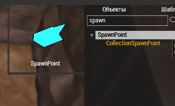
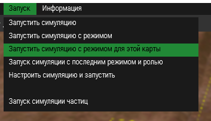

# Создание ролей

Создание ролей занимает львиную долю при разработке режима. Важно знать все ньюансы и уметь пользоваться всеми функциями, доступными для создания ролей. Данное руководство предназначено для изучения создания ролей, разделенное на разделы. Чтобы лучше вникнуть в весь процесс рекомендуем **последовательно** изучать каждый из разделов.

Когда мы создали наш режим `GMSampleGamemode` были созданы 2 файла: `GMSampleGamemode.sqf`, отвечающий за логику режима и `GMSampleGamemode_roles.sqf` - в котором мы будем описывать роли, существующие в этом режиме.

> Внимание!
>> Перед руководством по ролям редкомендуем предварительно ознакомиться с [гайдом по созданию режима](Editor_newgamemode.md), так как в процессе создания ролей мы будем редактировать некоторые методы в нашем режиме.

Давайте откроем файл `GMSampleGamemode_roles.sqf` в редакторе VS Code


Данный файл сгенерировал класс роли `GMSampleGamemode_BasicRole`, от которого мы будем наследовать все наши роли, доступные в режиме `GMSampleGamemode`. Обратите внимание, что наша базовая роль унаследована от класса `BasicRole`, которая предоставляет множество полезных и базовых функций для любых ролей.

# Создание новой роли режима

Каждая роль имеет имя и описание, отображаемое в лобби. Для базовой роли мы не будем менять описание, поэтому давайте унаследуем `GMSampleGamemode_BasicRole`, создав от неё класс ниже.

```sqf
class(RExplorer_GMSampleGamemode) extends(GMSampleGamemode_BasicRole)
	
	var(name,"Исследователь");
	var(desc,"Вам предстоит исследовать тестовый режим");

endclass
```

В данном примере мы создали роль `RExplorer_GMSampleGamemode`. Вы можете выбрать другое название роли, но обратите внимание на префикс `R` в начале роли. Это стандартизированное название пользовательских ролей, предназначенное для избежания конфликта имён и удобного поиска по ролям. Так же в роли присутствует постфикс `_GMSampleGamemode` аналогичный имени нашего режима. Он нужен чтобы другие разработчики ролей понимали, что эта роль создана и используется для режима `GMSampleGamemode`.

> Проблема конфликта имён!
>> ООП расширение sqf, написанное специально для ReSDK не имеет поддержки пространств имён. Если бы в одном режиме мы создали роль `Head` и во втором с таким же именем мы получили бы конфликт имен, так как есть игровой предмет, имеющий класс `Head` и 2 наших роли в разных режимах. Именно поэтому для классов ролей существует стандартизированное правило именования, обязывающее указывать префикс `R` и постфикс с именем режима.

Пока что наша роль не готова к игре. Её необходимо [добавить в режим](#прописывание-роли-в-режим) и установить [позицию спавна](#позиция-спавна)

## Прописывание роли в режим

После создания роли нам необходимо добавить её в список ролей для лобби, либо для ролей, доступных после начала раунда.

Вернемся к файлу режима, найдем метод **getLobbyRoles** и добавим туда нашу роль:
```sqf
// Список ролей (имён классов) для режима GMSampleGamemode, доступных до старта раунда.
func(getLobbyRoles)
{
	[
		// Введите тут строковые имена классов ролей через запятую
		/*
			Пример:
				"GMSampleGamemode_BasicRole1",
				"GMSampleGamemode_BasicRole2",
				"GMSampleGamemode_BasicRole3"
		*/
		"RExplorer_GMSampleGamemode"
	]
};
```

# Общие настройки роли

После имени и описания мы видим несколько методов и полей общего назначения. Давайте рассмотрим их поподробнее:

## Свойство главной роли

Для указания что роль является главной (ключевой) существует метод **isMainRole**. Обычно он используется в пользовательском коде, а конкретно при распределении антагонистов. Если у нас есть старейшина деревни, который является ключевой ролью, было бы странно и неинтересно если бы он стал антагонистом-маньяком, цель которого убить всех жителей.

## Требование смены лица и имени после смерти

Когда игрок умирает и возвращается в лобби он может зайти за нового персонажа. В обычных условиях настройки лобби, а конкретно лицо и имя остаются от старого персонажа. И получается не классно, когда умерший игрок заходит за персонажа с таким же именем и лицом в раунд как его предыдущий погибший персонаж. 

Для решения этой проблемы существует метод **canStoreNameAndFaceForValidate**, который при значении `true` обязывает системно сменить лицо и имя, которые должны отличаться от данных предыдущего персонажа игрока. Значение `false` можно применять например для различных монстров, у которых (вероятнее всего) нет лица и имени.

## Количество слотов роли

Большинство ролей обычно ограничены в своем количестве. Так например в городе может быть только 1 Голова, 10 ополченцев, 2 лекаря и т.д.

Для ограничения количества заходов за роль существует переменная роли **count**, в которой мы можем указывать количество персонажей, которые могут зайти за эту роль из лобби. Когда игрок заходит за роль, её значение **count** уменьшается на 1. При достижении нуля роль убирается из списка доступных. Однако, так как это переменная роли, мы можем динамически управлять количеством ролей во время раунда. Например, если на сервер заходит больше человек, а ролей остаётся мало, то можно увеличить количество.

Для получения объекта роли во время выполнения из любого места в коде используйте функцию `gm_getRoleObject`

```sqf
// Получаем объект роли
private _myRole = "RExplorer_GMSampleGamemode" call gm_getRoleObject;

// Устанавливаем количество "слотов" для роли, равное 10
setVar(_myRole,count,10); 
```

> Обратите внимание!
>> Если роль уже убрана системой при достижении нуля, изменение её значения поля **count** не вернёт роль обратно в список доступных.

## Возврат в лобби после смерти

Обычно при смерте персонажа игрок может покинуть его тело, зайдя за призрака. В некоторых случаях (например если игрок играл за монстра) заходить за призрака не целесообразно. Для мгновенного возврата в лобби после смерти персонажа существует переменная **returnInLobbyAfterDead**. Если она принимает значение, true то игрок сразу вернется в лобби когда его персонаж погибнет.

# Позиция спавна
До сих пор мы либо запускали симуляцию через контекстное меню, либо ещё не заходили за нашу созданную роль `RExplorer_GMSampleGamemode`. Выше мы уже добавили её в режим. Теперь необходимо задать отправную точку, на которой будет появляться персонаж.

Для этого в редакторе нужно добавить точку спавна. В библиотеке объектов введем в поисковую строку `spawn` и найдем в списке классов SpawnPoint.



**SpawnPoint** - это единичная точка спавна. Позиция и направление этой точки будет начальным расположением, на которое будет помещён наш персонаж при входе в игру. От **SpawnPoint** унаследован класс **CollectionSpawnPoint**. Его отличием является выбор одной случайной позиции спавна из списка точек с одинаковым именем. Оба вида точек рассмотрим чуть ниже. 

Для начала добавим на карту один SpawnPoint и укажем ему уникальное имя.


`centerpos` - это просто случайное имя точки и вы вольны называть их любым текстом. В нашем случае мы её назвали так, потому что у нас она находится в самом центре нашей карты. Рекомендуется именовать точки спавна таким образом, чтобы по их имени можно было понять для какой роли, режима или локации предназначена данная точка.

## Привязка точки спавна к роли

После создания на карте точки спавна и указания ей имени мы можем прописать эту точку для нашей роли `RExplorer_GMSampleGamemode`. Для привязки спавна ролям существует метод **spawnLocation**, который должен возвращать строку, являющуюся именем спавна, который задается как `pointName` в инспекторе.

```sqf
getter_func(spawnLocation,"centermap");
```

Если мы хотим расширенную логику спавна, то можно развернуть метод **spawnLocation** из геттера в обычный. Например, мы хотим сделать так, чтобы персонажи, зашедшие со старта раунда спавились в точке `spawn1`, а зашедшие после старта в `spawn2`:

```sqf

// Пример расширенной логики выбора точки спавна персонажа
func(spawnLocation)
{
	objParams();
	
	private _spawnName = "";
	
	// Для проверки когда зашёл игрок (на старте или после него)
	// используется метод, определенный в BasicRole - isLateAssigned
	// Если возвраащает true - игрок зашёл после старта раунда
	// Если false - зашел на старте раунда
	if callSelf(isLateAssigned) then {
		_spawnName = "spawn2";
	} else {
		_spawnName = "spawn1";
	};

	_spawnName // возвращаем значение
};
```

Теперь когда с созданием спавна и его привязкой к роли покончено можно запустить симуляцию.



Если режим загрузился без ошибок мы увидем окно лобби. Выбираем роль, нажимаем готовность и появляемся в позиции нашей точки спавна. Обратите внимание, что направление персонажа определено направлением объекта точки спавна в редакторе. 

## Случайное направление при спавне

Если вы хотите, чтобы при спавне персонаж был направлен в случайную сторону, установите **useRandomDirOnSpawn** в `true`. Попробуйте добавить код ниже в вашу роль и каждый раз при заходе за неё ваш персонаж будет направлен в случайном направлении.

```sqf
// Указываем случайное направление при спавне
getter_func(useRandomDirOnSpawn,true);
```

## Случайные точки спавна

Но если нам нужно сделать случайный спавн на одной из 100 позиций? Писать каждому спавну вручную centermap1, centermap2 ... и так до 100 очень долго. А если мы просто скопировали бы нашу точку, то при сборке карты в консоли отобразится следующая ошибка:

> SpawnPoint 'centermap' double define at position

Для коллекции случайных точек с одинаковым названием мы будем использовать **CollectionSpawnPoint**. Переместим одну такую точку на нашу карту внутри редактора. И пропишем ей имя `centermap`. Кстати, если вы ещё не заметили, все точки спавна помещаются в отдельный слой и благодаря этому их можно скрыть при необходимости.


Можно было бы ввести и другое имя точки, но мы специально оставим его таким же как и у ранее созданного SpawnPoint, чтобы показать явное указание типа точки спавна. Скопируем нашу **CollectionSpawnPoint** в несколько мест на карте и перейдём к редактору кода где в нашей роли определена точка спавна.

Когда есть **SpawnPoint** и **CollectionSpawnPoint** с одинаковыми именами, по умолчанию система будет выбирать обычную точку спавна и создавать персонажа на ней.
Чтобы явно указать системе точку спавна как **CollectionSpawnPoint** нужно добавить префикс `rpos:` перед именем точки. 
Для случаев, если нужно обозначить точку как обычный **SpawnPoint**, добавьте префикс `pos:`

```sqf
getter_func(spawnLocation,"rpos:centermap");
```

> **Обратите внимание!**
>> Допускать одинаковые имена для типа **SpawnPoint** и **CollectionSpawnPoint** настоятельно не рекомендуется. Пример с одинаковыми именами выше сделан исключительно для того, чтобы лучше понять работу системы точек спавна.

Заново запускаем симуляцию и наблюдаем изменения. Теперь при каждом заходе за роль персонаж будет появляться на одной из случайных точек спавна с именем centerpos, которые вы расположили на карте.

## Появление на кровати/стуле

Мы можем сделать спавн персонажа на кровати или стуле. Для этого нужно сделать 2 действия.
1. Расположить на карте рядом с точкой спавна стул/кровать.
2. Указать в классе роли ссылку на стул/кровать или на тип объекта. 

Создадим кровать рядом с обычной точкой спавна. 


В классе роли сделаем изменения:

```sqf
	getter_func(spawnLocation,"pos:centermap");
	getter_func(connectedTo,"type:HospitalBed");
```

## Различные способы указания точки привязки.

Аналогично `spawnLocation` метод привязки к кровати или стулу `connectedTo` имеет 2 опциональных префикса. 
- `type:` - префикс указания типа. В нашем примере мы ограничили привязку только на кровати типа HospitalBed и все дочерние от неё типы. Если бы рядом с точкой спавна были 2 таких кровати, то выбралась бы самая ближайшая.
- `ref:` - префикс указания глобальный ссылки, получаемой с помощью `getObjectByRef`.

Если имеется ситуация с конфликтом имён, когда вы не указали префикс и одновременно существют имя класса и глобальная ссылка с одинаковым названием, по умолчанию точка привязки будет считаться как имя класса (неявный префикс `type:`).

Так же вы можете объявить дополнительный параметр индекса привязки. Так как некоторые лавочки, диваны и кровати имеют несколько мест, мы можем явно задать точку на объекте, на которой будет расположен объект. Узнать какой индекс привязки относится к каждой точке объекта можно посмотрев метод `getChairOffsetPos`, определенный в объекте.

Так как HospitalBed имеет только одно лежачее место, то мы можем указать его по индексу 0:

```sqf
getter_func(connectedTo,"type:HospitalBed:0");
```

Если вы не указали индекс привязки, персонаж будет помещен на ближайшее свободное место на указанном объекте.

> **Обратите внимание!**
>> Объект привязки должен находиться на достаточно близком расстоянии (не дальше 3х метров) к фактической точке спавна. Если этот объект будет слишком далеко, то персонаж не сядет/ляжет на него а посто появится на позиции спавна.

# Настройки доступности роли

В нашей базовой роли `RExplorer_GMSampleGamemode` есть ещё одна группа методов, с некоторыми из которых мы уже могли встречаться выше.

## Условие видимости роли на разных этапах режима

При создании режима мы вносим наши роли в список лобби (**getLobbyRoles**) и в список доступных ролей во время игры (**getLateRoles**). Мы можем настраивать доступность конкретной роли для старта из лобби и после начала раунда. Для этого у нас есть 2 метода:
- **canTakeInLobby** - метод, указывающий можно ли взять роль до старта раунда. Данный метод принимает 2 параметра: 
	- `_usr` - ссылка на клиента, который запрашивает данную роль.
	- `_canPrintErrors` - указывает, выполнен ли запрос этого метода пользователем и можно ли вывести какую-то ошибку клиенту, например в чат. Данный параметр нужен для того, чтобы избежать спама сообщений о невозможности взять роль, так как запрос может выполняться не только пользователем но и сервером, например при подключении клиента до старта раунда.
- **canVisibleAfterStart** - метод, указывающий можно ли взять 

Попробуем создать расширенную логику для **canTakeInLobby** и **canVisibleAfterStart**. Сделаем следующее: для взятия роли из лобби создадим условие, что она доступна только для мужских персонажей. Во время раунда роль будет видима только через 5 минут после старта и если в игре не более 7 живых персонажей, зашедших за эту роль:

```sqf
func(canTakeInLobby)
{
	objParams_2(_usr,_canPrintErrors);
	
	// Получаем настройки клиента, которые он указал в лобби (имеет тип хэшкарта)
	private _charachterSettings = getVar(_usr,charSettings);
	
	// 0 - мужчина, 1 - женщина
	if ((_charachterSettings get "gender") != 0) exitWith {
		
		// Выводим сообщение об ошибке, если это был запрос клиента
		if (_canPrintErrors) then {
			callFuncParams(_usr,localSay,"Роль доступна только для мужских персонажей." arg "error");
		};

		false
	};

	true
};

func(canVisibleAfterStart)
{
	objParams_1(_usr);
	
	// Прошло меньше 5 минут со старта - роль не будет видно
	if (gm_roundDuration < t_asMin(5)) exitWith {false};

	// Подсчитываем количество не мертвых персонажей, зашедших за роль
	// isDead - переменная, определенная в классе Mob
	private _countAlive = {!getVar(_x,isDead)} count callSelf(getBasicMobs);
	
	// сравниваем: живых должно быть не более 7
	_countAlive <= 7
};
```

> Для получения количества персонажей, зашедших за роль используйте метод **getBasicMobs** а для персонажей, имеющих роль в данный момент используйте **getMobs**. Данные методы определены в классе **BasicRole**. Список `имеющих роль`, это динамический массив, который изменяется, когда персонаж меняет "профессию" в процессе игры. Базовая роль остается неизменяемой а текущая может изменяться сколько угодно. 

## Ограничения по статусу клиента

У каждого из клиентов есть один уровень доступа (ACCESS_PLAYER,  ACCESS_FORSAKEN) и несколько ролей в дискорде. Мы имеем несколько методов, позволяющих ограничить доступность роли для клиентов с определенными уровнями доступа и ролями в дискорде.

- **needDiscordRoles** - метод, который должен возвращать массив строк. Каждая строка является названием роли в дискорде discord.relicta.ru. При сравнении учитывается совпадение с одной из ролей. Пустой список, означает что роль не имеет ограничений на наличие ролей дискорда и доступна всем игрокам.
- **roleAccess** - метод, который должен возвращать массив чисел, являющихся уровнями доступа. Пустой массив означает, что роль доступна с любым уровнем доступа. Так как уровни доступа определены в `Src\host\ClientManager\Client.hpp` нам нужно либо подключить этот заголовочный файл в месте использования, либо конвертировать строчное представление через функцию `cm_accessTypeToNum`. 

> Примечание к **roleAccess**
>> Если указаный доступ ACCESS_PLAYER, то роль становится доступной для этого уровня доступа и выше. Например: ACCESS_ADMIN - позволит взять эту роль админам и всем кто выше по статусу. Отрицательные значения (прим.: -ACCESS_PLAYER) означают, что правило доступа относится ТОЛЬКО для этой роли.

Несколько примеров использования roleAccess:
```sqf
// Пример 1. Роль доступна только владельцам доступа ACCESS_PLAYER и ACCESS_FORSAKEN
getter_func(roleAccess,[-ACCESS_PLAYER arg -ACCESS_FORSAKEN]);

// Пример 2. Роль доступна только владельцам доступа ACCESS_ADMIN
getter_func(roleAccess,[-["ACCESS_ADMIN"] call cm_accessTypeToNum]);

// Пример 3. Роль доступна владельцам доступа ACCESS_FORSAKEN или выше
getter_func(roleAccess,[["ACCESS_FORSAKEN"] call cm_accessTypeToNum]);

```

# Умения персонажа и начальное снаряжение

Каждый персонаж в зависимости от статуса и роли имеет различные базовые атрибуты и навыки. Ниже рассмотрим как с ними работать.

## Базовые атрибуты

Базовые атрибуты - это 4 основных атрибута: сила (**ST**), ловкость (**DX**), интеллект (**IQ**) и здоровье (**HT**), определяемые в методе **getSkills**.

Данный метод должен возвращать строку, в которой определенены эти 4 основных атрибута. Они могут быть константным (постоянным) значением либо принимать случайное значение в определенном диапазоне. Атрибуты, не определенные в методе **getSkills** по умолчанию будут принимать значение 10 - стандартное значение для обычного человека.

Для определения любого базового атрибута нужно указать его название и через двоеточие, либо равно значение, представленное в виде целого числа, либо диапазона, разделяемого дефисом для случайного выбора. Обратите внимание, что определение каждого атрибута должно быть разделено точкой с запятой.

Определим базовые атрибуты для нашего персонажа. Его сила будет равна 11, ловкость будет случайной от 9 до 12, интеллект будет в диапазоне от 9 до 11 и здоровье будет равно 12:

```sqf
getter_func(getSkills,"ST:11; DX:9-12; IQ:9-11; HT:12");
```

> Обратите внимание, что регистр букв в названии навыка не учитывается.

## Навыки

Так же вы можете задать уровень определенным навыкам. Их достаточно много и полный список с описанием перечислен в методе **getOtherSkills**. Опеределение навыков использует такие же правила как и для атрибутов:
- регистр имени навыка не учитывается
- разделитель между определением навыка `;`
- разделитель между именем навыка и его значением `:`
- случайный диапазон значений навыка можно указать с использованием `-`

Попробуем определить несколько навыков для ловкого воришки:

```sqf
getter_func(getOtherSkills,"theft:3-5; knife:2-4; agility:3-4");
```

> **Обратите внимание!**
>> На данный момент навыки зависят от базовых атрибутов. Персонажу с низкими показателями базовых атрибутов потребуется гораздо больший уровень навыков для эффективного использования. Учитывайте это.

## Снаряжение

Когда мы заходили за нашу созданную роль `RExplorer_GMSampleGamemode` то появляись совсем голым без одежды (и возможно с яйцом в руке). Выдачу определенного снаряжения мы можем выполнить в методе **getEquipment**. Ознакомиться с классами одежды и головных уборов можно по пути `Src\host\GameObjects\Items\Clothes\cloth.sqf`

```sqf
func(getEquipment)
{
	objParams_1(_mob); // _mob - ссылка на игровой объект персонажа

	// Создание одежды в слоте одежды
	private _cloth = ["MerchantCloth",_mob,INV_CLOTH] call createItemInInventory;

	// Создание 1 предмета в одежде
	["Bandage",_cloth] call createItemInContainer;

	// Создание головного убора на слоте головы
	["HatOldUshanka",_mob,INV_HEAD] call createItemInInventory;
};
```

> **Обратите внимание!**
>> Слоты персонажа, такие как например `INV_CLOTH` или `INV_HEAD` определены в файле `Src\client\Inventory\inventory.hpp`. Данный файл подключен в `Src\host\GameObjects\GameConstants.hpp`, который в свою очеред уже подключен в `GameMode.h` 

# Основные события

## Событие при назначении на роль (первый вход)

Когда клиент заходит за роль вызывается метод **onAssigned**. Данный метод вызывается лишь один раз при старте игры за определенную роль. Иными словами - метод вызывается при назначении на роль. Метод **onAssigned** имеет 2 параметра:
- **_mob** - ссылка на игровой объект персонажа.
- **_usr** - ссылка на объект клиента.

Данный метод необходим для инициализации специальных состояний и действий, относящихся к этой роли. Например, можно вывести сообщение в чате от лица этого персонажа при заходе за эту роль:

```sqf
func(onAssigned)
{
	//_mob - персонаж, _usr - клиент
	objParams_2(_mob,_usr);
	
	// Метод meSay предназначен для воспроизведения эмоута в чате
	callFuncParams(_mob,meSay,"ворочается и начинает просыпаться.");
};
```

## События смерти

Когда персонаж игрока погибает будут вызываться 2 метода: **onDeadBasic** и **onDead**. Оба метода имеют 2 параметра:
- **_mob** - ссылка на игровой объект персонажа.
- **_usr** - ссылка на объект клиента.

Метод **onDeadBasic** вызывается от класса роли, за которую заходил клиент. Можно сказать, что от какой роли вызывался **onAssigned**, то от этой же роли будет вызываться и **onDeadBasic**.

Метод **onDead** вызывается от класса роли, которую имеел персонаж на момент смерти. Не гарантируется, что базовая роль будет такой же как и текущая. Это связано с тем, что в процессе игры персонаж может сменить роль. Например, кочевник пришёл в город, прописался там и стал местным лекарем. Таким образом базовая роль персонажа будет - кочевник, а текущая - лекарь.

К примеру отнимем пару очков за смерть на нашей роли:

```sqf
func(onDeadBasic)
{
	objParams_2(_mob,_usr);

	// При смерти за роль отнимаем 2 очка у клиента
	// Второй параметр true отвечает за то, чтобы действие по изменению очков выполнялось пока идёт раунд. 
	// Если бы персонаж умер после конца раунда то очки бы не отнялись.
	// Если было бы false то очки отнялись бы при смерти даже после конца раунда
	callFuncParams(_usr,removePoints,2 arg true);
};
```

## События конца раунда

Когда раунд заканчивается для ролей всех игроков, находящихся в игре (включая мертвых) выполняются события **onEndgame** и **onEndgameBasic**. Принцип их работы аналогичен событиям смерти - basic-вариант выполняется на объекте роли, которую занимал игрок при входе в игру, а обычный onEndgame - выполняется на объекте роли, которой игрок владеет в данный момент. Оба метода имеют 2 параметра:
- **_mob** - ссылка на игровой объект персонажа.
- **_usr** - ссылка на объект клиента.

К примеру давайте наградим нашего живого персонажа если он лежал на кровати когда раунд закончился:

```sqf
func(onEndgameBasic)
{
	objParams_2(_mob,_usr);
	
	// Мёртвых не считаем
	if getVar(_mob,isDead) exitWith {};

	// Присоединён ли персонаж к другому объекту (кровати или стулу)
	if callFunc(_mob,isConnected) then {
		
		// Проверяем, что он лежит на кровати, а не сидит на стуле
		if isTypeOf(getVar(_mob,connectedTo),BedBase) then {
			// Даем 2 очка за лежание на кровати...
			callFuncParams(_usr,addPoints,2);
		};
	};
};
```

# Антагонизм

## Создание роли полного антагониста