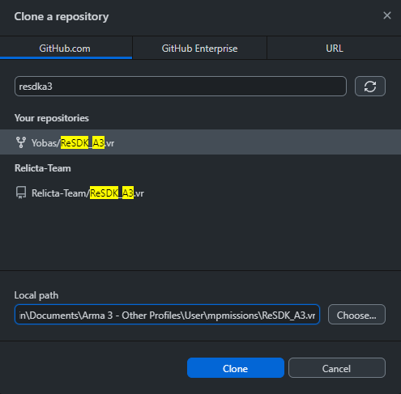
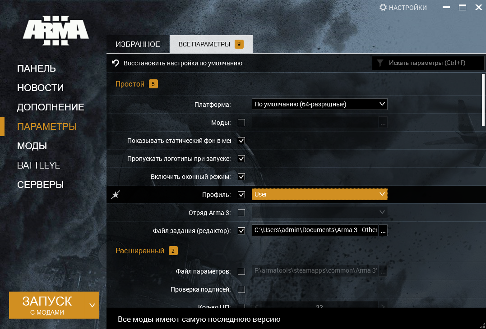
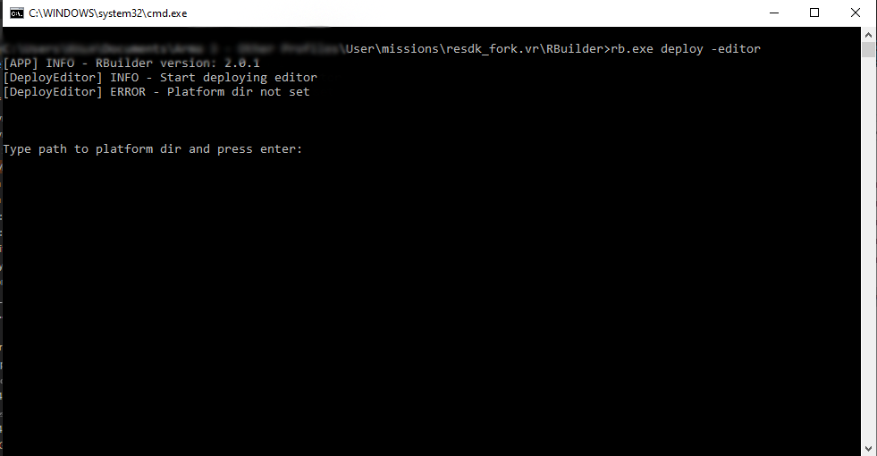
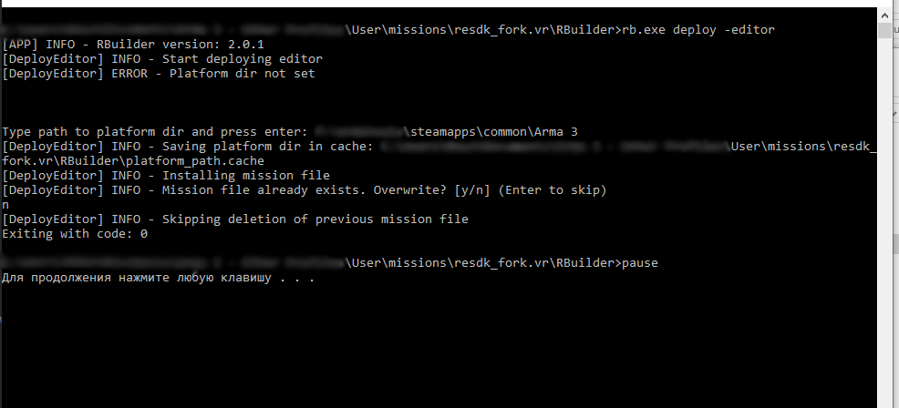
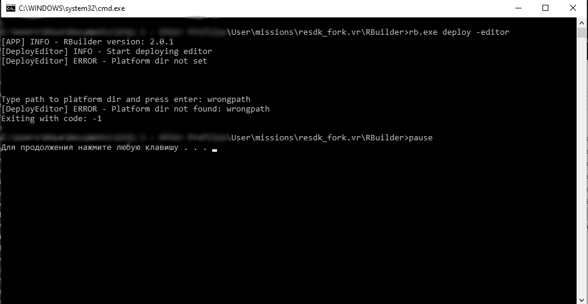
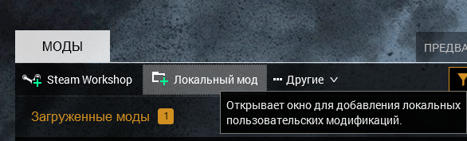
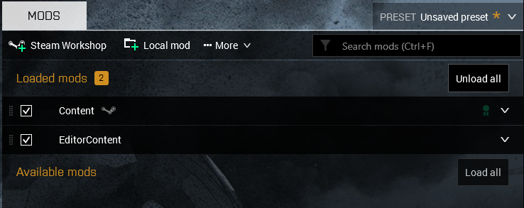
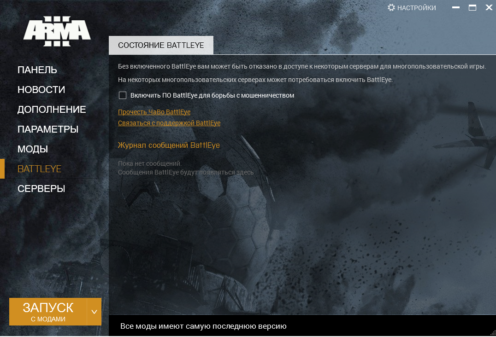
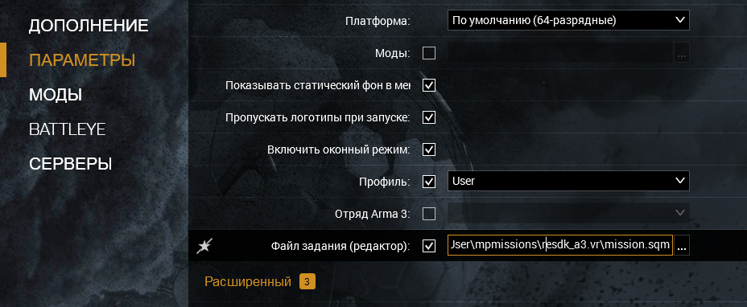

# Руководство по установке ReSDK_A3

Данное руководство предназначено для новых пользователей, желающих внести вклад в разивтие проекта ReSDK_A3.
Перед началом убедитесь, что ваша система удовлетворяет [необходимым требованиям для работы](../README.md#требования-к-работе)

# Получение репозитория
Для работы над кодом необходимо установить git-клиент. Для новых пользователей рекомендуем [Github Desktop](https://desktop.github.com/)

> Если до этого вы не работали в Github, то вам так же потребуется учетная запись Github.

Скачиваем Github Desktop, устанавливаем и запускаем.

Затем сделайте **форк** репозитория ReSDK_A3 на GitHub, нажав на кнопку "Fork" в правом верхнем углу страницы проекта. Это создаст копию проекта в вашем аккаунте GitHub.

После клонирования в Github Desktop жмем **File** и **Clone repository**


В открывшемся окне выбираем ваш репозиторий. Он будет называться как ВАШ_GITHUB_НИК\ReSDK_A3.vr



## Выбор пути для репозитория

Путь, куда должен быть сохранён репозиторий это папка missions, лежащая в документах вашего пользователя.
Если у вас только один профил Arma 3, то сохраняйте по путь должне быть такой:
```
C:\Users\Admin\Documents\Arma 3\missions\ReSDK_A3.vr
```
Если же профилей несколько, то такой:
```
C:\Users\Admin\Documents\Arma 3 - Other Profiles\YOUR_ARMA_PROFILE\missions\ReSDK_A3.vr
```
Вместо YOUR_ARMA_PROFILE должно быть имя вашего профиля. Посмотреть список профилей можно в настройках лаунчера


После клонирования репозитория в указанной папке появится наша версия репозитория, независимая от версий, над которыми работают другие пользователи.

# Установка мода редактора
Для работы всех компонентов редактора потребуется установить мод @EditorContent. Сделать это можно двумя способами:
* [Развернуть сборку через RBuilder](#Установка-мода-через-RBuilder)
* [Вручную установить мод](#Установка-мода-вручную)

Мы рекомендуем установку через RBuilder во избежании ошибок и автоматизации процесса установки или обновления SDK.

## Установка мода через RBuilder
Заходим в папку RBuilder в корне нашего скопированного репозитория. Там запускаем файл `DEPLOY.bat`, либо через командную строку запускаем RBuilder с аргументом `deploy -editor`.
> После первого запуска в папке RBuilder автоматически будет создан файл `platform_path.cache`, в котором хранится путь до директории Arma3.

Во время установки RBuilder предложит ввести путь до папки с установленной Arma3



Вставляем туда путь до платформы Arma 3 и нажимаем Enter. Результат выполнения данной команды должен быть таким же как на изображении ниже:



Если после ввода пути в окне консоли вы указали неверный путь до папки с Arma 3 программа завершится с ошибкой.



В результате успешной установки через RBuilder в вашей папке с Arma 3 появится папка `@EditorContent` в которой хранятся библиотеки, необходимые для работы ReSDK, а в корне вашего репозитория будет создан файл mission.sqm.

## Установка мода вручную
1. Создаем в вашей папке с Arma 3 папку `@EditorContent`. Обязательно с таким именем, другие имена не допускаются.
2. Содержимое папки `RBuilder\deploy\editor` копируем в `@EditorContent`
3. Файл `editor_bootload.sqm` в `RBuilder\deploy` скопировать в корень вашего репозитория.
4. Готово, однако при каждом обновлении библиотек в `RBuilder\deploy\editor` все операции по копированию файлов придется делать повторно.

# Подключение мода в лаунчере Arma 3
Запускаем лаунчер Arma 3 и нажимаем кнопку добавления локального мода и указываем папку с `@EditorContent`



После этого ставим галочки напротив [мода реликты](https://download.relicta.ru) и нашего `@EditorContent`



# Запуск

**Для работы @EditorContent обязательно требуется отключить Battleye**



Так же можно изменить параметры в лаунчере.



Вот основные настройки, которые рекомендуется включить:

- **Включить исправление файлов** - Включаем.
- **Включить оконный режим** - особенность при работе с SDK, связанная с постоянной сменой с окна Arma 3 на редактор или информационное окно кода и обратно.
- Откл.паузу - не приостанавливает симуляцию когда окно платформы неактивно.
- Пропускать логотип - немного ускоряет загрузку платформы
- Профиль - если у вас несколько профилей Arma 3, то нужно указать тот, в папку которого вы клонировали репозиторий (YOUR_ARMA_PROFILE), [подробнее выше](##Выбор-пути-для-репозитория)
- Файл задания (редактор) - можно указать тут путь до файла `missions.sqm` в корне нашего репозитория если хотите, чтобы при запуске Arma 3 сразу запускался редактор ReEditor.

После всех манипуляций с лаунчером нажимаем кнопку **Запуск с модами**. Как и обычно нужно подождать некоторое время пока загрузится Arma 3, после чего в главном меню нажимаем *"редактор"*, выбираем любую карту и жмем *"далее"*. Когда редактор загрузится сверху нажимаем *"Сценарий"* и *"Открыть"*. Выбираем ReSDK_A3 и жмем открыть.
> Обратите внимание, что если в параметрах лаунчера вы указали *Файл задания*, то после запуска Arma 3 вы сразу попадёте на выбранную карту.

# Известные проблемы
- У меня не работают некоторые функции редактора.
	- Проверьте выключен ли BattlEye в настройках лаунчена. Если он был включен - выключите и перезапустите платформу.
- Я всё правильно настроил, но при запуске ReSDK крашится Arma3
	- Зайдите в свойства всех `dll` файлов в папке `@EditorContent` и нажмите "Разблокировать". [Пример на изображении](https://forum.lers.ru/uploads/default/original/1X/491c696ffa11443028bb46eb4ef5b486e5be5dc8.png)
- При загрузке/сохранении карты или каких-либо других операциях с файлами через редактор пишет что-то про "заблокированный файл"
	- Когда файлы внутри платформы Arma3 загружаются через язык SQF они блокируются на любое изменение внешним кодом. Данная проблема решается через смену активного окна. Просто нажмите `Alt+Tab`, либо вручную смените активное окно а затем повторите операцию.

# Дальнейшие действия

Рекомендуем ознакомиться со следующими разделами:

- [Базовая документация по архитектуре](PROJECT_ARCHITECTURE.md) - для понимания как устроен проект и как он работает.
- [Документация API](API/README.md) - автоматически сгенерированная документация, содержащая список функций и констант в модулях.
- [Руководство по программированию](ScriptingGuides/README.md) - для тех, кто хочет заняться созданием игровой логики, нового функционала или исправлением текущего.
- [Руководство по работе с редактором ReEditor](EditorGuides/README.md) - для тех, кто хочет работать с картами, режимами или частицами. Так же данный раздел содержит информацию по создание и работе с различными типами игровых объектов.
