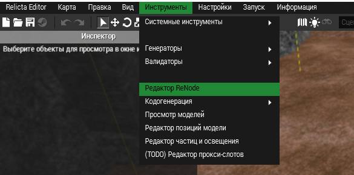
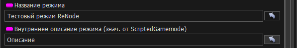
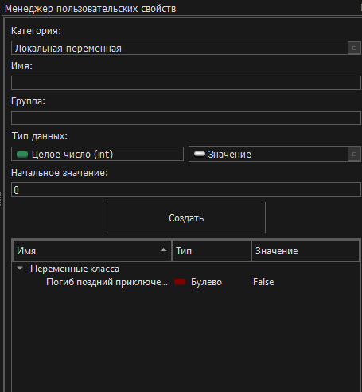

# Запуск
Запустить редактор можно двумя способами:
1. Запустить редактор через ReEditor
2. Запустить исполняемый файл ReNode.exe
Первый способ предназначен если вы планируете отлаживать граф и следить за ходом его выполнения в реальном времени. Второй способ удобен при разработке без возможности запуска Arma3.

## Запуск через ReEditor
Если вы хотите использовать редактор с возможностью работы отладчика, который позволит наблюдать выполнение кода узлов в реальном времени, запустите ReNode через редактор карт ReEditor. В панели меню `Инструменты` выберите `Редактор ReNode`

## Ручной запуск
Ручной запуск не позволяет использовать отладчик, но такой вариант удобен, когда вам нужно работать с графами без возможности запустить Arma3.

Для запуска откройте папку с вашим SDK и запустите файл: `ReNode\ReNode.exe`. После запуска редактор будет запущен и вы можете приступить к работе!

# Окно редактора
Окно редактора разделено на несколько основных виджетов. Каждый из них можно скрывать, отображать, изменять размер, группировать и откреплять в отдельное окно. При закрытии редактора визуальные свойства виджетов сохраняются - вы можете настроить редактор как вам будет удобно и при следующих запусках положения виджетов будут восстановлены.

1. [Меню-бар](#Меню-бар) - меню управления приложением.
2. [Инспектор-свойств](#Инспектор-свойств) - отвечает за изменение параметров графа. Иными словами - инспектор служит для редактирования созданных атрибутов графа.
3. [Окно-графа](#Окно-графа) - основное окно сцены графа. Возможно открытие нескольких вкладок графов и переключение между ними.
4. [Менеджер-пользовательских-свойств](#Менеджер-пользовательских-свойств) - панель для создания пользовательских переменных и функций.
5. [Консоль](#Консоль) - окно вывода отладочных, системных и информационных сообщений.
6. [История](#История) - история изменений текущего активного окна.

## Меню-бар
В меню расположено несколько разделов. Там вы можете открыть, сохранить, загрузить графы. Настроить отображение виджетов редактора или компилировать граф.

## Инспектор свойств
В инспекторе свойств отображаются поля и константы (переменные графа), которые вы можете изменять (переопределять).

На скриншоте выше представлены 2 свойства графа режима. Для изменения значения введите новые данные, которые будут актуальны для этого графа и всех графов, которые будут унаследованы от него. 

Если справа от названия свойства есть текст в скобках, например `(знач. от Базовый Режим)` это означает что данное свойство имеет значение по умолчанию для этого графа. Для сброса свойства на начальное значения нажмите на стрелку справа от этого свойства.

## Окно графа

В окне графа отображаются все открытые в данный момент окна графов. Именами вкладок являются имена классов, которые были указаны во время создания графа. 

На открытые вкладки графов можно навестить, чтобы увидеть основную информацию: состояние компиляции, путь, имена класса графа и его родителя. При нажатии `ПКМ` открывается контекстное меню для переключения между вкладками. Сами вкладки сортировать, перетаскивая их с зажатой `ЛКМ` и закрыть, нажав на значок крестика, расположенного в правой стороне вкладки.

В левой части вкладки отображается статус компиляции графа:
 - Вопрос (оранжевый символ `?`) означанет, что граф не скомпилирован.
 - Галочка - граф скомпилирован и актуален
 - Восклицательый знак в треугольнике - граф успешно скомпилирован, но при компиляции возникли предупреждения.
 - Красный знак "Стоп" - граф не скомпилирован в результате ошибок компиляции. Обратитесь к консоли, чтобы узнать причины ошибок.

После названия вкладки иногда может отображаться значок зведочка `*`. Если вы видите этот значок, значит в вашем графе есть несохраненные изменения.

## Менеджер пользовательских свойств

Менеджер пользовательских свойств позволяет добавлять логику и состояние графа - создавать новые свойства (переменные, константы) и задавать их начальные значения. Так же здесь создаются пользовательские функции (методы графа), которые можно вызывать из графа или использовать в других графах. 

На скриншоте выше изображено окно менеджера пользовательских свойств. Категория отвечает за тип свойства, имя будет являться видимым именем узла, создаваемого из свойства. Указав группу свойство будет сгруппировано в отдельную вкладку с заданным именем. 

Под группой находятся опции свойства, которые будут разными в зависимости от выбранной категории создаваемого свойства.

Кнопка `Создать` служит для создания нового свойства. Под этой кнопкой отображаются все созданные пользовательские свойства в виде дерева, отсортированные по категориям и группам (если они заданы). Для изменения группы переменной или её удаления нажмите `ПКМ` по свойству, которое необходимо изменить.

При создании новых переменных класса они автоматически добавляются в [окно инспектора](#инспектор-свойств).

## Консоль

Окно консоли позволяет взаимодействие с графом и внутренними функциями а так же наблюдать в реальном времени логируемые сообщения, а так же результат компиляции. В нижней части окна консоли расположена строка ввода команд. Для отправки команды нажмите Enter, либо соотвествующую кнопку отправки. Для просмотра всех доступных команд введите `help`.

Подчеркнутый зеленый текст является ссылками (чаще всего ссылками на узлы), на которые можно нажать `ЛКМ`. Например, при нажатии на ссылку узла камера переместится к этому узлу.

## История

История отображает последние манипуляции, выполненные с текущим активным окном графа. Любое действие, будь то создание пользовательских свойств, изменение атрибутов сцены с узлами или свойствами инспектора записываются в окно истории. Для отката или возврата изменений используйте [горячие клавиши](#хоткеи-сцены) или нажмите ЛКМ для отката до нового состояния.

При открытии графа в историю всегда помещается элемент начального состояния а рядом с ним статус компиляции. При сохранении графа значок устанавливается в текущий элемент истории. Проще говоря - значок рядом с элементом истории означает что файл сохранён в этом этапе истории.

# Управление
В этом разделе содержатся комбинации клавиш для управления и манипуляции графом.
> **ЛКМ**, **ПКМ** - левая и правая кнопки мыши. **СКМ** - колесо мыши.

## Управление сценой
| Кнопка | Что делает |
| --- | --- |
| **ЛКМ** | Выделение узлов в сцене |
| **ЛКМ** (зажать+тянуть) | Выделение нескольких узлов в сцене. Снимает выделение с предыдущих объектов.
| **ПКМ** | Открывает контекстное меню. Существуют разные контекстные меню - отдельно для графа (при нажатии по сцене) и для узла (при нажатии по узлу)
| **СКМ** | Изменить зум в сцене
| **Tab** | Открыть библиотеку узлов

## Хоткеи сцены

| Кнопка | Что делает |
| --- | --- |
| **Shift** + **ЛКМ** | Выделение области/узла и добавка к уже выделенным.
| **Ctrl** + **ЛКМ** | Снять выделение выбранной области/узла
| **Alt** + **ЛКМ** | Перемещение по сцене
| **Alt** + **Shift** + **ЛКМ** | Удаление связей между узлами на проведённой линии. 
| **Ctrl** + **Z** | Отмена последнего действия
| **Ctrl** + **Y** | Повторить последнее действие
| **Ctrl** + **C** | Копирование в буфер обмена выделенных узлов/узла на который нацелена мышь.
| **Ctrl** + **V** | Вставка выделенных узлов/узла из буфера обмена.
| **Ctrl** + **X** | Удаление выделенных узлов/узла на которой нацелена мышь и копирование в буфер обмена
| **Ctrl** + **A** | Выделение всех узлов

## Общие хоткеи

| Кнопка | Что делает |
| --- | --- |
| **F5** | Скомпилировать граф в текущей открытой вкладке
| **Ctrl** + **N** | Открыть окно создания нового графа
| **Ctrl** + **O** | Загрузить граф из `.graph` файла
| **Ctrl** + **S** | Сохранить текущий открытый граф
| **Ctrl** + **Q** | Выход из редактора

# Первый граф
Вся работа в редакторе состоит из 3х основных пунктов.
1. Создание нового графа или открытыие существующего
2. Написание логики и добавление свойств
3. Компиляция

Для начала давайте попробуем создать свой первый режим и роль к ней.

## Создание режима

## Создание роли

## [Вернуться назад](README.md)