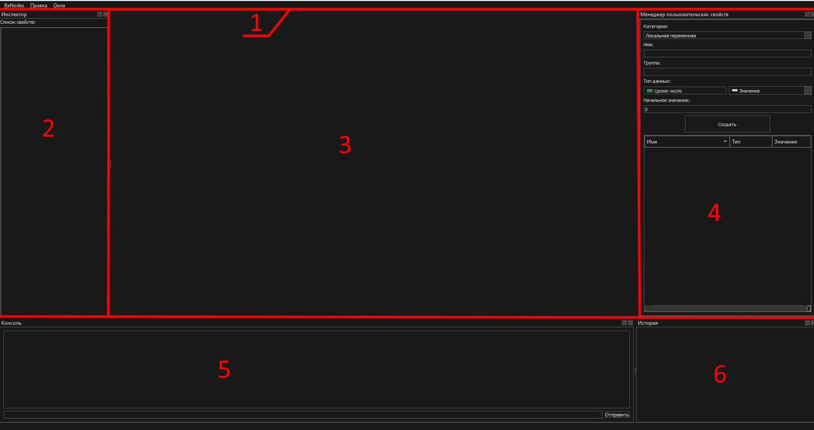

# Первый запуск
... TODO: когда пройдёт первый тест написать как запускаться впервые.

# Окно редактора
Окно редактора разделено на несколько основных виджетов. Каждый из них можно скрывать, отображать, изменять размер, группировать и откреплять в отдельное окно.

1. [Меню-бар](#Меню-бар) - меню управления приложением.
2. [Инспектор-свойств](#Инспектор-свойств) - отвечает за изменение параметров графа.
3. [Окно-графа](#Окно-графа) - основное окно сцены графа. Возможно открытие нескольких вкладок графов и переключение между ними.
4. [Менеджер-пользовательских-свойств](#Менеджер-пользовательских-свойств)
5. [Консоль](#Консоль)
6. [История](#История)

## Меню-бар
В меню расположено несколько разделов. Там вы можете открыть, сохранить, загрузить графы. Настроить отображение виджетов редактора или компилировать граф.

## Инспектор свойств
В инспекторе свойств отображаются поля и константы (переменные графа), которые вы можете изменять.

## Окно графа

В окне графа отображаются все открытые в данный момент окна графов. Именами вкладок являются имена классов, которые были указаны во время создания графа.

## Управление
> **ЛКМ**, **ПКМ** - левая и правая кнопки мыши. **СКМ** - колесо мыши.

## Управление сценой
| Кнопка | Что делает |
| --- | --- |
| **ЛКМ** | Выделение узлов в сцене |
| **ЛКМ** (зажать+тянуть) | Выделение нескольких узлов в сцене. Снимает выделение с предыдущих объектов.
| **ПКМ** | Открывает контекстное меню. Существуют разные контекстные меню - отдельно для графа (при нажатии по сцене) и для узла (при нажатии по узлу)
| **СКМ** | Изменить зум в сцене
| **Tab** | Открыть библиотеку узлов

## Хоткеи сцены

| Кнопка | Что делает |
| --- | --- |
| **Shift** + **ЛКМ** | Выделение области/узла и добавка к уже выделенным.
| **Ctrl** + **ЛКМ** | Снять выделение выбранной области/узла
| **Alt** + **ЛКМ** | Перемещение по сцене
| **Alt** + **Shift** + **ЛКМ** | Удаление связей между узлами на проведённой линии. 
| **Ctrl** + **Z** | Отмена последнего действия
| **Ctrl** + **Y** | Повторить последнее действие
| **Ctrl** + **C** | Копирование в буфер обмена выделенных узлов/узла на который нацелена мышь.
| **Ctrl** + **V** | Вставка выделенных узлов/узла из буфера обмена.
| **Ctrl** + **X** | Удаление выделенных узлов/узла на которой нацелена мышь и копирование в буфер обмена
| **Ctrl** + **A** | Выделение всех узлов

## Общие хоткеи

| Кнопка | Что делает |
| --- | --- |
| **F5** | Скомпилировать граф в текущей открытой вкладке
| **Ctrl** + **N** | Открыть окно создания нового графа
| **Ctrl** + **O** | Загрузить граф из `.graph` файла
| **Ctrl** + **S** | Сохранить текущий открытый граф
| **Ctrl** + **Q** | Выход из редактора

## Менеджер пользовательских свойств

Менеджер пользовательских свойств позволяет взаимодействие с графом - создавать новые свойства (переменные, константы) и задавать их начальные значения. Так же здесь создаются пользовательские функции (методы графа), которые можно вызывать из графа или использовать в других графах. 

## Консоль

Окно консоли позволяет взаимодействие с графом и внутренними функциями а так же наблюдать в реальном времени логируемые сообщения, а так же результат компиляции. В нижней части окна консоли расположена строка ввода команд. Для отправки команды нажмите Enter, либо соотвествующую кнопку отправки. Для просмотра всех доступных команд введите `help`.

## История

История отображает последние манипуляции, выполненные с текущим активным окном графа. Любое действие, будь то создание пользовательских свойств, изменение атрибутов сцены с узлами или свойствами инспектора записываются в окно истории. Для отката или возврата изменений используйте [горячие клавиши](#хоткеи-сцены) или нажмите ЛКМ для отката до нового состояния. 

# Цикл работы с редактором
1. Создание графа
2. Написание логики
3. Компиляция

## [Вернуться назад](README.md)