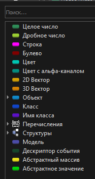

# Типы данных

Работа в ReNode - это работа с данными. Данные бывают разных типов. В этом разделе мы разберем различные типы данных и способы работы с ними.

## Основные типы

Основные типы данных перечислены на скриншоте ниже. Каждый из них имеет свой цвет для удобства ассоциации типов портов.

| Тип | Описание | Значения |
| --- | --- | --- |
| $${\color{SeaGreen}Целое\spaceчисло}$$ | Знаковое целое число | `-1`, `100`, `2589`, `-493028`
| $${\color{YellowGreen}Дробное\spaceчисло}$$ | Знаковое дробное число с плавающей точкой. В описании узлов чаще всего обозначается как "Число", так как дробные числа - основной числовой тип в Платформе | `0.0`, `1.5`, `-1304.0`, `0.999`
| $${\color{Magenta}Строка}$$ | Набор символов. | `"Hello, World!"`, `"123"`, `"ReSDK 100500"`
| $${\color{Maroon}Булево}$$ | Логическое значение. В описании узлов ещё именуется как ИСТИНА и ЛОЖЬ. | `true`, `false`
| $${\color{#048C7F}Цвет}$$ | Структура RGBA (Red, Green, Blue, Alpha), содержащая 4 атрибута дробных чисел. Альфа-канал - прозрачность. | `[1,1,0,1]`, `[0.5,0.5,0.5,0.5]`
| $${\color{#D4A004}2D\spaceВектор}$$ | Структура XY (X, Y), содержащая 2 атрибута дробных чисел. | `[0, 0]`, `[-3420.941, 2873.45611]`
| $${\color{#D48104}3D\spaceВектор}$$ | Структура XYZ (X, Y, Z), содержащая 3 атрибута дробных чисел. | `[0, 0, 1]`, `[24.3, -75, 34.837]`
| $${\color{#1087C7}Объект}$$ | Все игровые объекты, роли и сущности являются объектами. Объекты создаются из пользовательских графов (классов) и внутреннего кода SDK. | -
| $${\color{#1044C7}Класс}$$ | Все объекты фактически создаются из [классов](README.md#системные), получая их свойства и атрибуты. В классе содержится информация о типе объекта - его имя и список атрибутов. В редакторе ReNode при компиляции графа происходит создание/обновление пользовательского класса. | `object`, `Item`, `GameObject`, `BasicRole`
| $${\color{#5C10C7}Имя\spaceкласса}$$ | Уникальный идентификатор класса для идентификации типа. | `object`, `Item`, `GameObject`, `BasicRole`
| $${\color{#2D543E}Перечисления}$$ | Типы данных, чье множество значений представляется набором уникальных идентификаторов. Например, есть перечисление для навыков персонажа (скрытность, воровство, хирургия и т.д.) | `enum.SpawnPointType (Тип спавнпоинта)`, `enum.ChatMessageChannel (Тип сообщения чата)`
| $${\color{#2B4FBA}Структуры}$$ | Типы данных, реализующие сгруппированный набор атрибутов. Например, существует структура "Точка спавна", содержащая параметры - тип точки и её имя. | `struct.SpawnPoint (Точка спавна)`, `struct.GamemodeFinishResult (Завершение раунда)`
| $${\color{#4C4CA8}Модель}$$ | Визуальный объект, реализуемый предоставляемой платформой Arma 3. | sample
| $${\color{#17452b}Дескриптор}$$ | Идентификатор события, выполняемой задачи или любой другой указатель на данные. Представлен в виде беззнакового числа, начинающегося с 0. Значение `-1` означает инвалидный (неверный) дескриптор. | `-1`, `0`, `1`, `1038402`, `9837945`
| $${\color{#EBE01E}Абстрактный\spaceмассив}$$ | Коллекция элементов различных типов данных. | -
| $${\color{#02D109}Абстрактное\spaceзначение}$$ | Общее представление любого значения (или его отсутствия) в ReNode. | -
| $${\color{#E40045}Абстрактная\spaceфункция}$$ | Общая ссылка на абстрактную функцию. Подробнее в [документации по локальным функциям](Nodes.md#локальные-функции-и-события)

# Контейнеры
Контейнеры представляют собой коллекции элементов разной логикой работы, скоростью доступа или изменения элементов.
В ReNode существует 4 основных типа контейнеров данных: 

- Значение - обычное значение, не находящееся в коллекции.
- Массив - упорядоченная коллекция элементов одинакового типа. Доступ к элементам массива осуществляется с помощью индекса. Индекс первого элемента всегда 0, второго 1 и т.д. 
- Словарь - неупорядоченное множество пар типа "ключ-значение", доступ к которым получается с одинаковой скоростью и осуществляется с помощью ключа, по которому можно получить значение. Словари предназначены для хранения данных, доступ к которым осуществляется по ключам. В одном словаре никогда не может быть более 1 пары с одинаковыми ключами.
- Сет - множество неупорядоченных уникальных значений, доступ к которым получается с одинаковой скоростью. Сеты используются, когда вам надо хранить большое количество различных объектов в коллекции (более 1000) и необходимо постоянно проверять наличие элементов в них. В одном сете никогда не может быть более 1 элемента с одинаковым значением.

## Типы значений
Типы значений это большинство базовых типов. **Числа** (в том числе целые), **строки**, **булево** и **дескрипторы** являются типами значений. Эти типы передаются по значению (копируются) в каждый подключенный соответствующий порт подключения узла. Т.е. типы значений являются неизменяемыми литералами.

Не беспокойтесь о производительности и занимаемой памяти при работе с типами значений. Их вес и требуемые ресурсы незначительны в рамках всей Платформы даже несмотря на постоянное копирование.

## Ссылочные типы
Ссылочные типы это указатели на данные (ссылки). При изменении данных ссылочного типа изменяется исходный объект, т.е. все месте, которые ссылались на данные типа, также изменяются.
Ссылочными типами являются все **контейнеры** и типы, не перечисленные в разделе выше (объекты, модели, векторы, структуры и т.д.)

Данные ссылочного типа создаются немного дольше по сравнению с типами значений и занимают чуть больше размера в памяти, однако благодаря своей ссылочной природе данные ссылочного типа могут быть переиспользованы в нескольких местах программы несколько раз за симуляцию.

# Объекты

Все игровые объекты, роли и сущности являются объектами. Объекты создаются из [классов](README.md#системные). Классы компилируются (генерируются) из графов, а графы создаются пользователем. При создании каждого нового графа пользователь указывает родительский класс, свойства, методы и атрибуты которого [унаследуются](#наследование) в дочерние классы.

Например при старте симуляции создается режим (объект от типа `ScriptedGamemode`), в котором можно зайти за роли (унаследованные прямо или косвенно от `ScriptedRole`). При установке режима создается карта, объекты которой представлены различными (прямыми и косвенными) наследниками типа `GameObject`.

Из раздела выше вы уже знаете, что все объекты являются ссылочными типами. Объекты были придуманы и реализованы специально для работы в ReSDK и это накладывает на них некоторые ограничения. Все остальные типы в Платформе способны автоматически высвобождать свои ресурсы. Объекты же не могут удаляться самостоятельно. Создавая предмет, задачу для персонажа или любой другой объект - пользователь самостоятельно должен отслеживать *жизнь* свои объектов и удалять их при необходимости. Хорошая новость - ReSDK помогает пользователю, автоматизируя жизненные процессы некоторых объектов, тем самым своя работу по запоминанию что и когда нужно удалить к минимому.

## Наследование

Наследование - это концепция объектно-ориентированного подхода, которая позволяет создавать новые классы на основе существующих классов. Класс, от которого происходит наследование, называется базовым классом или родительским классом, а класс, который наследует функциональность базового класса, называется производным классом или дочерним классом.

Концепция наследования позволяет избежать многократного переписывания кода или копипаста графов. К примеру в режиме есть событие `При старте режима`, которое вызывается когда раунд запустился. И к примеру в этом режиме у нас выполняется сложное вычисление взаимоотношений между игроками. Если бы мы хотели создать второй режим на основе первого и дополнить его событие `При старте режима`, то нам не придётся копировать все узлы из первого режима во второй. Мы просто наследуем второй режим от первого и переопределяем наше событие старта режима, предварительно обратившись к коду первого режима (об этом чуть подробнее в следующих разделах).

Дочерний класс/граф наследует все атрибуты (переменные) и методы (функции) своего родительского класса. Это позволяет использовать уже существующие свойства/узлы и добавлять или изменять его функциональность в дочернем классе без необходимости повторного построения графа.

# К следующему разделу
Основы типы данных и объектной концепции мы освоили. Теперь перейдём к разбору того, из чего строится вся логика в графах - узлах. Ознакомьтесь со [следующим разделом](Nodes.md) для ознакомления с узлами.

## [Вернуться назад](README.md)