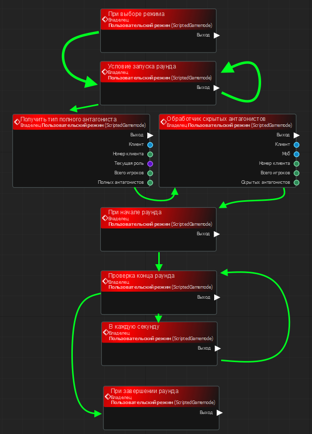
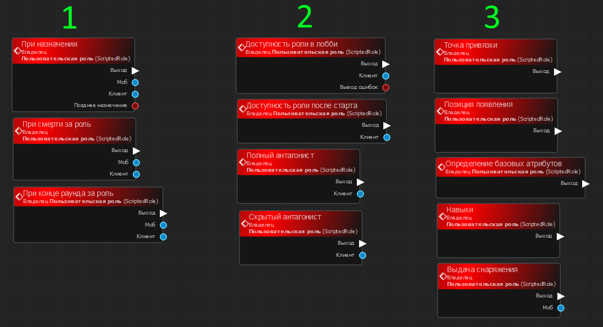

# Создание графа
Для создания графа в панели меню нажмите первую кнопку и выберите "Новый граф", либо нажмите комбинацию клавиш `Ctrl+N`.

После этого будет открыт менеджер создания графов. Он поэтапо предложит выбрать тип и задать настройки вашего графа.

## Граф режима

Режим предоставляет выполнение основного игрового цикла. Формально игровой цикл делится на следующие этапы:
1. Установка режима и карты администратором или системой.
2. Ожидание выполнения условий для запуска раунда.
3. Основной цикл игры и оценка возможности завершения раунда.
4. Завершение раунда с последующием перезапуском или выключением сервера.

На изображении ниже представлен порядок выполнения точек входа от момента установки режима до его завершения. 

### При выборе режима 

Выполняется когда режим установлен и карта загружена. На этом этапе игроки могут начать занимать роли. В этот момент можно выполнить подготовочные действия или сложные расчеты перед началом игры. К примеру, можно создать дополнительные объекты на карте в разных точках.

### Условие запуска раунда

По истечению таймера до старта раунда выполняется проверка условия запуска раунда. Если условие не соблюдено, то таймер сбрасывается и так до тех пор пока все условия запуска не будут соблюдены. Например, мы можем сделать, что раунд не запустится, если не будут заняты некоторые из ролей.

### Обработчики антагонистов

Система режимов предоставляет возможность создания антагонистов - злодеев, противодействующих нормальному выполнению режма. Обработчики антагонистов помогают определить игроков на основе собственных правил выбора, которые станут полными или скрытыми антагонистами.

**Полные антагонисты** - это игроки, которые заходили за одну роль, но в результате успешной проверки на полного антагониста получат новую роль при входе. К примеру, игрок заходил за уборщика но стал полным антагонистом и появился в роли монстра. Обработчик полных антагонистов требует возвращаемого значения типа "Имя класса". Если персонаж не должен быть антагонистом - подключите к возвращаемому значению порт "Текущая роль", чтобы он появился за ту роль, которую выбрал игрок.

**Скрытые антагонисты** - это игроки, которые получают основные задачи режима и при этом остаются на своей роли. Например, игрок заходил за повара и в результате успешной проверка на скрытого антагониста стал поваром-диверсантом. Мы предоставляем возможность самостоятельного подсчета и хранения информации о выбранных антагонистах. Вы можете создать [переменную класса](UserProps.md#переменная-класса) и хранить коллекцию из антагонистов в виде массива, записывать каждого антагониста в отдельную переменную или использовать любой другой удобный способ хранения информации о злодеях.

### При начале раунда

Данное событие вызывается когда условие запуска раунда соблюдено. После этого момента каждую секунду выполюняются проверки [конца раунда](#проверка-конца-раунда) и [в каждую секунду](#в-каждую-секунду).

### Проверка конца раунда

Данное событие вызывается раз в секунду с момента начала раунда и до его конца. В нем вам необходимо реализовать логику проверки может ли раунд завершиться. Для завершения раунда добавьте и подключите узел "Завершить раунд".

### В каждую секунду

Это событие вызывается раз в секунду и работает пока раунд не закончится. Оно предоставляет вам возможность исполнения действий вспомогательного характера. Например, подсчет времени с момента начала раунда, выполнение действий в определенные моменты игры или изменение каких-либо других данных как режима так и игровых объектов в нём. Вы можете делать эти действия и в проверке конца раунда, но для чистоты графов рекомендуется разделять логику вспомогательных действий и проверки конца раунда в разных точках входа.

### При завершении раунда

Это финальное событие, которое вызывается при удовлетворении условий завершения раунда. На этом этапе мы можем выдать награду, вывести статистику и т.д. После выполнения этого события через какое-то время сервер выполняет перезапуск для нового раунда, либо выключение. 

## Граф роли

Граф роли предоставляет возможность создания и настройку игровой роли, за которые могут заходить игроки. В графах ролей настраивается логика, отвечающая за отличительные особенности их владельцев - навыки, снаряжение, точка появления и т.д.

Основные точки входа можно разделить на 3 группы, представленные на изображении ниже:

### Группа 1 - Основные события

Данные события вызываются в ключевые моменты существования владельца роли: когда персонаж заходит за роль (При назначении), при гибели (При смерти за роль) или когда персонаж на роли застал конец раунда (При конце раунда за роль).

### Группа 2 - Доступность и антагонизм

В этой группе предусмотрены точки входа, которые предоставляют возможность гибкой настройки возможности видимости роли для игрока. Так же здесь можно настроить логику может ли персонаж, зашедший за эту роль стать полным или скрытым антагонистом. Если вам не требуется специальные условия и нужно просто состояние "ВКЛ/ВЫКЛ", то можно обратиться к окну [инспектора свойств](Basics.md#инспектор-свойств) и изменить нужные вам значения.

### Группа 3 - Общие настройки

Обычно общие настройки (за исключением выдачи снаряжения) устанавливаются в [инспекторе свойств](Basics.md#инспектор-свойств), но вы так же можете настроить их через точки входа, если вам необходимы особые условия. Например, можно настроить выбор позиции персонажа на роли с помощью точки события "Позиция появления". 

Последним в данной категории представлен узел "Выдача снаряжения". В нем вы можете настроить создание экипировки, и оружия в слотах вашего персонажа. Рекомендуем использовать данную точку входа **исключительно для выдачи снаряжения** и избегать любой работы с логикой роли и режима.

## Граф игрового скрипта

> В процессе заполнения...

## [Вернуться назад](README.md)