# Узлы

Руководство по узлам содержит основную информацию для работы с основными элементами, создаваемыми в сцене графа - узлами. Данный раздел содержит описание узлов, основные принципы работы с ними, а так же общие примеры, направленные на понимание принципов их работы.

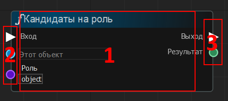

1. Узел.
2. Входные порты. 
3. Выходные порты

Основные правила узлов:
- Все выполнения начинаются с точек входа. Точками входа *обычно* являются красные или желтые узлы без входных портов.
- **Выходные** порты одного узла могут быть подключены к **входным** узлам другого. Нельзя объеденить 2 входных или выходных порта разных узлов. Иными словами, **правые** (выходные) порты узла "А" могут быть подключены к **левым** (входным) портам узла "Б".
- Узел не может быть подключен сам к себе.
- Создание циклических связей невозможно. Все графы в ReNode ацикличные.

## Входные порты

Входные порты, это порты, которые получают значения на вход из подключенных связей. В некоторых узлах к входным портам прилагаются пользовательские опции, представленные в виде виджетов ввода различных данных (числа, строки, чекбоксы, листбоксы). Если в порт с пользовательской опцией не подключена связь, то будет использовано значение из этой пользовательской опции.

## Выходные порты

Выходные порты, это порты, которые отдают на выход значения, обработанные узлом. Пример в начале этого раздела отдает результат, равный количеству клиентов, занявших указанную роль. Так же он посылает импульс на порт "Выход" передавая управление следующему узлу, подключенному к нему.

## Узел

Большинство узлов разделяются по цвету для упрощения понимания природы и тонкостей их работы. Примеры различных типов узлов ниже:

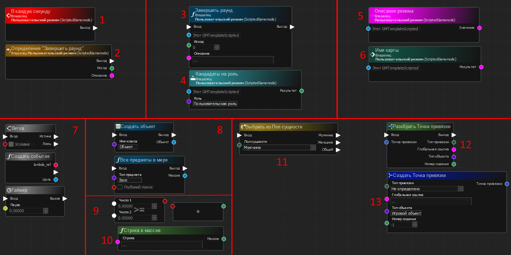

### Объектные (1-6)

Все объектные узлы являются членами объектов, создаваемых из графов или кодом внутри SDK. Они вызывают функции и манипулируют свойствами благодаря входному порту "Цель" синего цвета, который есть у каждого объектного узла (кроме точек входа). Иными словами, порт "Цель" это объект, который выполняет действие или управляет свойством объекта. Если порт не подключен, то по умолчанию берется значение из пользовательской опции, являющееся ссылкой на объект графа, в который помещен объектный узел. Если опция рядом с портом "Цель" отмечена красным цветом, значит в текущем графе объектный узел не может использоваться без явного подключения к порту "Цель".

Точки входа:

1. Событие. Начальный пункт выполнения узла. Большинство событий нельзя вызвать вручную, так как они вызываются самим SDK.
2. Определение и переопределение точки входа. Предназначен для объявления или перезаписи/обновления логики точки входа в дочерних графах, унаследованных от родительского.

Выполняемые:

3. Метод (функция класса/графа). Если функция класса создана пользователем, то она должна так же иметь определение (см. 2).
4. Функция-геттер. Функция, которая не изменяет свойства объекта и служит для получения каких-то значений. Чаще всего такие функции не просто возвращают значения свойств объекта, а производят некоторые вычисления внутри себя, отдавая на выход готовый результат.

Хранящие данные:

5. Свойство графа. Цвет и иконка отражают тип данных свойства. Существует 2 типа таких узлов для каждого свойства: получить значение и установить его. На некоторые свойства, поставляемые из SDK накладываются ограничения. Например, нельзя установить имя клиента, так как имя устанавливается системой при подключении, но можно его получить.
6. Константа. Неизменяемое значение объекта. Обычно константами в графах определяют то, что не может быть изменено на протяжении жизни объекта.

### Системные (7)
Сюда входят большинство системных узлов серого цвета, контролирующих порядок и логику выполнения графа.

### Функциональные (8-10)

8. Функции. Различные функции общего назначения, способные выполнять последовательность действий. Их отличием от методов (см. 3) является то, что у них нет порта "Цель", отвечающего за то, кем вызывается указанный узел.
9. Операционные. Простые узлы, выполняющие одну конкретную операцию за раз (сложить числа, преобразовать значение)
10. см. 9.

### Специализированные (11-13)
11. Свитчеры (переключатели). Предназначены для выбора значений из перечислений.
12. Структурные. Управляют значениями структур (получение, установка).
13. см. 12

## Типы портов
Каждый порт любого узла имеет свой тип данных. Для упрощенной ассоциации подключения обращайте внимание на форму и цвет порта. Чаще всего вы можете подключить 2 порта от разных узлов если они имеют одинаковый цвет. Для просмотра типов портов наведите мышь на выбранный узел.

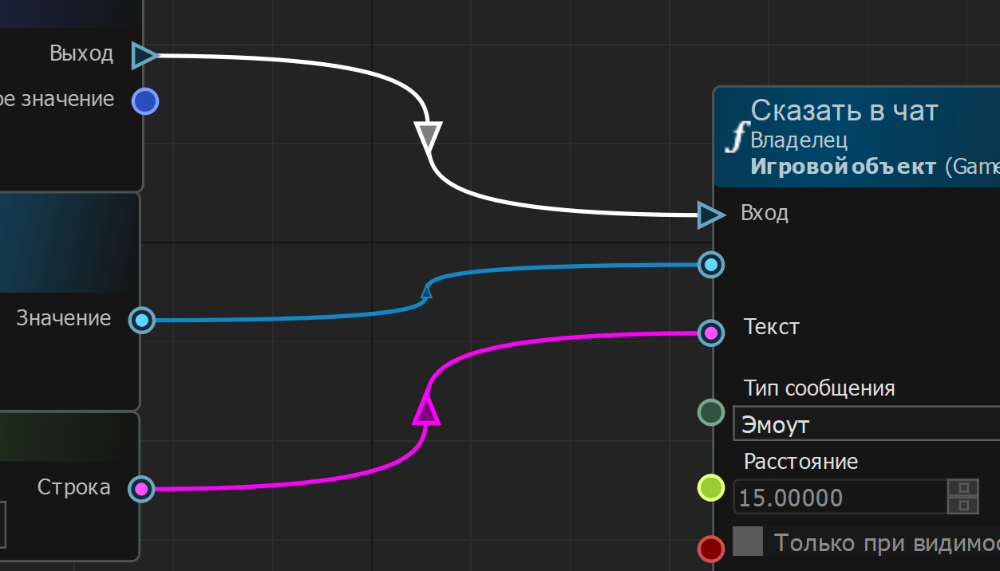

Полный список типов с обозначением цветов можно вспомнить и посмотреть в [предыдущем руководстве](Datatypes.md#основные-типы).

### Порты выполнения

Порты выполнения - это специальные порты, отвечающие за организацию последовательности (очереди) выполнения узлов. Они выглядят как белые треугольники, направленные вправо.

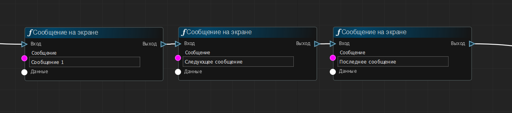

На изображении выше импульс выполнения поступает на самый левый узел "Сообщение на экране". После выполнения этого узла импульс поступит на следующий узел по середине, подключенный к первому и так далее. В итоге при выполнении этих 3х узлов у нас появится 3 сообщения на экране в следующем порядке: 
- "Сообщение 1"
- "Следующее сообщение"
- "Последнее сообщение"

Рассмотрим ещё один пример работы портов выполнения, представленный на изображение ниже:

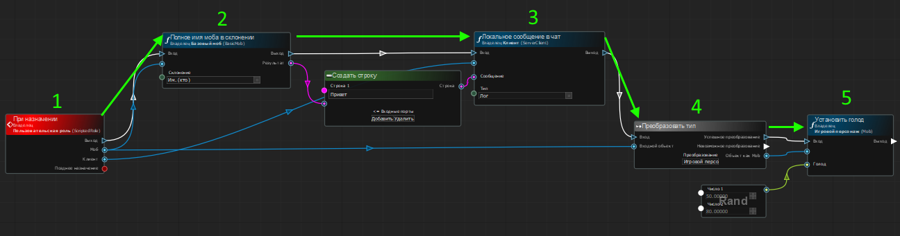

Передача импульса выполнения происходит по направлению зеленых стрелок:
1. Вызывается узел "При назначении". Этот узел вызывается когда клиент зашёл за определенную роль.
2. Получаем полное имя персонажа в именительном падеже. Пример: "Хоба Савин"
3. Выводим локальное приветственное сообщение мобу в чат "Привет Хоба Савин"
4. Преобразование типа. Пока не обращайте внинмания на этот узел. Подробнее о нём будет [рассказано ниже](#преобразования-типов-объектов)
5. Устанавливаем голод.

### Порты данных

Порты данных это круглые порты различных цветов. Они отвечают за передачу данных между узлами. Цвет порта данных характеризует его [тип](Datatypes.md#основные-типы).

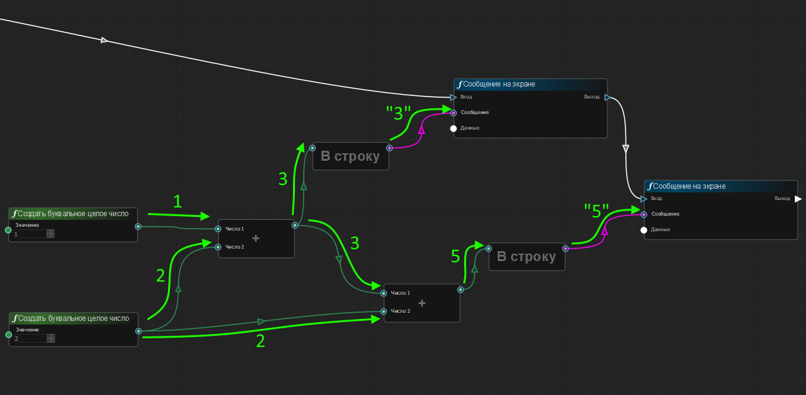

На примере выше выполняются операции сложения и вывод сообщений на экран. Ярко-зелеными стрелками отображается передача значений между порами узлов а цифры рядом с ними - какие значения передаются. В результате выполнения на экране выведется 2 сообщения:
1. "3"
2. "5"

### Автоматические порты

Автоматические порты, это круглые порты белого цвета (не путать с портами выполнения), к которым можно подключать различные порты других типов. При создании связи с автопортом определяется и устанавливает его цвет (тип). 
На автоматические порты могут действовать ограничения типов подключений, которые можно посмотреть если навести мышь на узел внутри графа.

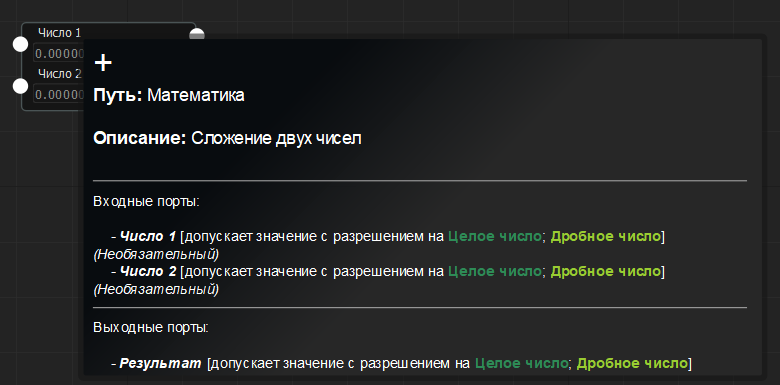

На изображении выше показано описания узла сложения двух чисел. Из описания становится ясно, что автоматические порты этого узла принимают (допускают к себе) значения дробных или целых чисел. Соответственно, например массивы строк или объекты не могут быть подключены в эти автоматические порты.

#### Использование автоматических портов

Для наглядного примера работы автоматических портов попробуем определить наличие элемента в массиве. Добавим в граф узел "Содержит элемент".

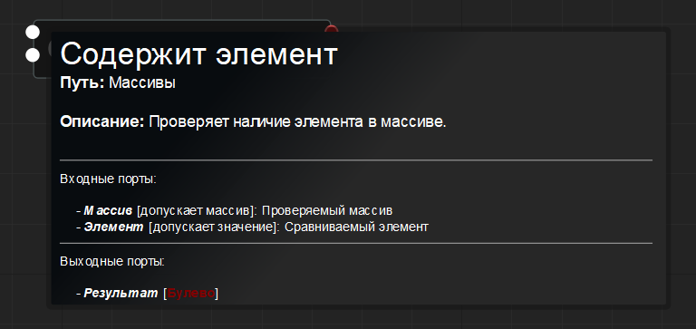

Мы видим следующее: данный узел позволяет подключить в его первый порт массив, что даже видно исходя из названия порта, а так же значение в порт "Элемент".

Создадим буквальную строку со значением "Первый;Второй;Третий" и разделим её на массив строк разделителем ";".

После этого подключим полученный массив строк (`["Первый","Второй","Третий"]`) в наш узел "Содержит элемент". При подключении мы увидим, что все белые порты изменят свои цвета, а при описании узла "Содержит элемент", выходной порт "Элемент" будет являться портом типа строки.
Подключим в порт элемента новую буквальную строку, наличие которой будет проверяться в массиве:

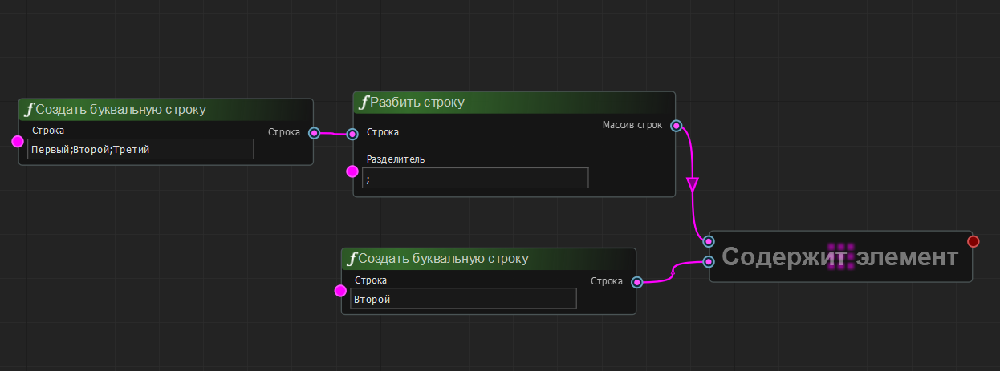

В примере выше мы проверяем наличие элемента в массиве. Если элемент существует - выходной порт узла "Содержит элемент" станет равен значению **Истина**. В иных случая он будет равен значению **Ложь**.

### Преобразования типов

Иногда может возникнуть ситуация, когда нам нужно преобразовать один тип данных в другой. Например, дробное число в целое, число в строку, булево в число и т.д. Другим примером можно привести случаи, когда мы работаем со несовместимыми типами данных, которые требуется подключить к какому-то узлу.

Ранее, в разделе выше про [порты данных](#порты-данных) вы могли заметить узел преобразования целого числа в строку. Библиотека узлов предоставляет набор специальных узлов для преобразования различных типов данных.

## Библиотека узлов

Библиотека узлов, это банк-хранилище системных и пользовательских узлов, которые можно добавлять в ваш граф. Под системными подразумеваются все узлы, поставляемые разработчиком вместе с редактором ReNode. Пользовательскими же являются узлы, которые создают пользователи в своих графах через [менеджер пользовательских свойств](Basics.md\#менеджер-пользовательских-свойств).

Для добавления откройте библиотеку узлов, нажав **Tab**. Поле ввода предоставляет возможность поиска узла по имени.

Основные разделы в библиотеке, на которые стоит обратить внимание:
- **Игровая логика**: категории и узлы для работы с режимами, ролями, системой задач.
- **Игровые объекты**: утилиты и специфичные узлы для взаимодействия с игровым миром - его модификацией, сбором информации, созданием и уничтожением.
- **Клиенты**: узлы работы с объектами клиентов, подключающихся к серверу во время игры.
- **Массивы**: утилиты для манипуляции массивами - создание, добавление, информация.
- **Математика**: узлы для работы с числами и логическими данными (и, или)
- **Объекты**: базовые узлы манипуляции с объектом и типами объектов.
- **Операторы**: узлы, управляющие контролем выполнения графа.
- **Перечисления**: утилиты для работы с типами перечислений (например, слоты инвентаря - перечисление)
- **Преобразования**: узлы для конвертации различных типов данных.
- **Система**: специфичные для платформы узлы (например, количество кадров, время работы платформы)
- **Системные**: декоративные узлы, такие как: группа, заметка
- **Строки**: узлы для работы с типом данных "строка".
- **Структуры**: утилиты для работы с типами структур.

## Различия узлов

Узлы условно можно разделить на 2 основных категории: чистые и функциональные.

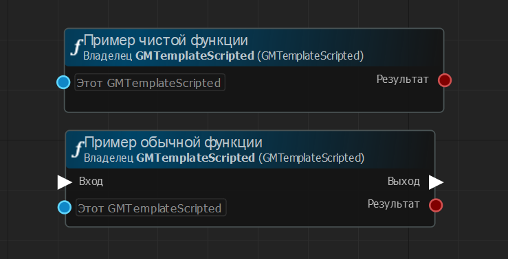

### Чистые узлы
Чистыми являются узлы, выполняющие простые операции, направленные на получение данных. Они получают значения объектов без сложных расчетов, либо вычисляющих какие-то значения на основе входных данных но без их изменения.
В контексте объектной системы чистые узлы это константы, узлы получения значений свойств, а так же пользователськие функции, которым задан признак "Чистая функция".

> !!! Помните: Узел считается "чистым" если не имеет ни одного порта выполнения. 

### Функциональные узлы
Функциональными являются узлы, выполняющие действия, направленные на изменения состояния или входных данных. Примером функционального узла может быть узел установки типов ключа. 

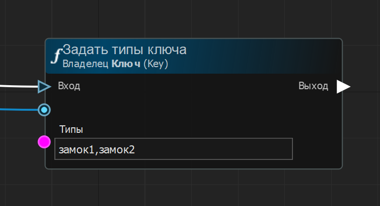

Он предназначен для установки совместимости ключа с дверями, которые можно открыть. При выполнении этого узла в объекте ключа, подключенном к порту "Цель" будет изменено значение с информацией о типах замков, которые можно открыть ключом.

# Основные операторы

Основные операторы находятся в библиотеке узлов раздела "Операторы". Они отвечают за контроль выполнения графом. В разделах ниже представлено содержательное описание основных узлов, с помощью которых выстраивается порядок выполнения различных действий.

## Контроль выполнения

Ниже представлены различные встроенные узлы общего назначения, позволяющие контролировать выполнение графа. 

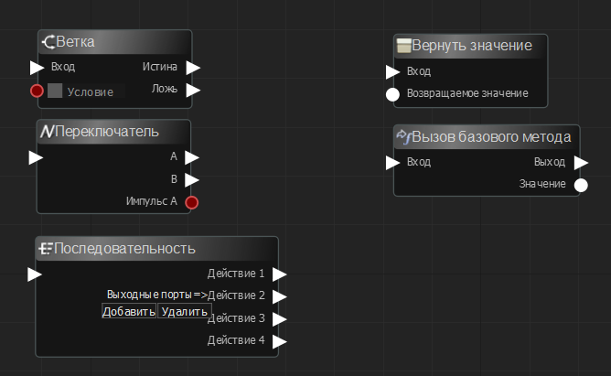

### Ветка

Ветка, это узел условного ветвления. При поступлении импульса выполнения на входной порт "Вход" узел вычисляет значение типа Булево, подключенное к входному порту "Условие". Если условие является истиной, то управление передается на выходной порт "Истина", а если ложь - на выходной порт "Ложь". Обратите внимание, что если к выходному порту, отвечающему за результат условия не подключен другой узел, то действие не будет выполнено.

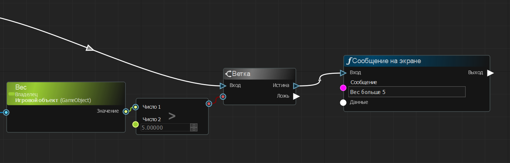

На примере выше представлена работа ветки. В качестве условия проверяется вес какого-то игрового объекта. Если он больше 5, то выведется сообщение на экране "Вес больше 5". В случае, если вес был меньше или равен 5 - ничего не произойдёт.

### Переключатель

Узел "Переключатель" реализует логику условного ветвления с автоматическим переключением между выходными портами выполнения. При поступлении импульса выполнения на входной порт "Вход" управление передается на выходной порт "A". При следующем поступлении импульса выполнения на этот узел управление будет передано уже на выходной порт "B". В третий раз управление передается на "A", в четвертый раз на "B" и так далее. Узел также имеет логический выход, позволяющий отслеживать, когда поступил импульс на выходной порт "A".

Каждый узел последовательности на графе имеет свой флаг состояния, который при первом вызове всегда будет "A". Переключение состояния происходит при поступлении импульса на узел вне зависимости были ли подключены узлы к выходным портам выполнения.

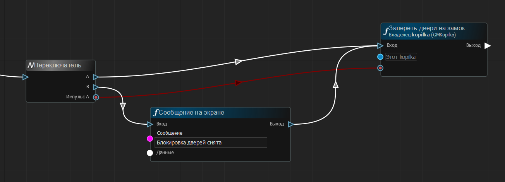

На примере выше демонстрируется базовый пример работы переключателя. В качестве примера в графе создана функция "Запереть двери на замок", которая в качестве входа принимает значение типа булево. Если значение истина - двери запираются на замок, если ложь - замки отпираются.

При поступлении импульса выполнения на узел переключателя в первый раз двери закроются, так как выполнение передастся на выходной порт "A". Мы используем выходной порт "Импульс A", который в первый раз будет истиной для передачи его в функцию, запирающую двери на карте.

При повторном поступлении импульса выполнения на переключатель управление передастся на узел, подключенный к порту "B" и мы увидим сообщение на экране "Блокировка дверей снята". После сообщения двери будут открыты, так как выходной порт "Импульс A" будет ложью.

Этот граф можно было сделать иначе, разделив на 2 ветвления закрытие и открытие дверей, но суть при этом не изменяется:

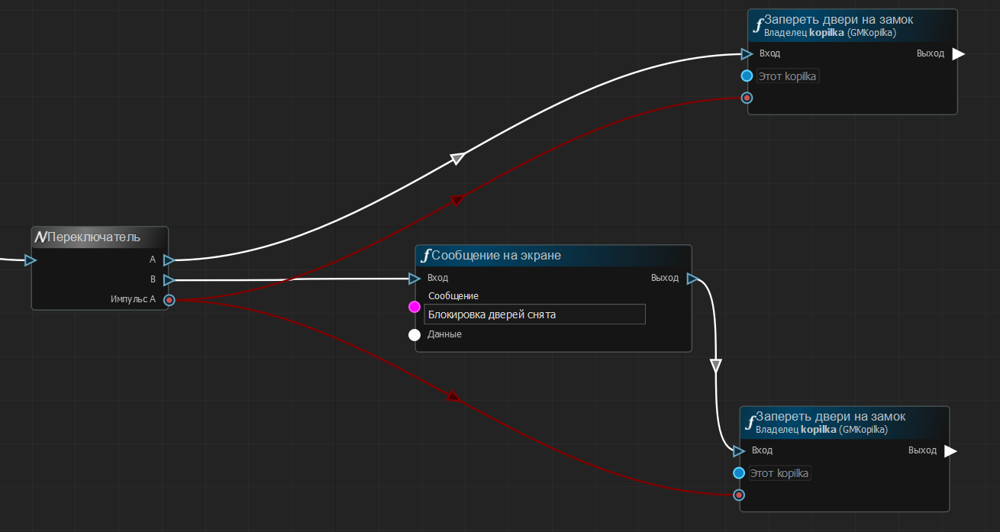

### Последовательность

Этот узел позволяет одному импульсу выполнения запускать последовательность событий по порядку. Узел может иметь любое количество выходов, все из которых вызываются, как только узел последовательности получает входной импульс выполнения. Они всегда вызываются по порядку, без каких-либо задержек. Если в один из выходных портов последовательности ничего не подключено, то управление передается на следующий порт последовательности.

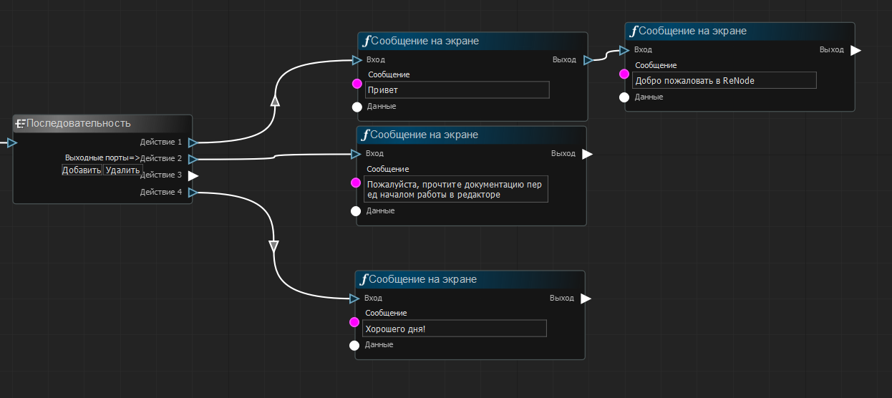

Выше представлен наглядный пример работы последовательности. В качестве примера мы нарочно пропустили подключения к порту "Действие 3", чтобы показать принцип её работы. В результате выполнения мы увидим сообщения на экране в следующем порядке:
- "Привет"
- "Добро пожаловать в ReNode"
- "Пожалуйста, прочтите документацию перед началом работы в редакторе"
- "Хорошего дня!"

### Вернуть значение

Возвращает значение из функции события или любой другой точки входа. При поступлении импульса на этот порт, выполнение функции прерывается а управление передается вызывающему узлу. 

На примере ниже представлен пример использования возвращаемого значения. 

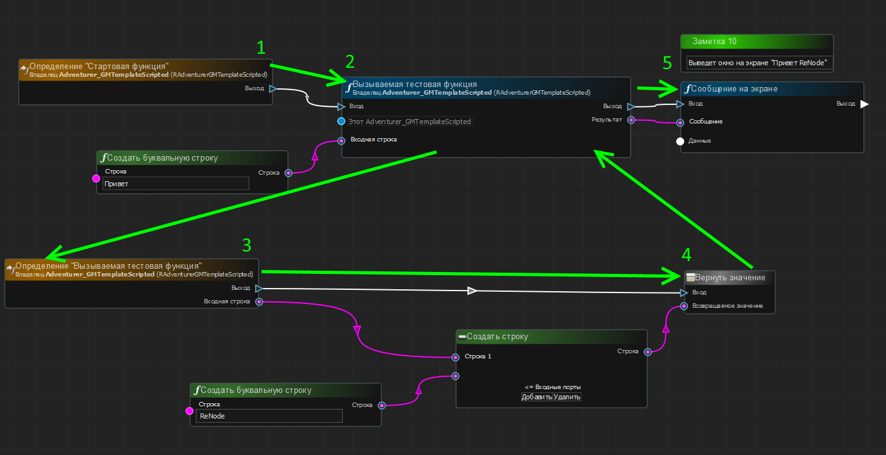

- Выполнение начинается с точки входа "Стартовая функция" (1). Эта точка входа выполняет другую функцию с названием "Вызываемая тестовая функция" (2). 
- Внутри этой функции объединяется строка, полученная из порта "Входная строка" и выполнение передается с 3 на 4. 
- Полученный результат возвращается **вызывающей функции (2)** со строкой "Привет ReNode" и эта строка выводится в окне на экране.

Обратите внимание, что узел "Создать строку" предназначен для создания и комбинирования строк. Если на вход ему подключено более одной строки, то они будут объединены последовательно. Из примера выше мы создаем строку из двух входных: "Привет" и " ReNode" (с пробелом в начале), которые при объединении превращаются в "Привет ReNode".

Рассмотрим другой пример, в котором мы создадим функцию, которая будет создавать сумку в инвентаре персонажа.

Для этого в менеджере пользовательских свойств создадим функцию класса. Под настройками функции нажимаем кнопку "Создать".

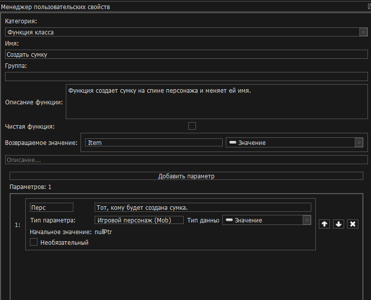

После этого под кнопкой создания в списке членов графа появится функция с нашим названием. Перетащим её на граф с помощью мыши или найдём её в библиотеке узлов по названию. На графе должно быть определение этой функции - то, что она будет делать и вызов - то, где она используется. Для примера ознакомьтесь с изображением ниже:

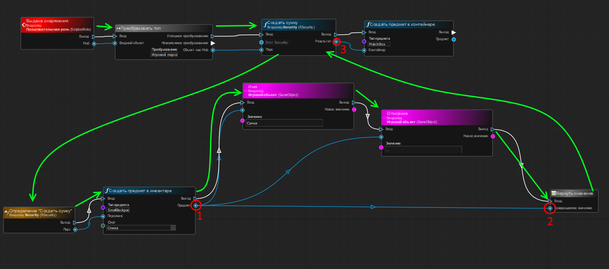

Для начала посмотрим что делает наша функция "Создать сумку". Она просто берет персонажа из порта "Перс" и создает у него на спине рюкзак, после чего устанавливает ему имя и пустое описание. После всех манипуляций возвращается значение, являющееся нашей созданной сумкой. На изображении выше красными кружочками обозначены порты, по которым и передается наша сумка. В 1 она создается, в 2 возвращается внутри функции а в 3 передается в узел, который создат внутри неё коробок спичек.

Ниже изображение представляющее вызов функции, если вы всё ещё не поняли основной принцип их работы. При вызове функции управление передается на точку входа для этой функции. По сути мы можем представлять что внутри нашей функции содержится то, что она будет делать. А общий поток выполнения "слева на право" позволяет проще ориентироваться при сопоставлении портов на точке входа, возвращаемом значении и при вызове функции.

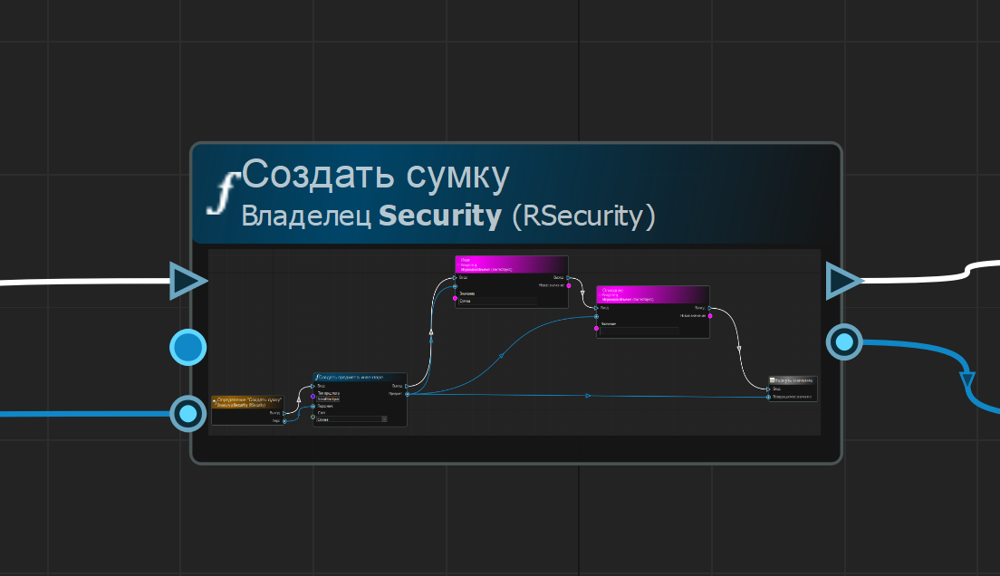

Благодаря возвращаемым значениям мы можем производить расчеты и обработки внутри функций без нагромождения связей в рамках одной точки входа.

### Вызов базового метода

Вызов базового метода. Этот узел вызывает такую же функцию (точку входа) родительского класса. Например, в некотором классе "А" есть функция "Действие". При создании собственного класса "Б", унаследованного от "А" и переопределяющего логику функции "Действие" мы можем выполнить "Действие" от родительского класса "А" с помощью этого узла "Вызов базового метода".

На примере ниже создано 2 графа. Первый - "Adventurer...", с созданной функцией класса "Некоторая функция". Второй - "LateAdventurer...", унаследованный от первого. 

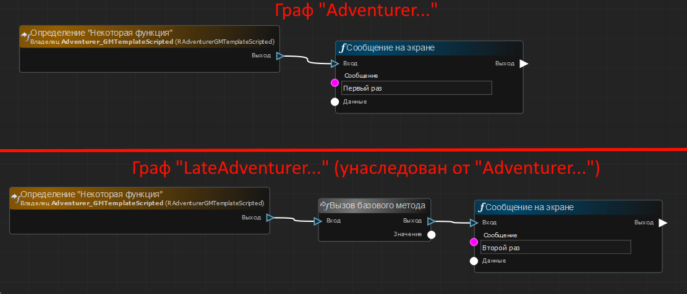

При вызове нашей функции внутри графа "Adventurer..." на экране выведется сообщение "Первый раз". При вызове нашей функции из "LateAdventurer..." на экране сначала выведется сообщение "Первый раз" а затем выведется сообщение "Второй раз". Следуя концепции наследования вызов базовых методов графов позволяет избавится от копирования кода. 

Так например, мы можем сделать роль горожанина, в которой при получении снаряжения будет выдан паспорт. После этого мы можем создать роль городского стражника, унаследованного от графа горожанина. При выдаче экипировки стражнику (например меча) сделаем вызов базового метода и таким образом мы выдадим паспорт нашему странжику вместе с мечом.

## Итераторы

Итераторы служат для повторения различных действий. Каждый тип итератора имеет свою логику условия и выполнения. Например, с помощью итераторов можно создать несколько свечей в ящике, или вывести всем мобам в игре сообщение в чате.

### Цикл

Узел "Цикл" предназначен для многократного выполнения последовательности действий. При поступлении входного имульса выполнения происходит проверка условия. Если оно истнно - выполнение передается на порт "Тело цикла". После завершения выполнения узлов, подключенных к порту "Тело цикла" проверка условия выполняется снова. Если она опять истинна - тело цикла выполняется снова и так до тех пор, пока условие будет истиной. Как только условие станет ложью - выполнение будет передано на порт "При завершении". Если в порт "Тело цикла" не идёт никаких подключений а условие возвращает истину то, проверка повторится снова до тех пор, пока условие не станет ложью.

Примечание: Обратите внимание, что узел цикла может выполнить тело цикла только 10000 раз. При достижении лимита выполнения цикл остановится. Данное ограничение является особенностью платформы. Используйте циклы только там, где вы уверены в том, что количество итераций не будет превышать допустимый предел.

### Цикл в диапазоне

Узел "Цикл в диапазоне" как и обычный цикл тоже предназначается для многократного выполнения действий за исключением того, что его количество итераций строго фиксировано и задано диапазоном значений от числа, указанного или подключенного в порт "Первый индекс" до другого числа в "Последний индекс". Причем диапазон задается от меньшего к большему.

Например, первый индекс равен `1`, последний равен `5`. Другой пример: первый индекс равен `-100`, последний равен `100`. Если первый индекс будет больше последнего, то тело цикла не выполнится. (прим. от `50` до `20` - ошибка)

Цикл выполняется пока выходной порт индекс входит в указанный диапазон. Пример:

1. Поступает импульс на узел "Цикл в диапазоне"
2. В нём задан диапазон от 5 до 7. (первый индекс = 5, последний = 7)
3. Поступает импульс на выходной порт "Тело цикла". В этот раз индекс будет равен 5. При завершении выполнения тела цикла выполнение будет перенаправлено к вызываемому узлу "Цикл в диапазоне".
4. Повторяются действия из пункта 3, но индекс равен 6. Тело цикла выполняется снова.
5. На следующей итерации тело цикла снова выполняется, но индекс в этот раз уже равен 7.
6. После действия в пункте 5 индекс станет равен 8, что не входит в диапазон от 5 до 7. В этом случае импульс выполнения будет передан на порт "При завершении".

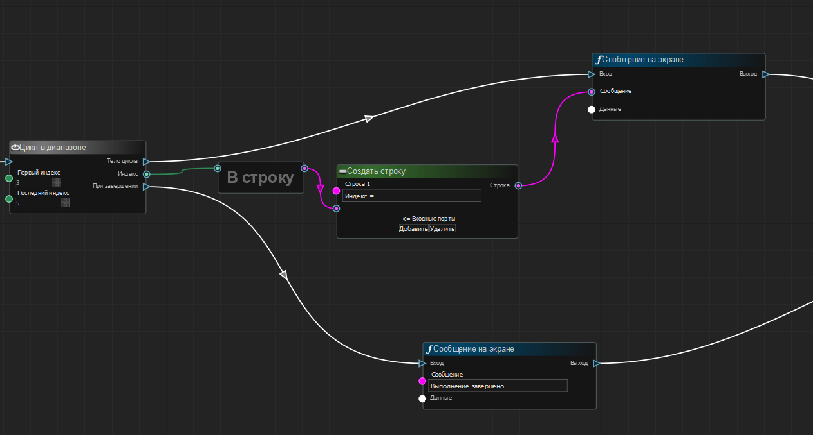

В примере выше появится несколько сообщений на экране в следующем порядке:
- "Индекс = 3"
- "Индекс = 4"
- "Индекс = 4"
- "Выполнение завершено"

### Цикл по списку

Цикл для перебора коллекций (например, массивов). Выполняется столько раз, сколько элементов в списке/коллекции. При поступлении входного импульса выполняется перебор каждого элемента, подавая сигнал на выходной порт "Тело цикла". После обхода всех элементов цикла импульс выполнения передается на порт "При завершении". Если на вход поступает пустая коллекция (например, пустой массив) то тело цикла не будет выполнено.

При выполнении тела цикла элемент становится значением коллекции на текущей итерации, а индекс становится индексом этого элемента. **Индексация коллекций начинается с 0**.

Обратите внимание, что выходные порты "Элемент" и "Индекс" могут быть использованы только в ветке, идущей от порта "Тело цикла". При попытке использовать их *снаружи цикла* (в ветке "При завершении") вы получите ошибку на этапе компиляции графа.

Ниже представлено изображение с примером использования цикла по списку.

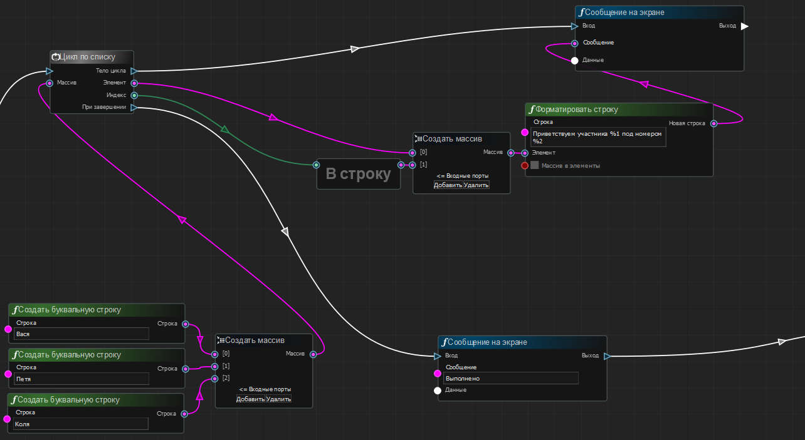

В примере выше появится несколько сообщений на экране в следующем порядке:
- "Приветствуем участника Вася под номером 0"
- "Приветствуем участника Петя под номером 1"
- "Приветствуем участника Коля под номером 2"
- "Выполнено"

### Контроль цикла

Иногда могут быть необходимы принудительные остановки, или пропуски итераций циклов. Для этого существуют узлы "Пропустить итерацию" и ""Прервать цикл". Они могут быть использованы внутри тела цикла для узлов: **Цикл**, **Цикл в диапазоне**, **Цикл по списку**.

- **Пропустить итерацию** - Пропускает текущую итерацию цикла. При поступлении импульса на этот порт, цикл продолжается с следующей итерацией, если таковая возможна.
- **Прервать цикл** - Останавливает выполнение цикла. При поступлении импульса на этот порт, цикл прерывается.

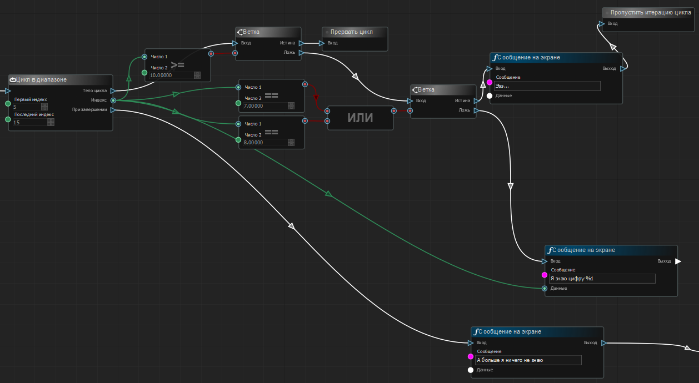

В примере выше итерируется диапазон от 5 до 15. В результате выполнения на экране появится несколько сообщений в следующем порядке:
- "Я знаю цифру 5"
- "Я знаю цифру 6"
- "Эээ..."
- "Эээ..."
- "Я знаю цифру 9"
- "А больше я ничего не знаю"

## Преобразования типов объектов

Представим ситуацию: нам нужно сделать, чтобы при смерти персонажа на определенной роли все ключи вокруг него смогли открывать дверь с замком типа "secret_door". Для этого обратимся к событию "При смерти за роль" и создадим немного узлов:

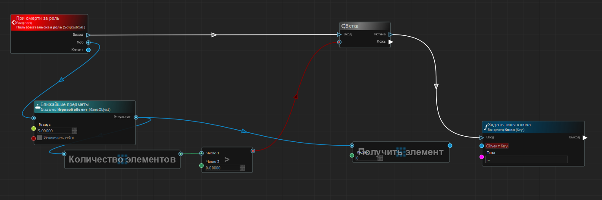

На изображении выше при смерти персонажа мы получаем ближайшие игровые предметы рядом с его телом. Если этих элементов больше нуля то мы выбираем первый игровой предмет из массива и собираемся ему задать тип ключа "secret_door". 

Но узел "Ближайшие предметы" возвращает массив предметов (тип Item). А для выполнения узла "Задать типы ключа" нам нужен объект типа "Key". Мы точно знаем что в момент смерти персонажа рядом с ним не было абсолютно никаких предметов кроме ключей. Попытавшись подключить выходной порт узла "Получить элемент" к функции "Задать типы ключа" мы увидим, что подключение невозможно. Как же исправить ситуацию?

Для этого существует узел "Преобразовать тип". На вход мы передаем **тип объекта** и в опции указываем к какому типу будет совершено преобразование. По факту преобразование не несет никакого функционального изменения объекта и нужно для двух вещей:
- Подсказать редактору тип объекта, так как он не умеет полностью вычислять фактические типы портов при выполнении.
- Обезопасить себя от ошибок во время выполнения симуляции или ещё хуже - во время работы сервера.

Добавляем узел преобразования типа и указываем значение опции преобразования - Ключ.

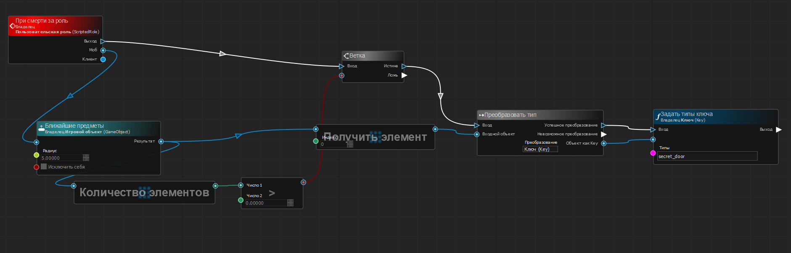

> !!! Примечание: Мы не можем преобразовывать типы объектов от **базового к дочерним** без использования "Преобразования типов". Однако преобразовать **дочерний тип в базовый** мы можем.  

## Асинхронность
ReNode позволяет создавать задержки выполнения между подключенными узлами. Для этого используются следующие узлы:

### Таймер

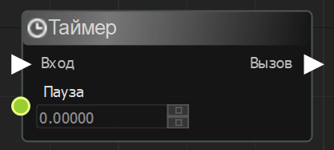

Узел "Таймер" предназначен для исполнения задержек (пауз) между действиями внутри функции. При поступлении входного импульса выполнение приостанавливается на время в секундах, указанное во входном порту "Пауза" и после этого пошлёт импульс на выходной порт "Вызов". Данный узел имеет некоторые накладные расходы при выполнении, поэтому не гарантируется задежрка с указанной точностью времени до миллисекунды. 

Обратите внимание, что таймеры не могут быть использованы в точках входа, которые должны возвращать значения.

### Условный таймер

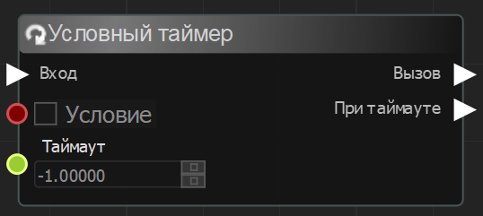

Узел "Условный таймер" предназначен для исполнения задержек (пауз) между действиями внутри функции. При поступлении входного импульса выполнение приостанавливается до тех пор, пока условие, вычисляемое каждый кадр не будет истинно. Как только условие станет истинно таймер будет остановлен и пошлётся импульс на выходной порт "Вызов".

# Локальные функции и события
Вы можете создавать локальные функции, функции-действия и события внутри своих графов, которые можно вызывать из любых мест. Для настройки созданной локальной функции нажмите **ПКМ** по ней.

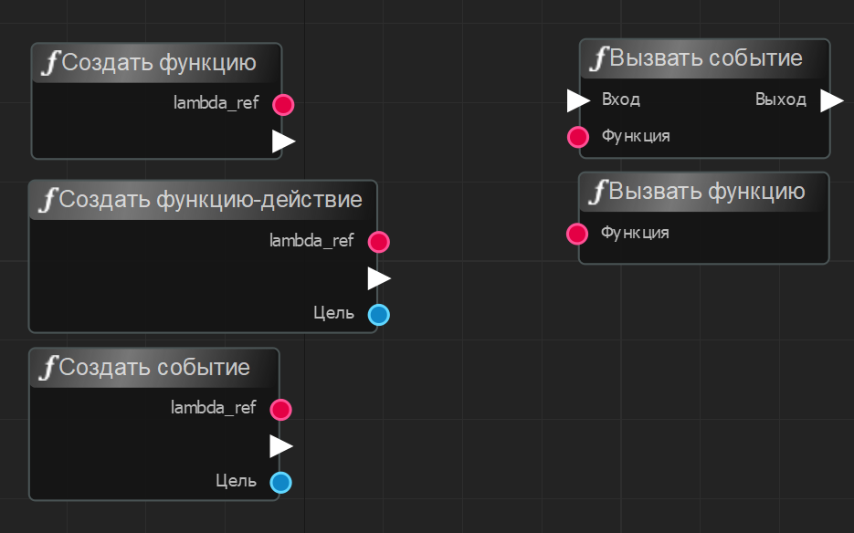

## Создать функцию
Локальная функция это набор выполняемых действий. Функция может иметь сколько угодно портов и возвращаемое значение при необходимости. 
Внутри локальных функций не передаются объект графа и локальные переменные. Все необходимые данные, которые будут использованы внутри функции должны быть явно переданы через созданные порты совместимого типа.

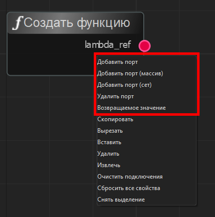

- Добавить порт - добавить порт типа *значение* в функцию.
- Добавить порт (массив) - добавить порт типа *массив* в функцию.
- Добавить порт (сет) - добавить порт типа *сет* в функцию.
- Удалить порт - удалить созданный порт.
- Возвращаемое значение - установить возвращаемое значение для функции. Если оно не требуется - выберите пункт "Без возврата".

## Функция-действие

Функция-действие это набор выполняемых действий по отношению к объекту. Такие функции предназначены для выполнения инструкций с возможностью возврата результата. В функции-действие всегда есть порт "Цель", который является объектом, вызвавшим действие. По аналогии с обычной функцией действиям внутри недоступны локальные переменные, созданные в графе, но они могут иметь сколько угодно дополнительных портов и опциональное возвращаемое значение. При нажатии на **ПКМ** доступны следующие опции:
- Добавить порт - добавить порт типа *значение* в функцию.
- Добавить порт (массив) - добавить порт типа *массив* в функцию.
- Добавить порт (сет) - добавить порт типа *сет* в функцию.
- Удалить порт - удалить созданный порт.
- Возвращаемое значение - установить возвращаемое значение для функции. Если оно не требуется - выберите пункт "Без возврата".
- Установить тип объекта - устанавливает тип обязательного порта "Цель".

В примере ниже попробуем разобраться с созданием функций-действий. В системе задач мы можем переопределить некоторые действия задачи, как например: действие при провале задачи, при успешном выполнении и обработать описание. 
Описание задачи выводится в окне воспоминаний персонажа. Попробуем создать кастомное описание для задачи. Для начала создадим обработчик описания и наведем на него мышь для просмотра необходимого набора входных и выходных параметров функции-действия.

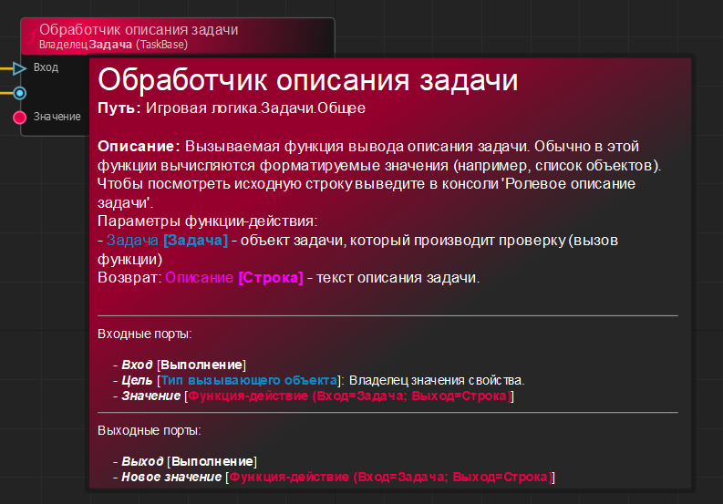

На изображении выше мы видим параметры задачи: Первый параметр это Цель. Он должен быть типа "Задача" или любой из дочерних типов от задачи. 

Создаем новую функцию-действие и через **ПКМ** зададим тип объекта через пункт *"Установить тип объекта"*, выбрав "Задача".

Далее в информационном окне узла мы видим требуемое возвращаемое значение "Описание" типа строка. Зададим его через **ПКМ** - *"Возвращаемое значение"*.

Наша функция-действие готова. Теперь мы сможем подключить её к обработчику описания задачи в порт значение и определить логику получения описания.

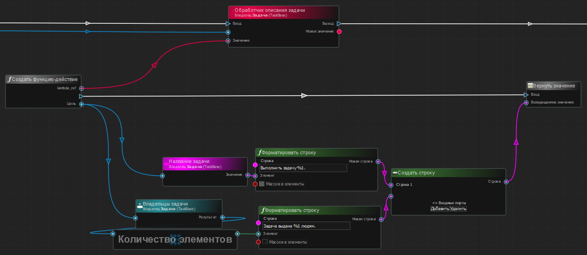

В примере выше мы создаем собственную логику получения описания задачи, которое будет возвращать строку типа "Выполнить задачу Задача. Задача выдана 1 людям.".

# Событие

События это набор действий по отношению к объекту. Такие функции предназначены для реакции на определенные действия.

Отличия от функции-действия заключаются в том, что события не могут возвращать значений, но могут быть сгруппированы, т.е. один обработчик может иметь более одного события. Обработчики для функций-действий же могут иметь только одно действие.

!!! ВНИМАНИЕ В текущей версии ReNode события не реализованы в полной мере.

## [Вернуться назад](README.md)