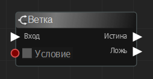
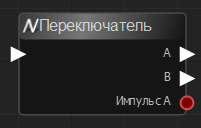
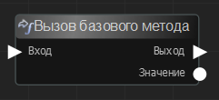
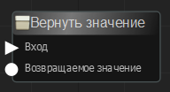
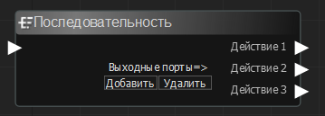
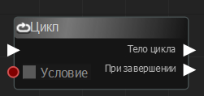
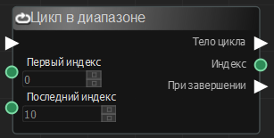
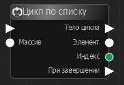
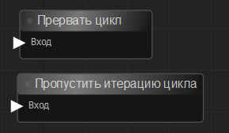

# Узлы

1. Узел
2. Входные порты
3. Выходные порты

## Библиотека узлов
## Различия узлов

# Основные операторы

## Контроль выполнения

Ниже представлены различные встроенные узлы общего назначения, позволяющие контролировать выполнение графа. 

### Ветка

Оценивает условие ветки. После выполнения узел просматривает входное значение логического значения порта "Условие" и выводит импульс выполнения на соответствующий выходной порт.

### Переключатель

Узел принимает входные данные выполнения и переключается между двумя выходными данными выполнения. При первом вызове выполняется выход A. Во второй раз Б. Потом А, потом Б и так далее. Узел также имеет логический выход, позволяющий отслеживать, когда был вызван выход A.

### Вызов базового метода

### Вернуть значение

### Последовательность

Этот узел позволяет одному импульсу выполнения запускать последовательность событий по порядку. Узел может иметь любое количество выходов, все из которых вызываются, как только узел последовательности получает входные импульс выполнения. Они всегда вызываются по порядку, но без каких-либо задержек.

## Итераторы

Итераторы служат для выполнения повторяющихся действий. Итераторы выполняются до тех пор, пока не будет выполнено какое-либо условие. Каждый тип итератора имеет свою логику условия и выполнения.

### Цикл

Выполнение кода несколько раз пока условие истинно. При поступлении входного имульса выполняется проверка условия. Если оно истнно - выполняется тело цикла. В ином случае выполняется узел, подключенный к выходному порту "При завершении", если таковой подключен.
Примечание: Обратите внимание, что узел цикла может выполнить тело цикла только 10000 раз. При достижении лимита выполнения цикл остановится. Данное ограничение является особенностью платформы.

### Цикл в диапазоне

Вызывается несколько раз в зависимости от указанного диапазона значений. Диапазон задается входными числовыми параметрами "Первый индекс" и "Последний индекс".

После выполнения цикла выполняется узел, подключенный к выходному порту "При завершении", если таковой подключен.

### Цикл по списку

Цикл для перебора коллекций (например, массивов). Выполняется столько раз, сколько элементов в списке/коллекции. При поступлении входного импульса выполняется перебор каждого элемента, подавая сигнал на выходной порт "Тело цикла". После обхода всех элементов цикла выполняется узел, подключенный к выходному порту "При завершении", если таковой подключен.

### Контроль цикла

Иногда могут быть необходимы принудительные остановки, или пропуски итераций циклов. Узлы, представленные на этом изображении можно использовать внутри тела цикла для узлов: **Цикл**, **Цикл в диапазоне**, **Цикл по списку**.

#### Пропустить итерацию

Пропускает текущую итерацию цикла. При поступлении импульса на этот порт, цикл продолжается с следующей итерацией, если таковая возможна.

#### Прервать цикл

Останавливает выполнение цикла. При поступлении импульса на этот порт, цикл прерывается.

## Асинхронность
ReNode позволяет создавать программные задержки выполнения между подключенными узлами. Для этого используются следующие узлы:

### Таймер

Узел "Таймер" предназначен для исполнения задержек (пауз) между действиями внутри функции. При поступлении входного импульса выполнение приостанавливается на время, указанное во входном порту "Пауза" и после этого пошлёт импульс на выходной порт "Вызов". Данный узел имеет некоторые накладные расходы при выполнении, поэтому не гарантируется задежрка с указанной точностью времени до миллисекунды.

### Условный таймер

Узел "Условный таймер" предназначен для исполнения задержек (пауз) между действиями внутри функции. При поступлении входного импульса выполнение приостанавливается до тех пор, пока условие, вычисляемое каждый кадр не будет истинно. Как только условие станет истинно таймер будет остановлен и пошлётся импульс на выходной порт "Вызов".

## [Вернуться назад](README.md)