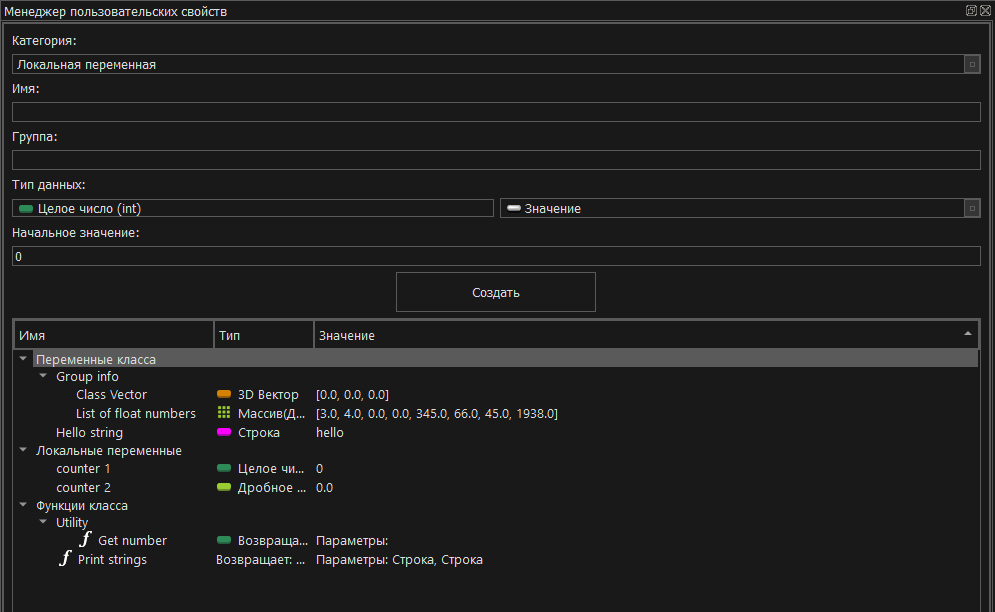
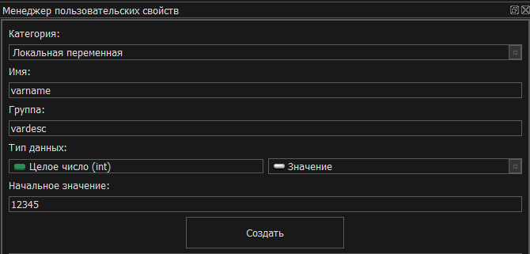
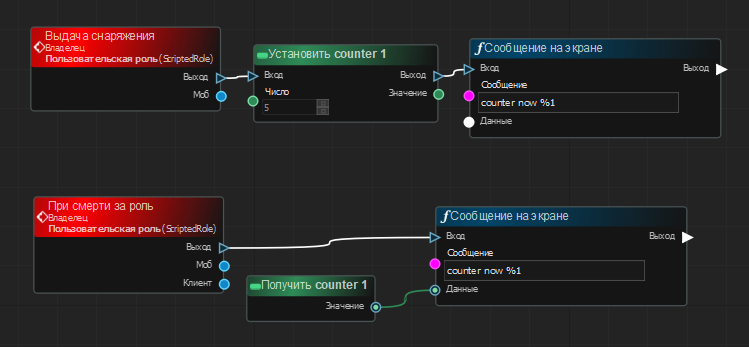
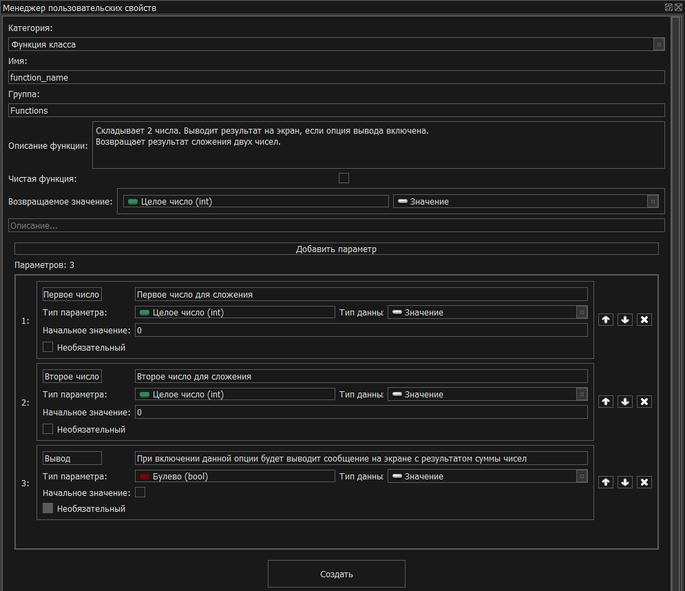
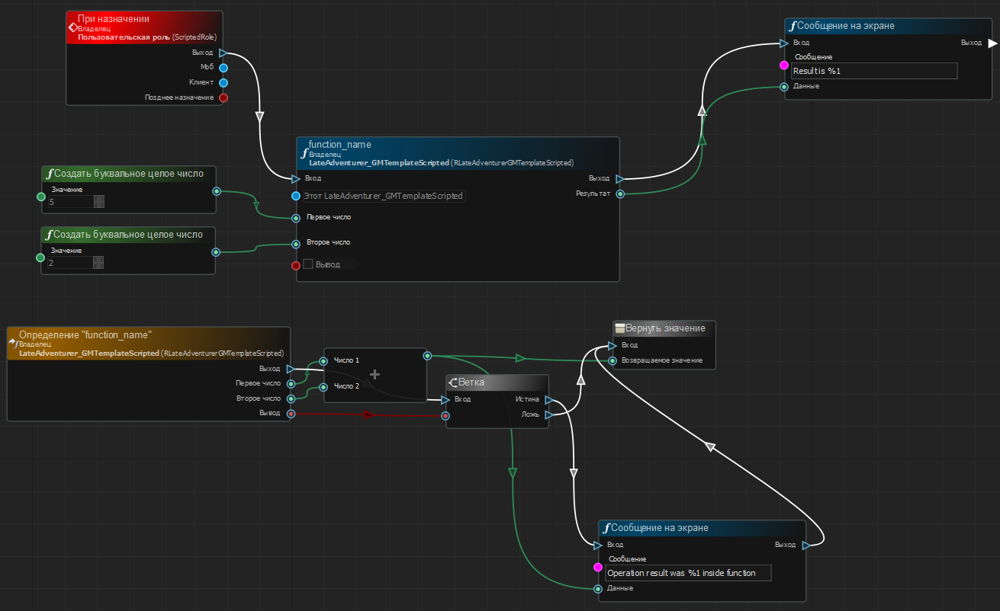

# Пользовательские свойства
В процессе создания своего графа может возникнуть необходимость реализовать дополнительные свойства для хранения собственных данных или функции для группы некоторых действий, которые нужно вызвать в других графах или использовать в текущем. Для этого вы можете использовать пользовательские свойства в окне "Менеджер пользовательских свойств".

На изображении выше представлено окно менеджера пользовательских свойств с созданными переменными класса, локальными переменными и функциями. При создании свойства вы можете задать имя и группу. Так же в зависимости от типа свойства можно задавать дополнительные опции, например такие как тип данных или начальное значение. Например, в приведенном примере создана переменная класса "Class Vector", помещенная в группу "Group info". Вы можете изменить настройки созданной переменной, нажав по ней **ПКМ**. Если вам необходима дополнительная информация о конкретной опции вы можете навести курсор мыши на название опции и посмотреть дополнительную информацию в открывшейся подсказке.

> !!! Внимание !!!
> В текущей версии редактора не представлена возможность изменения значений по умолчанию, а так же параметров функций.

# Типы свойств

Типы пользовательских свойств делятся на несколько категорий, каждая из которых имеет свои особенности при работе с ними. Рассмотрим их ниже.

## Локальная переменная

Локальные переменные предназначены для хранения и использования данных в конкретных точках входа. Такие переменные создаются автоматически в точке входа и существуют пока она выполняется. 

На представленном изображении показаны доступные настройки локальной переменной.
- Имя - имя локальной переменной
- Группа - имя группы, в которую будет помещена переменная. Если поле пустое - переменная не будет сгруппирована.
- Тип данных - [тип данных](Datatypes.md#типы-данных) и [тип хранимой информации](Datatypes.md#контейнеры) (значение или контейнер).
- Начальное значение - в зависимости от типа данных предоставляет свой виджет для настройки базового значения, которое будет иметь переменная при создании.

После установки всех необходимых настроек локальной переменной нажмите кнопку "Создать", а для добавления переменной на граф - перетащите её из дерева пользовательских свойств в окно графа. При добавлении переменной на граф вам будет предложен выбор типа узла для переменной. Используйте пункт "Получить", если вам нужно получить значение вашей переменной и "Установить", если вы хотите изменить его.

Обратие внимание, что вы **не можете** использовать одну локальную переменную в нескольких точках входа, так как может возникнуть неоднозначность при получении значения. При попытке сделать это будет получена ошибка при компиляции графа. 

На изображении выше представлен следующий пример: есть некоторая роль, в которой определены 2 точки входа: событие выдачи снаряжения и событие при смерти за роль. Так же в данном графе роли создана локальная целочисленная переменная "counter 1", которая изначально равна 0.

При выдаче снаряжения значение переменной "counter 1" устанавливается в 5 и данное число выводится на экран. Но при смерти за роль мы не сможем получить значение нашей локальной переменной, так как она удалится после завершения выполнения точки входа "Выдача снаряжения". Поэтому при компиляции этого графа мы получим ошибку. Если вам требуется переменная, значение которой должно использоваться/меняться в нескольких точках входа - используйте переменную класса.

## Переменная класса
Переменные класса (далее "переменные графа") предназначены для хранения и изменения пользовательских данных в объектах, создаваемых из вашего графа. Принцип их настройки и работы схож с локальными переменными за некоторыми исключениями:
- Переменные графа **можно использовать в нескольких точках входа**.
- Они существуют до тех пор, пока объект, созданный из графа существует.
- Они доступны в библиотеке объектов для возможности изменения в других графах при явном указании подключения к [порту "Цель"](Nodes.md#объектные-1-6). Вы также можете создать переменную графа, перетащив её из дерева свойств раздела "Переменные графа" на окно графа.

К примеру, создайте или откройте граф любого из режимов. В инспекторе свойств вы увидите список настроек, относящихся к этому графу. Эти настройки предоставляются как переменные графа, которые принимают указанные значения при создании объекта этого графа. При создании переменных графа вы можете так же изменить их начальные значения через инспектор свойств.

## Функция класса
Функции класса (далее "функции графа") это созданная пользователем последовательность действий (логики, алгоритмов) для использования в графах. Функции могут быть полезны для разделения выполнения действий на отдельные точки входа с возможностью переиспользования как внутри этого графа, так и в других. Все функции графа обязательно имеют порт "Цель", так как являются [объектными узлами](Nodes.md#объектные-1-6).

На представленном изображении выше продемонстрирована настройка различных опций создаваемой функции. Вы можете настроить следующие группы параметров:

Основные:

- Имя - имя функции
- Группа - имя группы, в которую будет помещена функция. Если поле пустое - функция не будет сгруппирована.
- Описание функции - описание функции, выводимое при наведении на узел этой функции, добавленной на граф.
- Чистая функция - отвечает за то, будут ли добавлены [порты выполнения](Nodes.md#порты-выполнения) в узел. Обычно функция должна быть установлена как "Чистая", если она не изменяет свойства графа, в которой определена. 

Возвратщаемое значение нужно, если ваша функция должна отдавать результат при выполнении:

- Возвращаемое значение - тип данных, возвращаемых функцией. Можно указать, что функция не будет возвращать ничего. При добавлении узла вызова функции возвращаемое значение является выходным портом (если оно указано), а при добавлении определения функции возвращаемым значением является подключенный узел "Вернуть значение".
- Описание - описание возвращаемого значения.

Параметры функции, служащие для определения входных данных, с которыми можно работать внутри функции (т.е. в её определении):

- (кнопка) Добавить параметр - служит для создания нового параметра.
- Имя параметра - название порта.
- Описание параметра - опциональное значение, выводимое при наведении на узел. Данная информация отображается в разделе с входными и выходными портами.
- Тип параметра, тип данных - определяет тип порта. Отвечает за то, какие [типы портов](Nodes.md#типы-портов) совместимы с этим параметром.
- Начальное значение - значение, которое будет установлено для точки входа, если установлен флаг "Необязательный".
- Необзятальный - флаг, определяющий, будет ли этот параметр необязательный или опциональным.

### Пример функции класса

Перед нами стоит следующая задача: при заходе за нашу тестовую роль (точка входа "При назначении") должны сложиться 2 числа и их результат должен быть выведен в сообщение на экране. 

Конечно можно было бы создать узлы прямо внутри точки входа и при необходимости повтороного использования алгоритма скопировать эти узлы. Но что, если в будущем нам понадобится использовать эту логику в нескольких местах и операция будет не просто сложением а целой группой сложных математических расчетов? В таком случае наш граф превратился бы в адское месиво, и это только, если логика используется внутри этого графа. А если нужно сделать небольшое изменение в этих расчетах, то придется сделать правки во всех местах. 

Для решения перечисленных проблем и существуют функции.
С помощью функци вы можете:
- Сделать функцию автоматической выдачи снаряжения по указанным параметрам.
- Создать сложные алгоритмы, как например, подсчитать все игровые объекты на карте, названия которых начинаются на "С" и они находятся рядом с живыми игроками.
- Создать отладочные функции для тестирования собственных механик.
- Создать функцию, которая будет тушить все факелы на карте.
- Функцию, которая поменяет имена всех лежащих персонажей на "Савелеон".
- Функцию, которая посчитает общее время жизни всех игроков, зашедших в раунд.
И многое, многое другое...

Рассмотрим пример работы и использования функции созданной по шаблону из предыдущей главы. Укажем все настройки так же как на изображении и нажмем кнопку "Создать".

Добавим точку входа "При назначении" в нашей роли. После этого добавим функции определения и вызова нашей созданной функции. Для этого перетащим функцию на граф, выбрав соответствующие пункты контекстного меню, либо откроем библиотеку узлов и впишем название нашей функции "function_name".

Когда мы зайдём за нашу роль начнется выполнение нашей функции. То, что наша функция будет делать реализовано в точке входа **Определение "function_name"**. Мы видим, что реализация функций складывает два значения из портов "Первое число" и "Второе число" и возвращает это значение. Если же "Вывод" (опциональное значение) является истиной, то дополнительно внутри функции будет выведено ещё одно сообщение "Operation result was 7 inside function". 

После выполнения функции значение, которое она вернула мы выведем вместе с сообщением "Result is 7".

Дополнительно про возвращаемое значение [можно ознакомиться в предыдущем разделе](Nodes.md#вернуть-значение).

## Константы, перечисления, структуры

В текущей версии создание пользовательских констант, перечислений и структур не реализовано.

## [Вернуться назад](README.md)