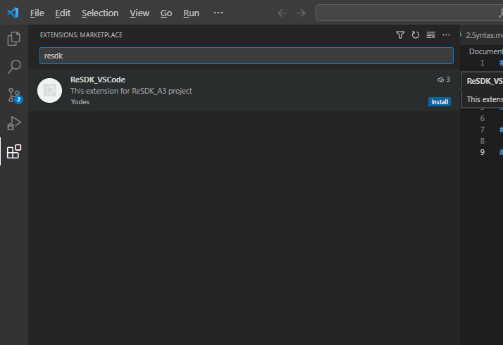
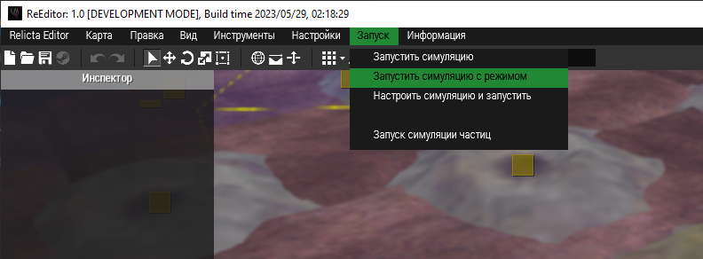
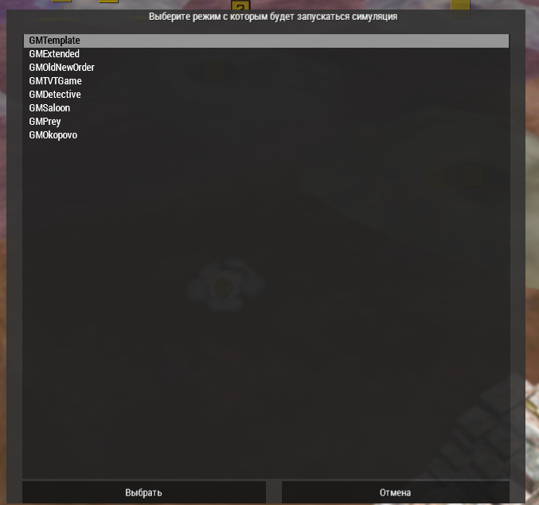
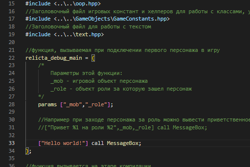

# Работа с кодовой базой

Перед началом работы с кодом требуется развернуть модификацию редактора. Подробная инструкция по установке и первоначальной настройке описана в [руководстве по установке ReSDK_A3](..\INSTALL_GUIDE.md)
Так же рекомендуем к предварительному ознакомплению:
- [Наши стандарты программирования](..\..\CODE-STANDARDS.md)
- [Описание архитектуры](..\PROJECT_ARCHITECTURE.md)

## Настройка редактора кода

1. Установите редактор [Visual Studio Code](https://code.visualstudio.com/download)
2. Запустите его, слева выбирите Extensions и в поисковой строке наберите `resdk`. Установите расширение ReSDK_VSCode - оно обеспечит подсветку синтаксиса и прочие полезные функции, которые будут расширяться по мере его разработки.

3. Сверху нажмите `File` и нажмите `Open Workspace from file`. Выберите файл с расширением `.code-workspace`, лежащий в корне вашего клонированного репозитория

4. Запускаем Arma 3, заходим в редактор ReEditor. В редакторе сверху выбираем `Запуск` и `Запустить симуляцию с режимом`

В открывшемся окне выберите режим, который будет запущен, например GMTemplate

Нажимаем `Выбрать`. Начнется запуск режима.

## Первый скрипт

В редакторе кода открываем файл по пути `host\Tools\EditorWorkspaceDebug\EntryPoint.sqf`

> Для теста различных вещей и обучения вы можете смело использовать данный файл, не боясь что вы что-то поломаете.

В функции `relicta_debug_main` попробуем вывести окно с нашим первым сообщением:

После этого, если вы уже зашли за роль нажмите `Esc` и выберите `COMPILE AND RUN`, либо просто нажмите `F6` и проект сразу рекомпилируется.
Если у вас открыто окно лобби, то нажмите комбинацию `SHIFT + Home`. Данная комбинация предназначена для экстренного закрытия текущего открытого дисплея.

После рекомпиляции выберите роль и нажмите кнопку готовности. Когда режим начнется и вас кинет за роль - вы сразу увидите своё сообщение.

Поздравляем! Вы написали свой первый код. Но это только начало...

Если вы хотите лучше понимать код, написанный на языке SQF, то смело переходите к следующему разделу.

## Изучение

Для того, чтобы написать какой-то функционал нужно хорошо понимать основы и принципы языка, с которым вы работаете. Язык SQF это достаточно простой для освоения высокоуровневый язык программирования, который при желании можно освоить за несколько часов. Для изучения основ языка, а также тонкостям при работе с классами мы подготовили руководство по программированию.

* [Основы языка и переменные](Scripting_baiscs.md)
* [Типы данных](Types.md)
* [Операторы, циклы](Control_structures.md)
* [Функции](Functions.md)
* [Массивы](Arrays.md)
* [Классы, наследование](Classes.md)

Не бойтесь экспериментировать а также задавайте свои вопросы в нашем [дискорде](discord.relicta.ru)

## Внесение изменений в проект
