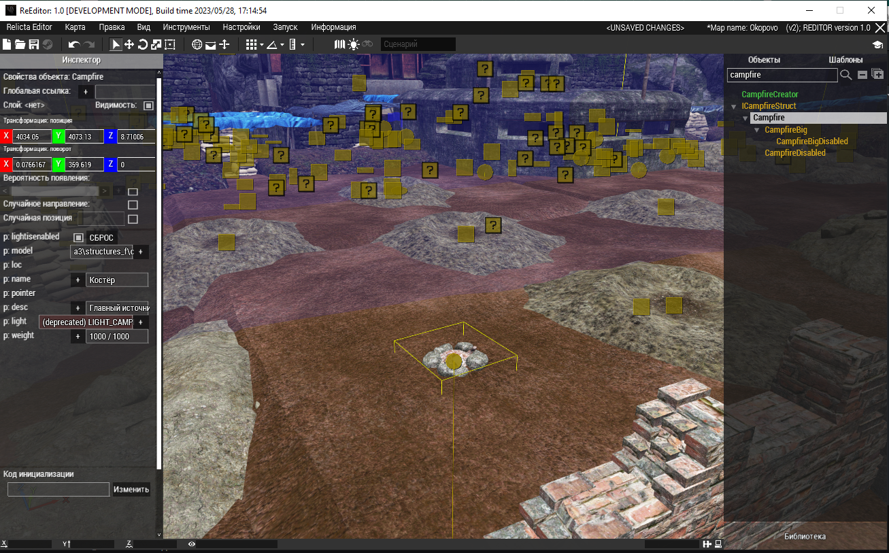
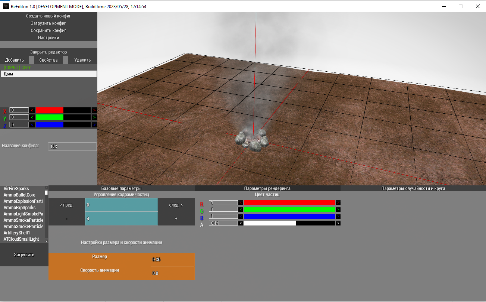
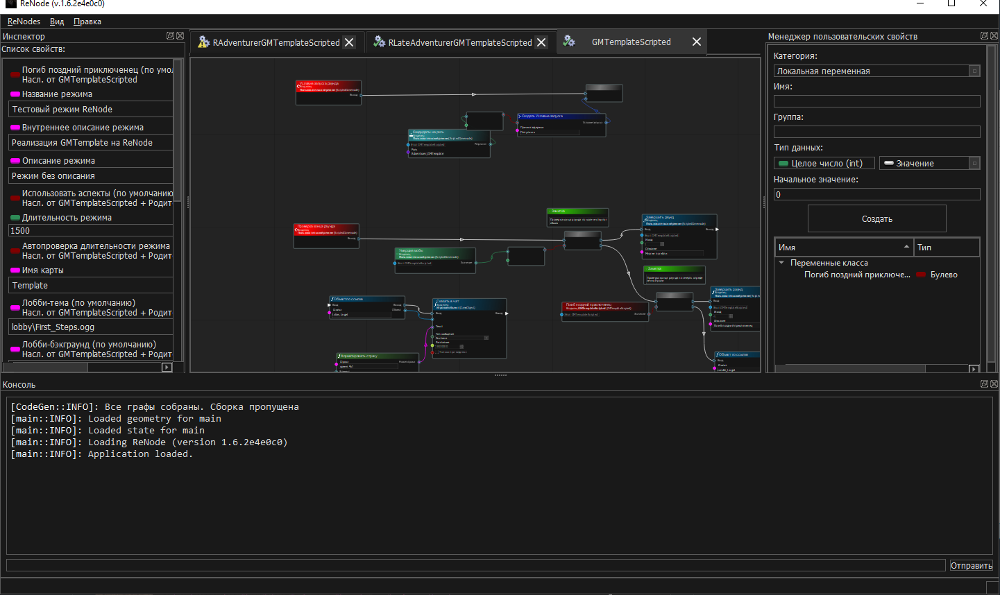
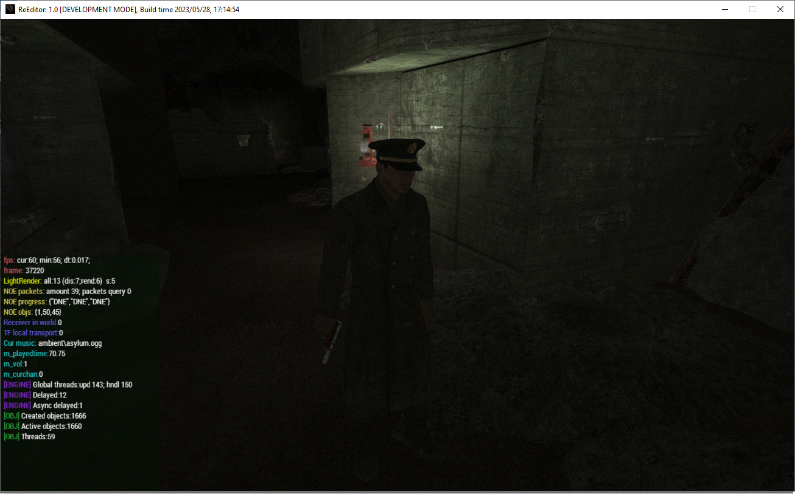
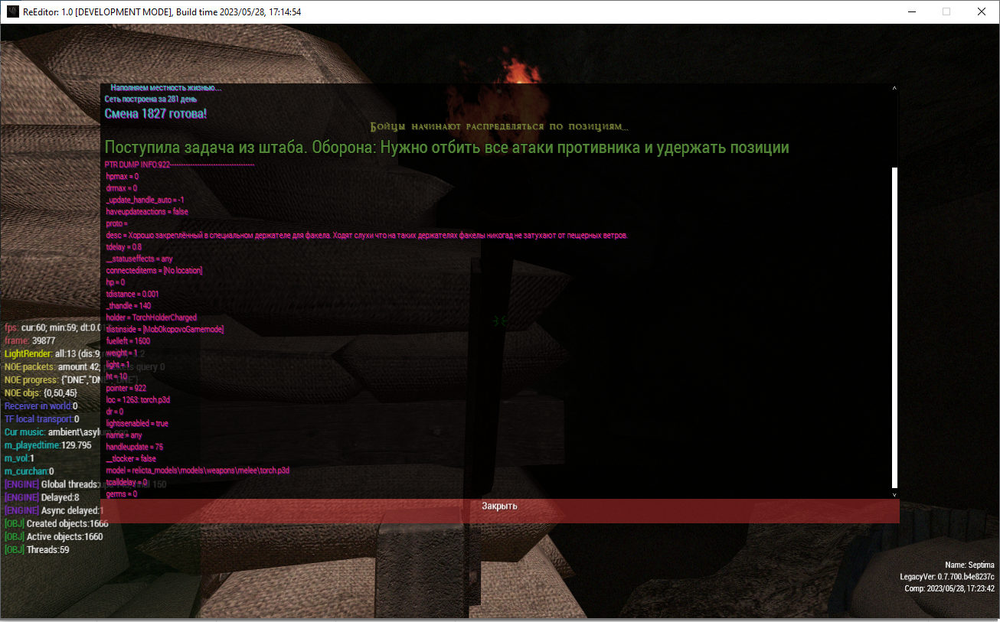
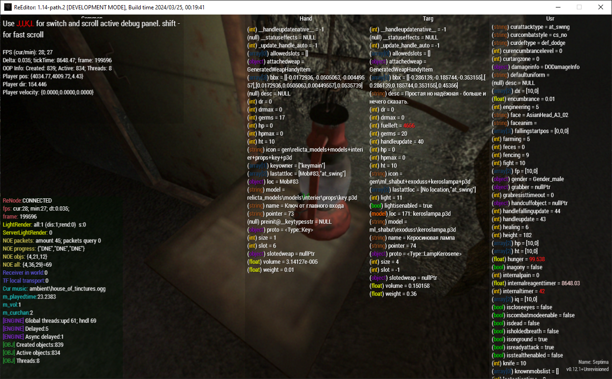

[](https://github.com/Relicta-Team/ReSDK_A3.vr/actions)
[](https://discord.relicta.ru)


# Описание

ReSDK - это набор инструментов для разработки и создания пользовательского контента к модификации [Relicta](https://relicta.ru), основанной на игре Arma 3. Данный проект включает в себя:
* Исходный код проекта Relicta, включающий в себя клиентские модули, серверный код и различные утилиты.
* WYSIWYG редактор ReEditor, позволяющий создавать режимы, карты и игровые объекты в несколько кликов.
* Редактор визуального программирования ReNode для создания игровой логики без кода.
* Утилиту RBuilder для быстрого развертывания модификации и сборок проекта.
* Компоненты ReBridge и ReEngine для возможности написания скриптов на языке C#, используемых в инструментах SDK.

# Возможности
- **Создание карт и игровых объектов в редакторе**: удобный редактор ReEditor позволяет создавать и редактировать карты а так же генерировать готовые игровые объекты (префабы) в несколько кликов. 
- **Редактор частиц и освещения**: частицы и источники света можно создавать и редактировать в удобном и простом для пользователя редакторе эмиттеров, доступном в ReEditor, создавая тем самым разнообразное и атмосферное окружение.
- **Создание игровой логики**: обширная кодовая база, собирающаяся и поддерживаемая с 2017 года позволяет в полной мере раскрыть все возможности платформы Arma 3 и создавать логику любой сложности а встроенный отладчик поможет обнаружить ошибки и указать на место их появления. Для тех, кто не силен в коде или хочет занятся прототипированием функционала, разработан редактор визуального программирования.

# Требования к работе
- Системные требования:
  - Windows 10 или Windows 11. Поддержка более старых версий Windows возможна, но только под x64 и нормальная работа не гарантирована.
  - ОЗУ 2.5 GB+
  - SSD для быстрых загрузок платформы и симуляции.
- Наличие платформы Arma 3.
- .NET Framework 4.7.2 или выше.
- Visual C++ Redistributable 2013 и 2015-2022
- Редактор кода Visual Studio Code
  - Расширение для Visual Studio Code - ReSDK Extension


# Настройка

### Более детальная инструкция по настройке с изображениями описана в [руководстве по установке](Documentation/INSTALL_GUIDE.md)

Экспресс инструкция по установке и настройке.

1. Убедиться что установлены все компоненты, описанные в [требованиях к работе](#требования-к-работе)
2. Клонировать репозиторий в папку с документами `Arma3\missions` 
Если у вас несколько профилей, то в `Arma 3 - Other Profiles\USER_PROFILE\missions`, где USER_PROFILE - имя вашего профиля
3. Развернуть мод для редактора
  3.1 Заходим в папку RBuilder, запускаем через cmd ```rb deploy -editor ARMA3_DIR``` (либо просто запускаем `DEPLOY.bat` в папке с RBuilder). **ARMA3_DIR** это путь до папки в которой хранится исполняемый файл arma3_64.exe.
  3.2 Если ARMA3_DIR не был указан то при запуске появится запрос пути до Arma 3 - прописываем его. 
  Для любителей хардкора можно вручную копировать файлы из папки `RBuilder\deploy\editor` в папку `@EditorContent`, которая должна быть создана в папке с Arma 3.
4. Подключить мод `@EditorContent`. Должно быть 2 включенных мода: `@Content` и `@EditorContent`. После этого можно запускать игру с модами и **выключенным BattlEye**.
5. В главном меню заходим в редактор и открываем нашу клонированную миисию ReSDK_A3.vr
6. Для редактирования кода в VS Code можно использовать наше расширение по ссылке: [ReSDK VS Code](https://marketplace.visualstudio.com/items?itemName=Yodes.resdk-vscode)

# Полезные ссылки

### [API документация](Documentation/API/README.md)
### [Архитектура проекта](Documentation/PROJECT_ARCHITECTURE.md)
### [Работа с редактором](Documentation/EditorGuides/README.md)
### [Работа с редактором ReNode](Documentation/ReNode/README.md)
### [Работа с кодом](Documentation/ScriptingGuides/README.md)
### [Расширение для VS Code](https://marketplace.visualstudio.com/items?itemName=Yodes.resdk-vscode)

# Лицензия
Проект ReSDK_A3 распространяется под открытой лицензией MIT.

Ознакомиться полным текстом лицензии можно [тут](LICENSE)

## Зависимости
В проекте используются третьесторонние компоненты:

* [DB Browser for SQLite](https://sqlitebrowser.org/)
* [SQFVm](https://github.com/SQFvm/runtime)
* [A3_LOG](https://github.com/Arkensor/A3LOG)
* [debug_console, url_fetch](http://killzonekid.com/)
* [CSScriptLib, e_sqlite3](https://github.com/oleg-shilo/cs-script)
* [file_ext](https://github.com/Vindicta-Team/FileXT)
* [BIS Filebank](http://community.bistudio.com/wiki/FileBank)
* [PBOManager](https://github.com/winseros/PBOManager)

# Вопросы

- Не получается настроить ReSDK
  - Пожалуйста, обратитесь к нашему [руководству по установке](Documentation/INSTALL_GUIDE.md)
- Я всё правильно настроил, но при запуске ReSDK крашится Arma3
  - Зайдите в свойства всех `dll` файлов в папке `@EditorContent` и нажмите "Разблокировать". [Пример на изображении](https://forum.lers.ru/uploads/default/original/1X/491c696ffa11443028bb46eb4ef5b486e5be5dc8.png)
- Как мне внести свой вклад в разработку?
   - Ознакомьтесь с [Руководством по внесению вклада](CONTRIBUTING.md)
- Где найти документацию по API?
  - Ознакомьтесь с [этой страницей](Documentation/API/README.md).
- Нужен ли Visual Studio Code, если я собираюсь работать только с редактором ReEditor?
  - Нет. Редактор VS Code необходим для удобства при работе непосредственно с кодом. Для создания контента в ReEditor он не обязателен.
- Могу ли я использовать данный проект для создания своего сервера?
  - Можете, однако обращаем внимание, что мы не осуществляем поддержку и консультацию по разработке сторонних серверов, основанных на кодовой базе этого репозитория.
- Зависает или медленно работает симуляция
   - Во время симуляции код клиента и сервера выполняется на локальной машине. Обычно производительность в симуляции в половину ниже чем на реальном сервере.
- У меня другой вопрос
   - Прочие вопросы вы можете задать в [нашем дискорде](https://discord.relicta.ru)

# Скриншоты SDK







